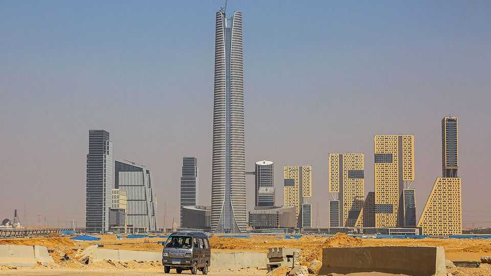

Middle East & Africa | Towering legacies
A new frontier for skyscrapers
Why African governments are building higher
September 4th 2025

AFRICA IS a low-rise continent. It has just 26 buildings taller than 150 metres, compared with nearly 300 in Dubai alone. Yet 12 of them have sprung up in the past five years alone, suggesting a mini-boom in skyscrapers. The tallest, Egypt’s Iconic Tower, was completed in 2024 and rises nearly 400 metres above the desert outside Cairo, the capital. Soon it will be surpassed by Tour F in Abidjan, the commercial capital of Ivory Coast. At 421 metres, Tour F will tower 300 metres over the city’s next-tallest building. Morocco and Ethiopia are also building towers.

Typically, argues Jason Barr, author of a book on skyscrapers, towers cluster in places where space is tight and growth is high, leading to cities expand upwards. Some of the countries building high, such as Ethiopia and Ivory Coast, are growing rapidly. Africa’s sprawling cities could do with densification.

Yet at a time of high debt, tight budgets and dwindling foreign-aid payments, the economic purpose of towers pushed by governments is doubtful. Iconic Tower is part of a new capital championed by President Abdel-Fattah al-Sisi, a project that may set Egypt back $58bn. Egypt’s government, which already spends nearly two-thirds of its budget on servicing its public debt, is borrowing most of the money from China. Bruno Nabagné Koné, Ivory Coast’s construction minister, says Tour F will be an efficient home for a large bureaucracy. But at more than $400m, it is not clear whether it will strain government finances or save money.

More plausibly, tall towers are in part about national prestige. Morocco’s Mohammed VI tower is named after the king. Mr Koné boasts that the slick design of Tour F is “appreciated” by Ivorians. Egypt’s prime minister says Iconic Tower is a “symbol of modern Egypt”. Ordinary people must hope that these grandiose building sprees do not come at the expense of rising living standards. ■

Sign up to the Analysing Africa, a weekly newsletter that keeps you in the loop about the world’s youngest—and least understood—continent.

This article was downloaded by zlibrary from https://www.economist.com//middle-east-and-africa/2025/09/04/a-new-frontier-for- skyscrapers

Europe

What Finland could teach Ukraine about war and peace Vladimir Putin is building a super-app Putin’s petrostate faces a kamikaze petrol crisis Fires, earthquakes and inflation are putting tourists off Turkey Bayrou on the brink Robotaxis will be the Sputnik Moment for a declining Europe