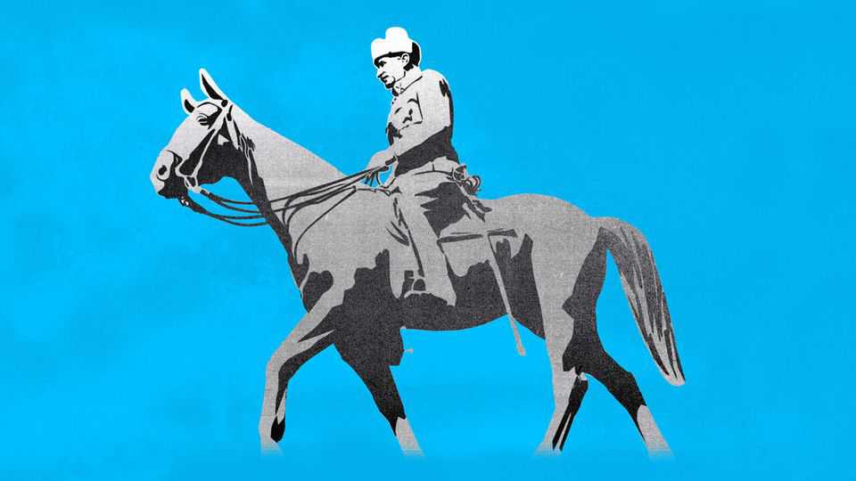
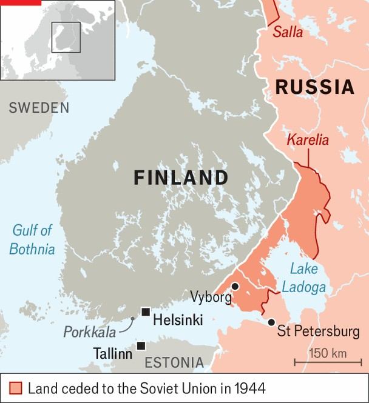

Europe | From Helsinki with love
What Finland could teach Ukraine about war and peace
President Alexander Stubb argues Ukraine can repeat Finland’s success
September 4th 2025

THE TYRANT in the Kremlin claimed it as within his sphere of influence, and demanded an unequal land swap. When that was rejected, he staged a false-flag operation and then invaded, expecting to take the capital in two weeks. The Western democracies promised support, but failed to deliver. Less than five years later the victim was forced to cede a tenth of its territory to Russia, and to promise perpetual neutrality. That was the fate not of Ukraine this decade but of Finland in the 1940s. It is now one of the most successful and prosperous of European states. Finland is back in focus these days. Its president, Alexander Stubb, was included in a meeting last month at the White House between Donald

Trump, Volodymyr Zelensky and six other European leaders. When Mr Trump turned to Mr Stubb, one of Ukraine’s staunchest and most cool- headed supporters, he said: “We found a solution in 1944 and I’m sure that we’ll be able to find a solution in 2025 to end Russia’s war of aggression, find and get a lasting and just peace.” And in a recent interview in Helsinki with The Economist Mr Stubb said of the 1944 decision, which is seen by many as a defeat, that “We still feel we won, because we retained our independence.”

When Stalin first attacked in the Winter War of 1939-40 Finland had only been independent for 21 years, having spent most of the 19th century as part of the Russian empire, and the 600 years before that as part of Sweden. It was included in the secret Molotov-Ribbentrop pact that carved up central and eastern Europe between Germany and the Soviet Union. Finland was assigned to the latter.

Yet unlike any other part of the former Russian empire, and much of central and eastern Europe as well, Finland, a country today of fewer than 6m people faced with a 1,300km border with Russia, never lost its independence or its democracy. It owed this not to Western support but to the grit of its people, the integrity of its elite and the hard realism of the man who commanded its army through the years of war—Carl Gustaf Mannerheim

(pictured), formerly a general in the Russian Imperial Army who was as resolute in putting up the fight as he was in accepting a bitter peace.

In March 1940, after “16 weeks of bloody battle with no rest by day or by night”, Mannerheim addressed his soldiers: “Our Army still stands unconquered before an enemy which in spite of terrible losses has grown in numbers.” The underwhelming scale of Western support and the overwhelming size and brutality of an enemy “whose life-philosophy and moral values are different from ours”, meant that although Stalin failed to achieve his maximalist goals, Finland had to forfeit land, but not its people.

“We must be ready to defend our diminished Fatherland with the same resolution and the same fire with which we defended our undivided Fatherland,” Mannerheim said. The entire population of Finnish Karelia— over 400,000 people—was evacuated after the end of the Winter War and the subsequent War of Continuation, in which for a while Finland pushed the Russians back.

Finland’s experience has been cited from the start of the war in Ukraine— both as a model to avoid and one perhaps to bear in mind and even follow. Mannerheim’s speech was circulated in President Volodymyr Zelensky’s office in the first months of the war,  but was put to one side.

The peace imposed on Finland in 1944 was hardly just. But it could have been worse. Finland handed over 10% of its territory, including Karelia and half of Lake Ladoga. Its army was restricted, as was its ability to join NATO. It was forced to let Russia lease a naval base on Porkkala, a peninsula in the Gulf of Finland just 30km from the capital. And, because it joined forces with Hitler later in the war, it was forced to pay reparations to the Soviet Union which had attacked it five years earlier.

To much of the world, this was a defeat. To Mr Stubb, whose father was born in the territory annexed by the Soviet Union, and whose summer house stands in Porkkala, back in Finnish hands since the 1950s, it looks different. Lacking any security guarantees from the West or anyone else, Finland exercised this independence not by turning anti-Russian—which would almost certainly have resulted in another invasion—but by building one of the most successful countries in Europe. “People didn’t wait for perfect

conditions. They worked with what they had,” Risto Penttila, a foreign- policy expert, explains.

In politics and in the media Finland carefully avoided anything that could anger Moscow. To most outsiders, what became known as “Finlandisation” was a servile form of appeasement. To Mr Stubb and most of his countrymen, “it was the definition of realpolitik at a time when we did not have a choice.” It allowed Finland to stick to its core values: universal education, social welfare and the rule of law.

Long before it joined NATO in 2023 Finland had developed a system of “total defence” that relies on compulsory national service and the voluntary participation of private businesses. Its conscript army generates a reserve force of almost 1m trained citizens. Esko Aho, a prime minister in the 1990s, says none of this would be possible without a sense of fairness. “Finland was able to create national defence not just because of a threat from Russia, but because it had something worth defending.”

Mr Stubb says that Ukraine today is in a better position than Finland was in 1944—“a devastated, dirt-poor country” with almost no support from the outside. Ukraine has allies working on security guarantees and helping it economically. Ukraine, he says, can either dwell in the past and lament the unfairness of the world outside, or “it can pick up the pieces, reconstruct and believe in its own future”; eradicating corruption, fostering freedom and social justice, and killing cynicism. That is the choice that lies ahead. ■

To stay on top of the biggest European stories, sign up to Café Europa, our weekly subscriber-only newsletter.

This article was downloaded by zlibrary from https://www.economist.com//europe/2025/09/01/what-finland-could-teach-ukraine- about-war-and-peace