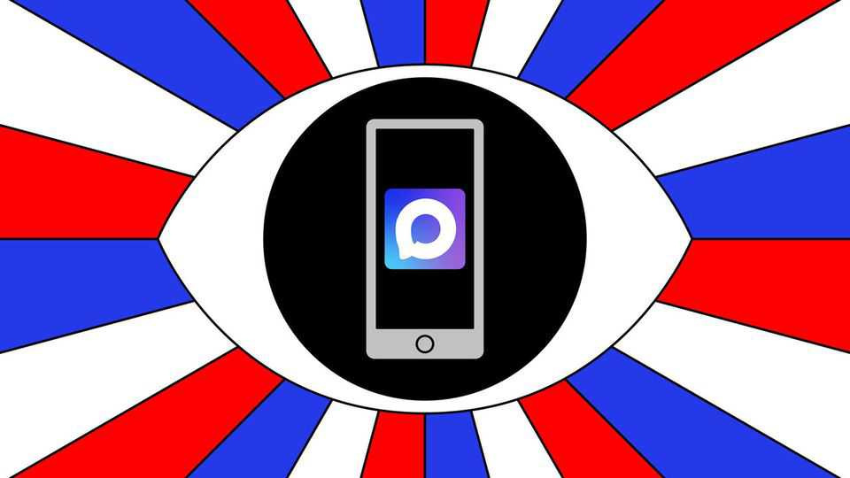

Europe | Here’s looking at you
Vladimir Putin is building a super-app
Russians will not like it, but will have it on their phones anyway
September 4th 2025

When Russia invaded Ukraine in 2022, the Kremlin swiftly banned Facebook and Instagram; their parent company, Meta, was labelled an extremist organisation. Yet one Meta-owned social-media service— WhatsApp—survived. A court ruled that the app’s focus on private chats, rather than sharing information publicly, meant it could be spared. But it may have simply been too popular to block: WhatsApp says it has more than 100m users in Russia. Now Vladimir Putin has re-entered the chat. On August 13th Russia’s internet watchdog, Roskomnazdor, said it was restricting calls on WhatsApp and Telegram, claiming it was trying to counter fraud. In fact, Russia’s president is preparing to promote a new domestic alternative. In June he

signed a decree ordering the creation of a state-endorsed app that would combine messaging with e-government services. The Kremlin assigned the project to VK, a state-linked social-media group that had already released the beta version of a platform called MAX, which integrates messaging, payment software and the ability to host “mini-apps” for activities such as shopping and food deliveries.

MAX is set to form the basis of the Kremlin’s new endeavour, which will be pre-installed on new devices. Yet the concept clearly stems from Asia’s super-apps, and particularly China’s WeChat. That app is a pillar of daily life in China. Some 1.3bn people use it not just for messaging but also for reading the news, booking travel, making medical appointments and paying bills. It is also an instrument for censorship and surveillance. It restricts material critical of the Chinese Communist Party, and police use it to snoop on dissidents, too.

Mr Putin no doubt craves such a tool. But the public’s appetite for a Russian WeChat is less certain. More than 36% of Russians already use virtual private networks (VPNs), software that gives access to blocked content by making a device appear as if it is in another country. And there are fears that the new app will allow the authorities to hack into the phone’s microphone or even its camera. ■

To stay on top of the biggest European stories, sign up to Café Europa, our weekly subscriber-only newsletter.

This article was downloaded by zlibrary from [https://www.economist.com//europe/2025/09/04/vladimir-putin-is-building-a-super-app](https://www.economist.com//europe/2025/09/04/vladimir-putin-is-building-a-super-app)