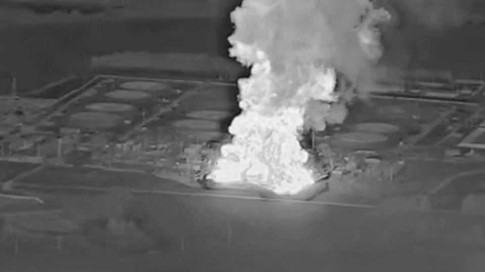
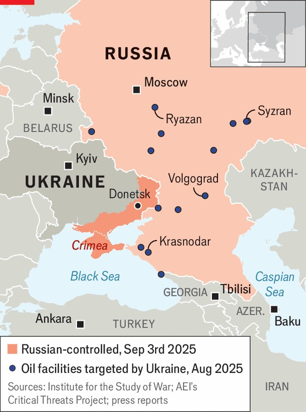

Europe | Incoming
Putin’s petrostate faces a kamikaze petrol crisis
Drivers queue as Ukraine’s drones take out 20% of refining capacity
September 4th 2025

As Donald Trump rightly observed on August 22nd, “It is very hard, if not impossible, to win a war without attacking an invader’s country.” Mr Trump may have earlier this year declared that Ukraine lacks “the cards” to win, but for two years it has been carrying out successful attacks on oil refineries and depots across Russia. And in the past month that campaign has shifted into a higher gear. Since the beginning of August, Ukraine is believed to have carried out over a dozen strikes on Russia’s oil-refining and distribution system, and the tempo shows no signs of flagging. The most recent were on refineries at Krasnodar and at Syzran, a city in the Samara region, on August 30th. Both of those refineries, which have been hit many times, supply fuel to Russian

military units, says Robert “Madyar” Brovdi, commander of Ukraine’s Unmanned Systems Forces. Ukraine says 40% of its long-range strike targets in 2025 have been Russian refineries. Others have hit storage and pumping infrastructure.

According to some estimates, up to 20% of Russia’s refining capacity has been taken out, at least temporarily: a loss of well over 1m barrels a day, mainly of petrol but also of diesel. Refineries that have been hit several times have suffered lasting damage. The destruction of the cracking units that break down crude oil into petrol, diesel and aviation fuel is hurting most, because they are difficult to replace under the sanctions regime.

The impact is being felt with forecourts running dry and queues for petrol across different parts of the vast country. The wholesale price of petrol has risen by 54% since the beginning of the year, and is at a record level. The authorities have suspended gasoline exports. The consequent loss of revenues is adding to Russia’s fiscal woes: the deficit for the first seven months of 2025 reached $61.4bn, already almost 3% of full-year GDP. Petrol rationing has been ordered in some parts of the country.

Sergey Vakulenko of the Carnegie Russia Eurasia Centre, a think-tank, says the refinery attacks in August have been on a different scale to previous

campaigns. Mr Vakulenko, who was strategy director of the Russian oil and gas giant Gazprom Neft until his resignation in February 2022 over the invasion of Ukraine, points out that Ukraine can now launch many more drones that are better at navigating and can attack in massive swarms that overwhelm Russian air defences.

Since the strikes on refineries located in an 800km arc, from Ryazan near Moscow to Volgograd in the south-east, coincided with peak demand for fuel during the holiday and harvesting seasons, Mr Vakulenko reckons they could have a serious impact on the domestic market. “Tens of millions of Russians live to the west of this arc,” he says. Fuel shortages have also been reported in places as far apart as Russian-occupied Crimea and Vladivostok in the far east of the country.

What has made this possible is a huge surge in the production of “kamikaze” or suicide drones. Olena Kryzhanivska, an expert on Ukrainian weapons systems, notes that the FP-1 long-range drone, which first appeared in May and now accounts for about 60% of deep strikes into Russian territory, is already being produced at a rate of 100 units a day. It carries a warhead of 60-120kg; with the lighter weight it has a range of up to 1,600km. Though costing only $55,000 each, the FP-1 is said to have sophisticated software that ensures accurate targeting under intense electronic-warfare conditions. Attacks are also being carried out by the heavier and costlier Lyutyi drones.

Mr Vakulenko reckons that the situation for Russia is “challenging but manageable” for the moment; the sort of full-on fuel crisis that could badly damage the economy and the army is still some way off. However, Sir Lawrence Freedman, a British strategist, warns that Russia will struggle to deal with the impact of the refinery strikes if the campaign continues at its current pace. He concludes: “By itself it will not be decisive, but in combination with a weakening economy and Ukrainian forces holding back Russian advances, it will add to the pressure on Putin.” ■

To stay on top of the biggest European stories, sign up to Café Europa, our weekly subscriber-only newsletter.

This article was downloaded by zlibrary from https://www.economist.com//europe/2025/09/03/putins-petrostate-faces-a-kamikaze- petrol-crisis