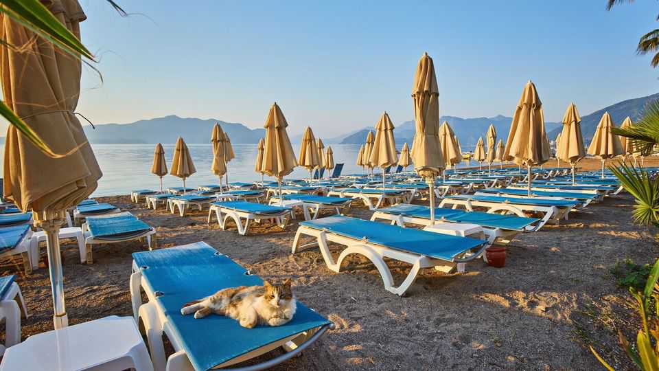

Europe | Wish you were here
Fires, earthquakes and inflation are putting tourists off Turkey
Greece is a big rival too
September 4th 2025

AS THE SUMMER draws to a close, Turkey’s tourism industry is counting the cost. For the fifth year in a row, huge swathes of the country have been incinerated by forest fires. The areas worst affected, along the Mediterranean and Aegean coasts, are also the centre of the holiday business, and this year’s blazes are just the latest misfortune to befall it: in 2020, the covid-19 pandemic and the Turkish government’s tight travel restrictions saw visitor numbers drop by 90%. This year there have also been hundreds of earthquakes in the Aegean, sparking fears that a really big one is coming. And on top of it all is Turkey’s inflation, which stood at 33.5% year on year in July and is robbing the country of its reputation as a budget getaway.

Tourists, both domestic and foreign, are increasingly choosing all-inclusive resorts, which set their prices months in advance and work alongside tour operators on economies of scale, over smaller hotels and self-catering accommodation, which are being squeezed. “Even long-stay visitors who traditionally stayed in self-catering apartments are now opting for all- inclusive resorts,” says Sedat Kirt, the deputy mayor of the Aegean district of Marmaris, which relies heavily on tourism.

In this, Turkey has an advantage: the all-inclusive model is the basis of the sun, sea and sand tourism that forms a major part of its travel industry. More than 62m visitors came to Turkey last year, and tourism receipts account for 12% of GDP. But the all-inclusives are bad news for restaurateurs, independent tour guides and shopkeepers, as well as smaller hoteliers who work independently of the large operators and are forced to keep their prices low in order to remain competitive. Though the value of the lira is falling, making the exchange rate attractive on paper, at the checkout desk that is outweighed by inflation. “Prices outside the hotels have increased rapidly,” says Mustafa Deliveli, a hotel owner in Marmaris. “I notice that guests are spending more time in the hotel rather than outside.”

Even Antalya, the biggest hub for all-inclusive hotels in Turkey and which on its own accounted for more than a quarter of the country’s visitor arrivals last year, has felt the decline. Visitor numbers had already dropped by 30% in the first quarter of 2025 compared with the previous year, with foreign arrivals dipping the most. Meanwhile Turks, who are suffering from a long- running cost-of-living crisis, are taking fewer domestic holidays and in some cases are choosing instead to go to Greece’s Aegean Islands, which opened a visa-on-arrival programme last year. When they get there, they find that prices in the euro zone are often cheaper than those at home.

In Marmaris, hotel occupancy rates in June hovered between 60% and 80%, and for the rest of this season hotels will have to depend on last-minute bookings. Mr Kirt also has longer-term worries. If current climate trends continue, the Mediterranean may soon become too hot, not to mention dangerous, for summer travel. Neither do Marmaris and other coastal-resort regions, all of which are controlled by the main opposition party at local level, get sufficient promotional or financial support from the central government, he says. When the region was hit by devastating fires in the

summer of 2021, President Recep Tayyip Erdogan provoked fury by casually tossing packets of tea to locals. The municipality is now focusing on out-of-season events to try to bring in year-round tourism, including staging sailing regattas, a seafood festival and even a local version of Bavaria’s Oktoberfest. ■

To stay on top of the biggest European stories, sign up to Café Europa, our weekly subscriber-only newsletter.

This article was downloaded by zlibrary from https://www.economist.com//europe/2025/09/04/fires-earthquakes-and-inflation-are- putting-tourists-off-turkey