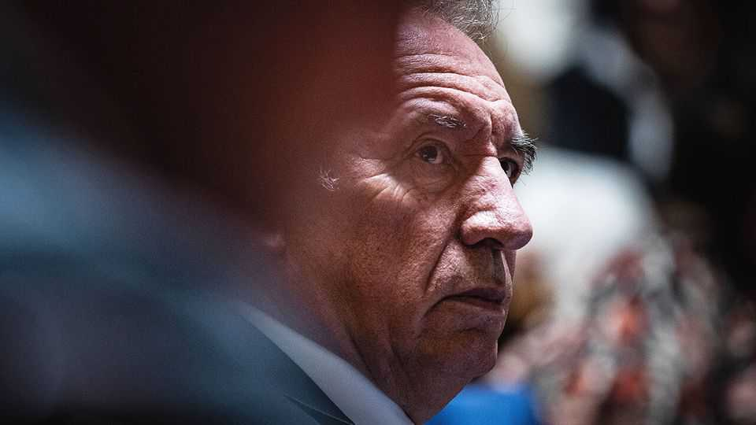

Europe | France’s government
Bayrou on the brink
Emmanuel Macron looks likely to lose yet another prime minister
September 4th 2025

The last time France went through five different prime ministers within two years was in the 1950s—nearly three-quarters of a century ago. That was under its chronically unstable Fourth Republic. Now under a different constitution (the Fifth Republic), designed in 1958 to secure stability, the country is on the brink of matching that unhappy record. François Bayrou, the current centrist prime minister, has scheduled a vote of confidence for September 8th over his unpopular deficit-reduction plans. Despite a last- ditch scramble for votes this week, a hostile parliament looks likely to bring his government down, and plunge France into yet more uncertainty. On September 2nd the yield on France’s ten-year bonds reached nearly 3.6%, its highest level for 14 years.

Mr Bayrou decided unexpectedly to recall parliament for the vote after opposition parties on the left and hard right threatened to reject his plans to make €44bn ($51bn) in budget savings in 2026. Given France’s high level of public debt (worth 114% of GDP) and the need to curb the budget deficit, which is running at 5.4% of GDP this year, the prime minister was hoping that such parties might at least agree on the need for such savings. Indeed, this narrow question is the one he will put to parliament in a speech before the vote.

But Mr Bayrou runs a minority government, and the National Assembly is split into three hostile blocs. To rescue his job he needs support from either Marine Le Pen’s hard-right National Rally (RN) or the Socialists, as well as other abstentions(Jean-Luc Mélenchon’s hard left was never going to co- operate). Both parties, however, instantly ruled it out. This week a succession of party chiefs filed into the prime minister’s office for last- minute talks. “No miracle happened,” noted Jordan Bardella, the RN party president, after he and Ms Le Pen met Mr Bayrou on September 2nd. They want President Emmanuel Macron to dissolve parliament and call fresh elections. For his part, Olivier Faure, the Socialist leader, this week offered his help forming a new government. He wants a less ambitious budget for 2026, based on only €22bn of net savings.

Either way Mr Bayrou’s days look numbered. “He’s toast,” says one of Mr Macron’s deputies. “We’re back to square one.” With protests and strikes planned on September 10th and 18th, chatter in Paris this week turned to what happens next. It is unlikely Mr Macron will call fresh elections immediately. The last time he did so, in June 2024, he shrank his own minority group in parliament. If another vote were held today, the RN and its friends would top first-round voting with 33%, according to Ifop, a polling group, well ahead of the four parties of the left, which might garner a combined 25%. Mr Macron’s centrists might get a miserable 15%.

Instead the president is expected to appoint yet another prime minister, in an effort to get a budget together for 2026. But the choices are limited. Mr Faure would be no better placed to secure a majority, not least because none other than his own left-wing ally, Mr Mélenchon, this week called the Socialist leader’s offer of service “dismaying”, and insisted that his party had nothing to do with it. Another prime minister from the centrist group,

such as Sébastien Lecornu, the defence minister, or Gérald Darmanin, the justice minister, would face exactly the same difficulty in breaking the parliamentary stalemate.

When it comes to Mr Macron, a surprise can never be ruled out, though not one that would involve himself stepping down. In the face of various calls for his resignation, the president has insisted that he will serve out his full second term, which runs until 2027.

This month he has a busy international diary, including France’s plan to recognise a Palestinian state at the UN General Assembly in New York. So if Mr Bayrou falls, as expected, the president will be keen to move fairly swiftly to name a new prime minister—his fifth since January 2024. This would put an end to one element of uncertainty. But it would do almost nothing to solve the political instability that has paralysed France for 15 months. ■

To stay on top of the biggest European stories, sign up to Café Europa, our weekly subscriber-only newsletter.

This article was downloaded by zlibrary from [https://www.economist.com//europe/2025/09/04/bayrou-on-the-brink](https://www.economist.com//europe/2025/09/04/bayrou-on-the-brink)