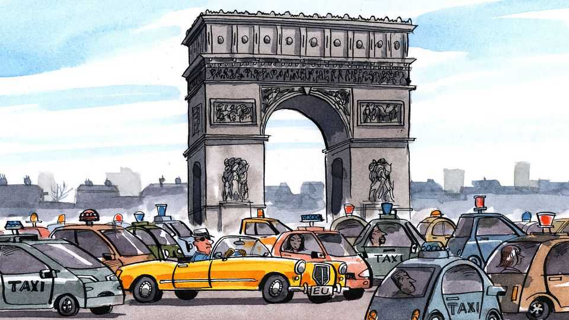

Europe | Charlemagne
Robotaxis will be the Sputnik Moment for a declining Europe
A slow-motion car crash on Europe’s roads
September 4th 2025

The rond-point de l’Étoile in Paris is where urban planning sets the stage for existential angst. In the shadow of the majestic Arc de Triomphe, hundreds of drivers converge from a dozen directions, swerving across eight lanes of a roundabout stretching half a kilometre round. In the absence of road markings or discernible rules—who needs them, anyway?—drivers trace circles that seem to promise escape only to later confirm the futility of the attempt in a way that might have been staged by Jean-Paul Sartre. Each honk is a reminder that choice cannot be avoided; each swerve, an assertion of will. Hell is other drivers, but giving up is impossible, one must trudge on, c’est la vie! Out of this anxious improvisation most cars end up propelled,

through an alchemy of will and fate, to roughly where they had intended to go.

If humans barely manage this, how about machines? Cars that drive themselves are becoming commonplace on the streets of ever more cities in America and China. Around a quarter of ride-hailing journeys in San Francisco are now made in cabs with no human at the wheel. Over 2,000 such robotaxis ferry millions of passengers a year in Wuhan, Shanghai and other Chinese cities without incident. The numbers are going up day by day as more cities are included. Yet a technology that is starting to feel humdrum in Guangzhou or Phoenix still seems like science-fiction in Warsaw or Rome. Fully driverless cars are barely being tested in Europe, let alone being made available to paying passengers. Few firms there are anywhere near the front lines of innovation. Will the absence of robotaxis in Europe mark the moment its citizens notice how far the continent has fallen behind?

Europeans are by now well used to being left in the technological dust. From the iPhone to TikTok by way of semiconductors and artificial-intelligence, newfangled products that delight consumers are inevitably imported from China or America these days. This exasperates politicians and investors. In contrast, consumers may not care much. The average European has access to the latest smartphones, ChatGPT models and so on, at more or less the same time as the denizens of the countries that invented them, after all. But driverless cars look as though they could be different: a technology that is not developed in Europe and not available to Europeans either, at least not for a while. Idiosyncratic roundabouts are one challenge for the peddlers of robocars. A bigger one is the steady ascent of policymakers in the European Union who fret about the bloc getting hooked on yet more foreign tech.

The reasons why European firms haven’t been at the forefront of this latest gizmo race will be depressingly familiar to those who have been tracking the continent’s economic plodding. Developing robotaxis to the point where they could be deployed has cost perhaps $100bn. Most of that has been invested by giant tech groups with multi-trillion dollar valuations like Google; or through venture-capitalists willing to take a punt on a speculative venture (in China the authorities’ eagerness for the technology helps loosen purse-strings there). Europe has neither, in part thanks to its fragmented single market. What it does have are large carmakers (one of which,

Stellantis, is part-owned by a group that is also a shareholder in The Economist’s parent company), which also have an interest in driverless cars. But their focus has been on tech that helps human drivers stay in their lane and keep a steady speed rather than outright replacing them. Going fully driverless would risk cannibalising incumbents’ sales, as people might hire robotaxis from time to time rather than own their own wheels. In any event, most European carmakers are focusing their research budgets on electric motors to replace internal-combustion engines, the sale of which will be banned in the EU by 2035.

Could Europeans not do with driverless cars what they did with iPhones, ie, simply import the end product that some clever foreign firm has developed? Perhaps. But a mood of technological nativism has enveloped the continent in recent times. On everything from F-35 jets to microchips, policymakers fret that Europe has become too dependent on China and America. Such a protectionist-adjacent agenda was once the purview of the French. It is now far more widespread. Today’s European Commission has a vice-president for “technological sovereignty”. Silicon Valley behemoths are already tricky for Brussels to regulate, not least when the Trump administration rails against EU rules on free speech or competition. Relying on Chinese tech is, if anything, more angst-inducing. Allowing a sensitive technology— driverless cars double as giant snooping machines, after all—sets many nerves jangling.

Worse, a free-for-all in driverless cars would result in foreign firms profiting at the expense of Europe’s incumbent carmakers—huge employers with the lobbying heft to match. As policymakers craft the new rules needed to accommodate robotaxis, the temptation will be to throw a bit of sand in the gears of those Chinese and American leaders, in the hope that Euro-rivals can catch up. Something similarly protectionist is being tried in the case of Chinese electric vehicles, which the EU hit with tariffs in 2024.

The risk for Europe’s politicians is that their citizens will soon realise that they are missing out. Returning from a holiday abroad having seen tech in action that is nowhere near reality at home will be a sobering moment for Europeans. Perhaps that feeling of being left behind will have a galvanising effect. In 1957 the American public clocked that the Soviet Union had pulled ahead in the space race when the first man-made satellite beeped down from

the sky. That “Sputnik moment” helped jolt America into action. Europe has fallen further, and more durably, behind both its rivals when it comes to tech. Its coming robotaxi moment would be the right time to get out of the slow lane. ■

Subscribers to The Economist can sign up to our Opinion newsletter, which brings together the best of our leaders, columns, guest essays and reader correspondence.

This article was downloaded by zlibrary from https://www.economist.com//europe/2025/09/04/robotaxis-will-be-the-sputnik-moment- for-a-declining-europe

Britain

The Farage power project Will British shipbuilders rule the waves again? How can a middle power compete in artificial intelligence? A cyber-attack isn’t enough to halt Marks and Spencer’s turnaround How the M&S strawberries-and-cream sandwich went viral How to take over a government via PDFs