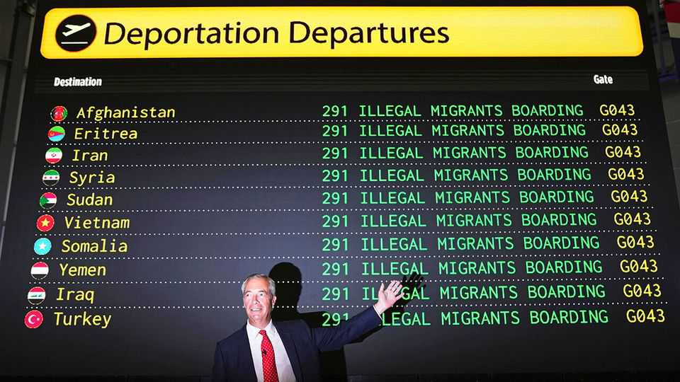
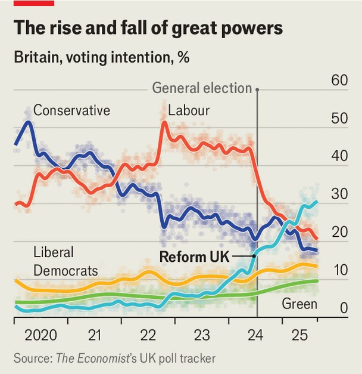

Britain | Reform UK
The Farage power project
Reform UK, on track for government, wants to turn back the constitutional clock
September 4th 2025

Why did Doge, the bureaucracy-slashing project of Donald Trump’s administration, fizzle after 130 chaotic days? The volatility of Elon Musk, its architect and enforcer, was a big factor. Zia Yusuf has another theory, which carries weight because of who he is: Nigel Farage’s right-hand man heads “Reform UK DOGE”, as Britain’s hard-right party terms its own cost- cutting unit. Mr Musk’s main obstacle, he says, was the insistence of America’s Founding Fathers that Congress controls the federal budget to which Mr Musk sought to take a chainsaw. And there, Mr Yusuf tells The Economist, lies the bull case for Great Britain. Because it has a far weaker separation of powers than America, a prime

minister who is elected with a working majority in the House of Commons would have far greater control over domestic policy than a president. A British Musk could cut at will.

That, in a nutshell, is Reform’s project for government: the blitzkrieg on the institutions of Donald Trump, enabled by the weak checks and balances of Britain’s unwritten constitution. On Sept 5th-6th Mr Farage will present his plans for a Reform government at a glitzy party conference in Birmingham. This is a plausible prospect. The party leads the national polls, at 31%, according to The Economist’s poll tracker. A simple calculation based on uniform national swing suggests it would have an almost one-in-two chance of a majority if an election were held tomorrow. Its success is fuelled by discontent over immigration and a perception of skewed policing.

But in Mr Yusuf’s telling, underlying the anger felt on the streets is a constitutional problem. Britons no longer believe in institutions, he says. They fail to do their job, and when voters demand change they work to sabotage it. Reform’s project is a restorationist vision, which promises to turn back the clock several decades to an imagined age in which the checks on executive power were looser, international treaties less binding and in which ministers rather than arm’s-length agencies made the decisions. The

decentralising government of Sir Tony Blair is, in this tale, the point where things went wrong.

And so in government, Reform would take the orthodox principle of parliamentary sovereignty and use it as a hatchet against perceived constraints on its agenda. Putting Westminster politicians, not unelected technocrats, back on top was the essence of Brexit, Mr Farage’s first crusade. In government he seeks to finish the job. “This is the spirit behind our constitution in this country,” says Mr Yusuf. “The will of the people must be obeyed, right?”

For all the talk of strengthening Parliament, a Farage premiership would have a presidential streak. Since 1945 the British cabinet has been drawn mostly from elected MPs. That, says Mr Farage, is a recipe for mediocrity and patronage; his would be formed of appointed business leaders and other outsiders, as in America. Since he dominates his party, he does as he likes. The hyperbole is Trumpian too; Mr Farage will be “even more transformative than Thatcher”, reckons Mr Yusuf.

One goal would dominate: the promise to deport some 600,000 illegal migrants in five years, a project termed “Operation Restoring Justice”. The first acts would be to denounce the international treaties that stand in the way, including the Refugee Convention and the European Convention on Human Rights.

Other constraints on executive power would be loosened too. The party values Britain’s independent judiciary, Mr Yusuf says, but all the same its deportation law will be drafted with the intention of precluding judicial review. (Reform’s own draftsmen will do the job in opposition, taking a dim view of the government’s lawyers.) Britain’s senior civil service would be cleared out in favour of apolitical appointees, Mr Yusuf says; a permanent bureaucracy is nice in theory, but one now “totally captured” by ideologues. He expects a titanic clash with the House of Lords. Speed would be of the essence and the party claims it will have stacks of legislation and lists of appointees ready for its first day.

Reform is following a path set by its rivals. The notion that parliamentary sovereignty is a get-out-of-jail card from international treaties was promoted

by Conservative governments in their own push to reduce migration. Sir Keir Starmer, the prime minister, also believes the centre of government is too weak and sclerotic, hence his recent appointment of a new “chief secretary to the prime minister” to enforce his writ on September 1st.

But the idea that there was ever a “golden age” in which politicians were unconstrained by the courts or international law is “considerable oversimplification”, says Mark Elliott, an expert on constitutional law at the University of Cambridge. While the legal checks on the executive have grown, there is nothing novel in the idea that Britain honours its treaties, he says, or that the theoretical capacity of Parliament is tempered by judicial review.

The greatest constraint will come from Reform itself. Mr Farage has a long record of feuds, which in office can be a recipe for paralysis. The party has four MPs. Mr Yusuf stands out in Mr Farage’s beery circuit: a 38-year-old Muslim, who worked at Goldman Sachs and made a fortune founding a luxury travel app, he speaks in the slide-deck terms of “high-agency people”. Many of the actual policies are still vague and poorly costed. But for now, Reform trumpets its inexperience as an asset. “We get this all the time. ‘You don’t know what you’re doing, you’re not the professionals’,” says Richard Tice, Mr Farage’s deputy. “If the professionals and the experienced politicians have been in charge for the last 20 years, how’s that working out?”■

For more expert analysis of the biggest stories in Britain, sign up to Blighty, our weekly subscriber-only newsletter.

This article was downloaded by zlibrary from [https://www.economist.com//britain/2025/09/04/the-farage-power-project](https://www.economist.com//britain/2025/09/04/the-farage-power-project)