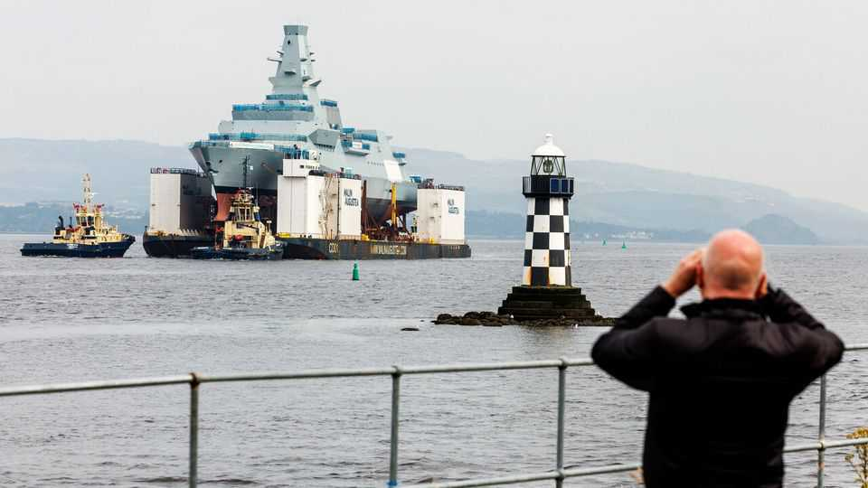
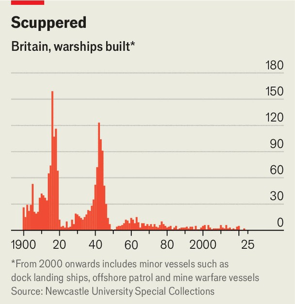

Britain | The warship business
Will British shipbuilders rule the waves again?
Britain’s naval dockyards prepare for a building boom
September 4th 2025

Norway last procured British-built warships in 1899. Assembled on the river Tyne in Newcastle, the two hulking Eidsvold-class battleships served as the flagships of the Norwegian fleet for nearly half a century. Now the country is again turning to British dockyards to replenish its navy. On August 31st the Norwegian government announced its biggest (single) defence investment to date: a £10bn ($13.5bn) contract for five Type 26 submarine- hunting frigates, to be built by BAE Systems at its facilities on the river Clyde in Glasgow. It marks Britain’s highest-value warship export deal ever. The order is part of a wider boon for the country’s naval shipyards. After decades of atrophy, they are finally again abuzz with the clanging of steel and sizzle of welding sparks. The Royal Navy’s surface fleet alone is

expected to grow to 24 frigates and destroyers by the mid-2030s, its most significant expansion in decades. As Britain and other European countries ramp up their defence spending, industry insiders believe this could revitalise the country’s once-mighty shipbuilding industry and usher in a new golden age.

Around 1900, Britain built 60% of all the world’s ships. Today it builds less than 1%. A shrinking empire and navy, and competition from lower-cost Asian shipbuilders, gutted the industry. In an attempt to save it, shipbuilding was nationalised in 1977, only to be reversed six years later. Today most shipyards have all but abandoned commercial shipbuilding. Instead, the Royal Navy buys the bulk of ships built in Britain. That has left shipbuilders exposed to cycles of boom-and-bust. As the conclusion of the cold war ended demand for big navies, British warship production plummeted (see chart). The number of firms making warships dropped from over a dozen in 1960 to just two today: BAE Systems and Babcock.

But the tide has begun to turn. The previous government in 2022 announced a shipbuilding strategy which included an order pipeline of 150 naval and civilian ships spread over 30 years. This should give firms greater clarity and continuity. “Momentum is gathering,” enthuses Sir Simon Lister, the

managing director of BAE’s maritime services. “I’m more optimistic than I have been for a long time.”

Amid such bullishness, BAE is investing some £300m in its shipyard at Govan on the River Clyde near Glasgow, where it recently opened the largest shipbuilding hall in the country. After years of programme delays on the Type 26, the company predicts the extra space will cut construction time on each ship by around a third. It is confident about delivering all eight Type 26s frigates for the Royal Navy by 2035. The Norwegian order means it will be building at least one ship a year well into the 2030s. In response BAE is rapidly expanding its workforce, investing £12m in a new welders academy, where it plans to take on some 200 apprentices a year. “The biggest risk to delivery right now is whether we can respond to all of that [demand]”, says Sir Simon.

Britain’s shipbuilding prowess is helping bolster the country’s geopolitical clout, too. Take AUKUS, a pact signed by Britain, Australia and America in 2021. Under its terms, Britain and Australia will jointly design and build an advanced nuclear-powered submarine, dubbed SSN-AUKUS. Australia plans to build five and Britain 12 such submarines, some of which will patrol the Pacific. In a similar vein, the Type 26 deal with Norway could see the “interchangeable use” of British and Norwegian sailors on joint patrols in the North Atlantic to hunt Russian submarines.

For all the newfound optimism, funding remains a problem. On current spending trends, Britain’s shipbuilding pipeline could face a £5.9bn funding shortfall, warns the National Audit Office, a watchdog. And although the government says it is committed to NATO’s spending target of 3.5% of GDP on defence, it is unlikely to meet that until some point in the 2030s. For shipbuilding to embark truly on a new golden age, the government will need to stump up. ■

For more expert analysis of the biggest stories in Britain, sign up to Blighty, our weekly subscriber-only newsletter.

This article was downloaded by zlibrary from https://www.economist.com//britain/2025/09/04/will-british-shipbuilders-rule-the- waves-again