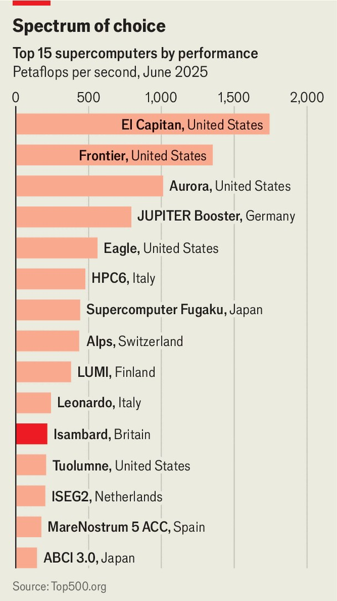

Britain | Meet Isambard AI
How can a middle power compete in artificial intelligence?
A tour of Britain’s newest supercomputer
September 4th 2025

IN A CAR PARK on the outskirts of Bristol in south-west England, security is unusually tight. Anti-crash barriers block the entrance to a fenced compound bristling with cameras and barbed wire. At night two dog units patrol beneath a pair of large black gates. “We call them Jurassic Park gates because they look like there should be a Tyrannosaurus or something behind here,” says Simon McIntosh-Smith, a professor at Bristol University, as the pistons hiss open. Behind them is no dinosaur, “just a supercomputer”. “Just” is an understatement. The gates cost around £250,000 ($339,000). Isambard AI, the country’s newest and biggest computer, cost almost a thousand times more (plus millions in running costs). Its black cabinets are

filled with blades, each holding copper-plated GPUs cooled by thick red and blue water pipes. Cables twist along the ceiling, hinting that Isambard has more computing muscle than all other British supercomputers combined.

It was, in truth, a panic buy. In 2023 Rishi Sunak, then prime minister, was promoting Britain as a science-and-technology “superpower”. Yet as the world obsessed over ChatGPT, “the UK didn’t really have any AI infrastructure,” admits Professor McIntosh-Smith, director of the Bristol Centre for Supercomputing. In hi-vis jacket and steel-toed boots, he apologises for the building site he surveys; but for once the mess is testament to a British infrastructure success, not a failure. A supercomputer typically takes four to five years to build. Isambard was commissioned in August 2023; it was switched on in July.

This is far from enough to turn Britain into a computing colossus. Finland, Germany, Italy, Japan and Switzerland all have more powerful resources (Isambard is the world’s 11th-fastest supercomputer, see chart). More broadly, Britain is deficient in the resources to match other middle powers in building data centres. The UAE has oil wealth and abundant solar power, and Canada has cheap energy (and land), notes Alex Krasodomski of Chatham House, a think-tank. Britain, by contrast, has some of the most expensive electricity in Europe.

Sir Keir Starmer, Mr Sunak’s successor, has pledged £2bn for AI investment, including £750m for a supercomputer in Edinburgh. That is a rounding error next to the $320bn America’s biggest tech firms will spend this year alone on AI infrastructure. Perhaps unsurprisingly, the biggest advocate of “sovereign AI” is Jensen Huang, the boss of Nvidia, whose firm supplied the 5,448 chips inside Isambard. In June Mr Huang schmoozed Sir Keir at a London tech event, praising Britain’s AI potential (before moving swiftly on to Paris). Left unsaid was that if the AI race is winner-takes-all, then third place after America and China will yield few prizes.

Even so, Britain has reason to try to stay in the game. “No one knows how [the AI race] plays out,” says Guy Podjarny, founder of Tessl, a startup that uses AI to help software developers write code. The winners could be those with the smartest models—or those building applications on top of them, using the models as a utility. Either way, data and applications will matter, and infrastructure will be needed for Britain to carve out a niche.

Britain’s best chance lies in nurturing AI talent. It is a world leader in machine-learning research. DeepMind, Google’s AI arm, and Wayve, a promising self-driving-software firm, are already based in London’s King’s Cross. The question, says Matt Clifford, until recently the government’s AI czar, is “How do we make this the best place in the world to try radically ambitious ideas that aren’t in the current paradigm?” One answer is to build hubs like Isambard for “frontier AI” model training. Professor McIntosh- Smith says the machine is already drawing researchers from America, Switzerland and the EU.

Isambard is not big enough to train the largest language models. It will, however, enable other research breakthroughs. Dima Damen’s team at Bristol University helped build the world’s largest dataset captured by wearable cameras. Until Isambard, they lacked the processing power to use it. Professor Damen now hopes to train models that can recognise actions and predict intentions—videos which in future may be able to prompt people with dementia (and also help train home robots).

Around 80% of the 100-plus current projects are in life sciences and health, from skin-cancer detection to drug design. One of Britain’s greatest opportunities, suggests Mr Clifford, could be using AI to reimagine public

services like the health-care system. Some projects are eccentric: monitoring cow behaviour to detect early signs of infection, or moth wings to help develop soundproof wallpaper. But the aim behind Isambard is serious. It takes its name from Isambard Kingdom Brunel, a Victorian pioneer who helped engineer the Industrial Revolution by building bridges, railways and tunnels. If Britain wants a stake in the next revolution, it will need more of the infrastructure of the future. ■

For more expert analysis of the biggest stories in Britain, sign up to Blighty, our weekly subscriber-only newsletter.

This article was downloaded by zlibrary from https://www.economist.com//britain/2025/08/31/how-can-a-middle-power-compete-in- artificial-intelligence