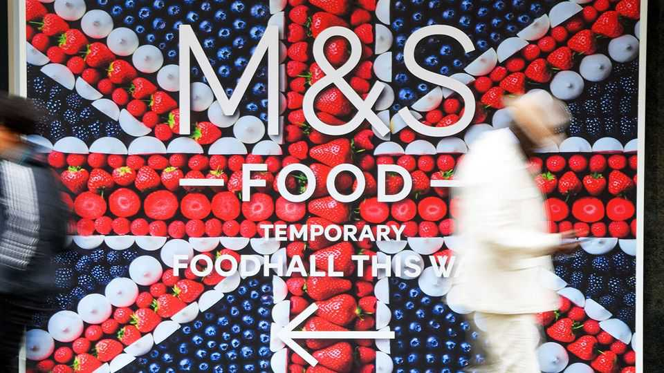
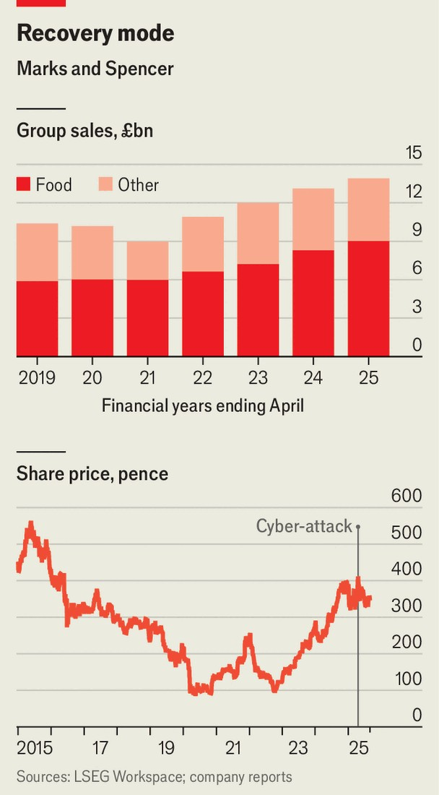

Britain | M&S
A cyber-attack isn’t enough to halt Marks and Spencer’s turnaround
M&S food is becoming cheaper and less posh; its clothes pricier and fancier
September 4th 2025

On April 18th Stuart Machin, the boss of Marks and Spencer (M&S), received a phone call every chief executive dreads: his security team had detected a cyber-attack on the retailer. The timing couldn’t have been worse. It was the start of a sunny Easter weekend and Brits were splashing out on summer dresses and picnic food. For the next two weeks Mr Machin and his team slept in the office. Most of the firm’s systems had to be switched off. Without the technology that links stores and warehouses, food went to waste. The website, through which one-third of M&S fashion, home and beauty is sold, was down for

around six weeks. The stock dropped by almost 14% in that period, while competitors like Next rallied. Once most of the business was back up and running, M&S estimated it had lost a total £300m ($405m) in operating profit as a result of the attack, roughly one-third of what it made last year. Mr Machin, otherwise frenetic, is sombre on the topic. “It’s quite hard, if I’m honest, reliving it,” he says. “It takes its toll.”

A few years ago an incident like this could have been fatal. M&S was to the retail industry what flip-phones are to telecoms. Some of its stores were drab and in poor locations. The website was clunky. The firm has 32m customers around the world, but Britain is its main market. Some 96% of Brits live within 25 minutes of a “Marks”. But its food was long viewed as pricey, if good quality, and its clothes cheap but unfashionable. In the 2021 financial year the firm, battered by Brexit and covid-19 lockdowns, reported cratering sales and pre-tax losses of over £200m.

Since 2022, when Mr Machin took over, M&S has begun to transform from a somewhat tired British institution to a once-again growing business. In the 2025 fiscal year, sales gained more than 6% year-on-year, while profits before tax and adjusting items rose by 22%. Mr Machin’s annual remuneration jumped to £7m thanks to performance bonuses. Shortly before the cyber-attack the stock rallied to its highest level since the Brexit vote.

“M&S has been about to be turned around for a generation, but it never delivered,” as Richard Hyman, a retail analyst, puts it. “Until now.”

At the core of the turnaround is an improved product range. Today, Britons go to M&S for much more than sensible underwear and its iconic Percy Pig sweets. In food, which accounts for over 60% of sales, M&S has long been popular for treats ahead of festivals like Easter or for sandwiches to eat on the go. It is trying to become a place where people do their weekly shop. That means selling more items in family-size packs and slashing the price of essentials, such as bananas and crackers, to match competitors. NIQ, a data provider, estimates M&S’s share of the British grocery market has crept up over the past four years from 3.4% to 3.8%.

The change in M&S fashion has been in the opposite direction. Maddy Evans, who took over womenswear in 2022, began by trimming the range to remove duplicate items and outmoded ones. (Her pet peeves were the vast array of black trousers and a pair of ruched boots shaped like “a Cornish pasty”.) Then she raised prices and added more stylish products to draw younger shoppers. In jeans, for example, the share of dated skinny styles has dropped to 30% from 70% three years ago. By sourcing more from Turkey rather than China, M&S has been able to roll out clothing faster in response to trends. Collaborations with celebrities like Sienna Miller, an actress, have boosted the brand’s image. Menswear has been glamourised, too.

Sales in the fashion division are rising after years of decline. Estimates from Deutsche Bank suggest three-quarters of clothing now sells at full price, up from half a couple of years ago.

Even chic products don’t sell in grim stores. With that in mind M&S has been investing in its property portfolio. The goal has been to cut down the vast store portfolio to around 420 food halls and 180 full-line stores by 2028. At M&S in Battersea Power Station in London the store manager, Camilla Harris, explains how new racks, wooden hangers and careful presentation give clothing aisles a swanky look. Food stores, which require freezers and bakeries, are more expensive to refurbish. Over 60% of the firm’s £578m capital spending last year went into stores and other property. The investment seems to be paying off. Return on capital employed, adjusted for

various things, jumped to 16.4% last year, from 12.2% in 2022, the last full financial year before Mr Machin took over.

All this goes some way to explaining how M&S survived a cyber-attack in which reams of customer data were stolen. Analysts say the firm did a good job communicating with the public and staffing up customer-service lines. It helps that other retailers, including Harrods, have faced similar attacks. Estimates from Kantar, a market researcher, suggest consumer sentiment around M&S has improved slightly since the attack, even as opinion on some competitors has dipped. Analysts reckon a large chunk of the £300m estimated cost will probably be covered by insurance.

The cyber-attack did, however, highlight another area of the business that is in need of investment: its technology infrastructure. Kate Calvert at Investec, a bank, describes the retailer’s tech platforms as “from a different generation”. Adam Cochrane at Deutsche Bank says they have been “cobbled together” over time. For customers, the M&S website is tough to navigate and bland to look at. Behind the scenes the firm has far too many applications, which require a vast team to operate. It also has too many distribution centres. And it is a long way from the slick automated warehouses that help competitors like Amazon keep costs low.

But there, too, change is under way. In August the company announced plans to spend £340m building a 1.3m-square-foot (120,770-square-metre) automated distribution centre for food, the biggest such investment in its history. Efficiencies from such ventures will be crucial for M&S to keep up its recent pace of growth.

It is a tough time to be a retailer. Inflation remains high. Trade wars have supply chains in flux. And the cost of doing business in Britain is rising.

Mr Machin estimates that recent changes to National Insurance, a payroll tax, will add some £60m to the firm’s costs this year, while new recycling rules will add another £40m. The retailer will feel the pain from added costs. It makes net profit margins of around 5% on food and 11% on fashion, home and beauty. “Take the shackles off,” Mr Machin implores the Labour government. “Let us go for growth and then you’re going to get more income tax and everyone is going to benefit.”

M&S has shackles of its own. Its investment in Ocado Retail, a loss-making online grocer, has been a disaster ever since it was agreed on in 2019. In the last financial year M&S posted a £250m non-cash impairment on its 50% stake in the business, dragging pre-tax profits lower. Then there is Marks’s international arm. The retailer sells in over 30 markets outside Britain. Its sales abroad are in decline.  In India, where it operates through a joint venture with a local giant, Reliance Retail, M&S products and prices are poorly tailored to local tastes and budgets. Some analysts also worry that Mr Machin, who gets involved in everything from writing public statements to reviewing new products, is not the sort of boss many senior executives want to work for.

In some ways M&S, with an older clientele, drab brick-and-mortar stores and a slow entry into online groceries, should be floundering. Countless retailers, like Debenhams and Topshop, have disappeared from British high streets. But this is not just any retailer. This is M&S.■

For more expert analysis of the biggest stories in Britain, sign up to Blighty, our weekly subscriber-only newsletter.

This article was downloaded by zlibrary from https://www.economist.com//britain/2025/08/29/a-cyber-attack-isnt-enough-to-halt- marks-and-spencers-turnaround