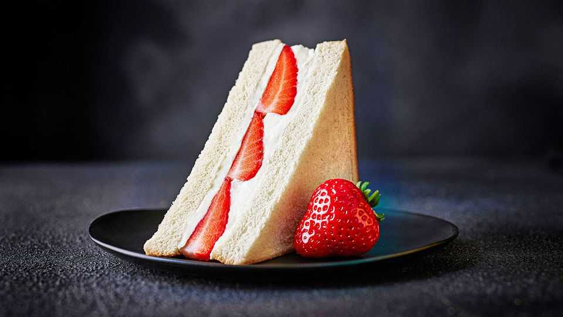

Britain | Sweet spot
How the M&S strawberries-and-cream sandwich went viral
It wasn’t the taste that did it
September 4th 2025

The hottest item in Marks and Spencer food halls this summer was as British as can be: a sandwich filled with strawberries and cream. The retailer launched it around the Wimbledon championship, a tournament viewers enjoy not just for the tennis but also for sightings of celebrities digging into cups of fruit and popping champagne. The “sando” quickly went viral on social media. Within weeks, M&S announced it had sold more than 1m of them. Tesco, a rival grocer, launched a jam-and-cream “birthday-cake sandwich” soon after.

Analysts grew obsessed with the product for what it says about retailing in the age of social media. M&S has long been known for its Percy Pig sweets and Colin the Caterpillar cakes. Now it is constantly launching products in response to online trends. Think pistachio chocolates, drinks that contain Lion’s mane, a fungus that is supposed to be healthy, and anything drizzled in “hot honey”, a sticky sweet-and-spicy sauce.

Marks and Spencer works with social-media influencers to peddle these products. A viral snack is just the sort of pick-me-up shoppers are looking for at a time of economic stagnation.

Economists became interested in the product for another reason. It wasn’t clear if M&S charged customers 20% value-added tax on the product, the standard rate for confectionery, or skipped the charge, as is the rule with some other food products, such as cold sandwiches. McVitie’s, a British foodmaker, fought a famous legal battle on this issue over its Jaffa Cakes, orange-jelly-sponge creations that look a lot like biscuits but that the taxman eventually decided are cakes.

In all the excitement one thing has been forgotten: flavour. Opinions on the strawberries-and-cream sandwich have been split. “Wow, that’s quite nice,” exclaimed one YouTube reviewer. “Goodness me!” Critics at a fashion magazine, by contrast, said it “proved to be a lot to digest”. Your correspondent took one bite before trying to pass it on to colleagues. Within weeks of its launch the sandwich, priced at £2.80 ($3.76), was being discounted by late afternoon in some stores.

No matter. Viral products boost sales because lots of customers buy them once, just to try. M&S launched the sandwich as a limited-edition product. It was taken off the shelves in August when peak summer ended and the strawberry—and silly—season with it. ■

For more expert analysis of the biggest stories in Britain, sign up to Blighty, our weekly subscriber-only newsletter.

This article was downloaded by zlibrary from https://www.economist.com//britain/2025/09/04/how-the-mands-strawberries-and-cream- sandwich-went-viral