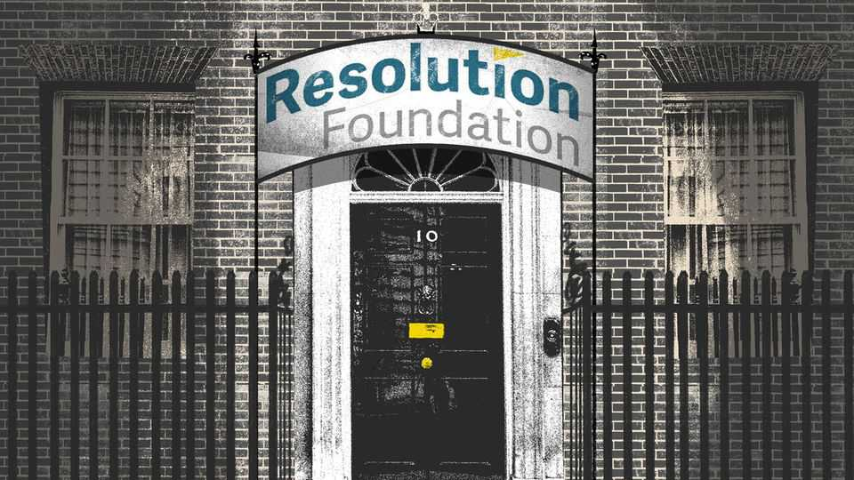

Britain | Bagehot
How to take over a government via PDFs
The long march of the Resolution Foundation
September 4th 2025

Skip through the cvs of the recently promoted and appointed in the Labour government and a pattern emerges. Torsten Bell, the boyish pensions minister, now has the unenviable task of helping pull together a painful budget. Before entering Parliament, Mr Bell spent nine years as the chief executive of the Resolution Foundation (RF), a centre-left think-tank. Minouche Shafik, a former deputy governor of the Bank of England, is now Downing Street’s economic adviser. She was the co-chair of rf’s The Economy 2030 Inquiry. Dan Tomlinson, an even more boyish mp and a former economist at RF, is now a Treasury minister. Overseeing this reshuffle? Vidhya Alakeson, the deputy chief of staff in Downing Street and formerly rf’s deputy chief executive.

If the fate of Labour’s spending plans is now in the hands of RF veterans, its supply-side agenda always was. Matthew Pennycook, the housing minister and another former RF researcher, oversees the party’s planning reforms— the keystone of its growth strategy. Even David Willetts, the long-standing president of RF, chairs Labour’s “Regulatory Innovation Office”, which ensures that red tape does not throttle progress. Judging the economic effect of such reforms is a tricky job, which falls to Richard Hughes, the head of the Office for Budget Responsibility. Luckily, he can call on his experience as a former research associate at RF.

To understand how Britain is run, walk away from Whitehall, turn right at the Houses of Parliament and head to 2 Queen Anne’s Gate. This 19th- century townhouse, opposite the pub where Treasury officials mingle post- budget, is home to rf, which since its founding in 2005 has become arguably Britain’s most influential economic institution. What began as a think-tank aimed at helping the poor has, somehow, ended up running the country.

Its rise starts with its founder. Sir Clive Cowdery can claim to be one of the most consequential men in politics even if few know who he is, even in Westminster. After a rough childhood, Sir Clive left school with no A-levels before making pots of cash in insurance. He put some of that money towards a pdf mill dedicated to helping those from similar circumstances.

Gaining influence in a G7 economy is cheap. At the start, RF’s funding was under a million; even now that it is a much larger operation, its budget remains under £4m ($5.4m). British think-tanks tend to be pound-shop operations—even grand-sounding outfits can turn out to be three 24-year- olds in a trench coat. Low wages in British think-tanks often mean that someone who chooses to work for one is either a saint, a moron or a zealot.

By contrast, RF has the means to pay good people to produce quality economic analysis. The patient, no-strings funding it enjoys from Sir Clive is a rarity in the sector. Others must pimp out their staff to whoever is willing to pay £80,000 for a 62-page pdf. Lucky rf staff can busy themselves with worthy things, such as pointing out that the Office for National Statistics labour-force-survey numbers are nonsense.

A sliver of political independence meant rf was painted as an objective observer. Lord Willetts, a former Conservative cabinet minister, provides a bipartisan veneer for an organisation staffed by future Labour ministers. The think-tank has always played down the idea that increasing living standards for the less-well-off is inherently left-wing. No one in British politics believes it. Fortunately, bbc commissioning editors do.

It is such an effective ruse that those on the right have dreamed of creating their own version of RF. If one existed, it might have stopped the previous Conservative government relying on RF’s ideas. George Osborne, a former Tory chancellor, became a Manchurian Candidate for the soft-left when it came to the minimum wage. In 2015 he cited rf as he set about cranking it to 60% of the median wage—a long-standing aim for the think-tank.

Circumstance played a role in RF’s rise, too. Emergencies, such as the covid-19 pandemic, required big fiscal responses that it was happy to flesh out. When the Conservative government was cooking up its response, it turned to a bunch of future Labour ministers. rf’s plan for “retention pay” was adopted almost wholesale by Boris Johnson’s government in the form of its furlough scheme. When a crisis occurs, argued Milton Friedman, a free- market economist, “The actions that are taken depend on the ideas that are lying around.” rf scattered plenty.

Having spent years shaping British economic policymaking indirectly, the rf gang now have the chance to do it themselves. Mr Bell’s works provide as good a guide as any for how Labour will look to raise money. The government has already adopted RF-approved schemes, such as levying inheritance tax on pension pots. Raising a few billion here while smoothing out a distortion there is the dream. But Britain’s fiscal position is more of a nightmare. Yields on gilts wobble higher; commentators predict a doom loop of implausible fiscal policy leading to higher debt costs, making fiscal policy even more implausible.

And so Mr Bell and friends face ugly choices. Spending restraint is necessary. But since poor people rely more on the state, this will hit those at the bottom. If the state wants to raise real money, it will have to look at broad tax rises that wallop the not-so-well-off, as well as the rich. The Conservatives (of all people) left behind an over-progressive tax system, in

which high-earners are overtaxed and those on middle incomes probably pay too little. In the 2010s RF could point out the follies of Tory austerity in a low-rate world; in 2025 its alumni have to govern in a high-rate one, where the Labour government has to cobble together its own version of austerity, with higher taxes and lower spending. In office, rf may have to hurt the people it once sought to protect. ■

Subscribers to The Economist can sign up to our Opinion newsletter, which brings together the best of our leaders, columns, guest essays and reader correspondence.

This article was downloaded by zlibrary from https://www.economist.com//britain/2025/09/03/how-to-take-over-a-government-via- pdfs

International

Meet the world’s hottest upstart weapons dealers How Israel’s arms exports have made it sanctions-proof Who is winning in AI—China or America?