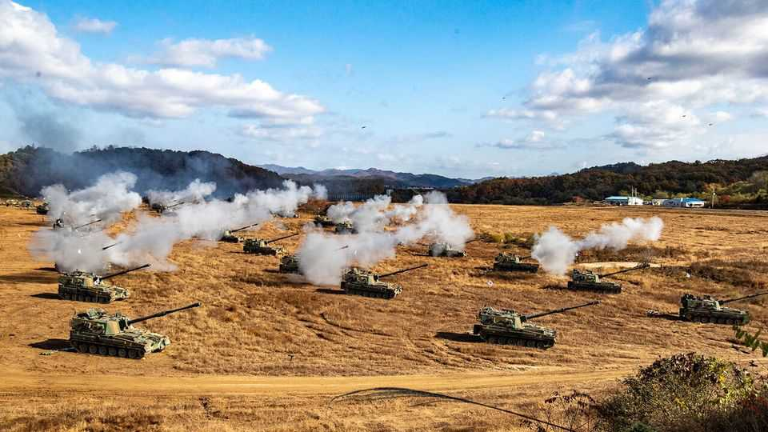
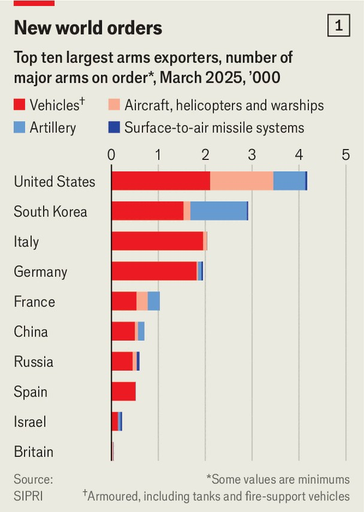
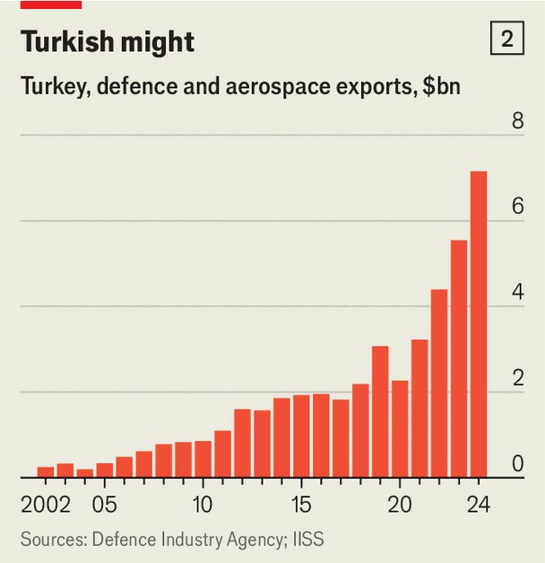

International | Flexing their arms
Meet the world’s hottest upstart weapons dealers
A ferocious global arms race is big business
September 4th 2025

The Gate of Heavenly Peace in Beijing was anything but tranquil on September 3rd, when Xi Jinping, Kim Jong Un, Vladimir Putin and others gathered to celebrate the end of the second world war. Chinese troops marched in a parade designed to boost national pride and flex military muscles. Perhaps most important, the parade showcased China’s newest warfighting equipment to potential adversaries, such as the DF-61 intercontinental ballistic missile. It also showed off new kit to potential buyers, including a high-powered laser for shooting down aircraft, as well as drones and anti-ship missiles, both supersonic and hypersonic. The display of China’s defence-industrial might comes as the world’s military planners are splurging on new weapons. The war in Ukraine, threats

of abandonment by America and worries that China might invade Taiwan have Western countries scrambling to fill stockpiles, harden supply chains and secure flows of munitions. There is a voracious appetite for tanks, artillery, fighter jets, drones and ships. On August 31st Britain announced a £10bn ($13.5bn) deal to supply Norway with five anti-submarine frigates, the country’s biggest shipbuilding order in decades.

Yet not all orders are going to traditional arms exporters in America, western Europe and Russia. Instead, two ambitious middle powers, South Korea and Turkey, are racing to expand their arms industries to capitalise on the boom.

The arms race reflects a larger realignment. Europe is rearming to meet the growing threat of Russian aggression and to fill gaps exposed by its worries over America’s declining commitment to the transatlantic alliance. Yet Europe’s arms companies need time to restore capacity lost after the end of the cold war and to rebuild inventories depleted by donations to Ukraine. Meanwhile, the order books of America’s big defence firms have filled up at speed as its armed forces replace their own stockpiles of missiles expended in the Red Sea and Israel, or donated to Ukraine.

Russia, usually the second-biggest arms exporter after America, is prioritising its own army after losing vast reserves of equipment in its war on Ukraine, including tanks stockpiled since the collapse of the Soviet Union. Western sanctions prevent its firms from getting components critical to building advanced systems such as fighter jets. Last year, Russian exports were down by nearly 50% from 2022 Clients such as India, Vietnam and Egypt are looking elsewhere, not least because Israel seemed to have little difficulty in knocking out Russian air defences in Iran.

Many buyers are turning to South Korea (see chart one). America is the biggest exporter of arms to European NATO members, with South Korea and France tied in second place. South Korea has more orders from around the world than America does for tanks and artillery. It is third behind America and France for combat aircraft. Last year South Korea sold $3.2bn- worth of Cheongung–II surface-to-air missile systems to Saudi Arabia, warships to Peru worth $460m and $1bn of self-propelled howitzers to Romania.

Largest of all is the deal South Korea signed with Poland in 2022, now worth $22bn, to sell a range of weapons systems partly built in Poland. That includes 180 K2 Black Panther tanks, 672 howitzers, 48 FA-50 fighters and 288 K239 rocket launchers. Poland wants to deter Russia, and quickly. For South Korea it is a bold signal that it is ready to join the front rank of arms exporters, opening the door to other lucrative deals in Europe.

South Korea can rapidly churn out NATO-standard gear at good prices. Seven giant firms work with the government to land orders and co-ordinate research and development. Maintaining capacity has been a priority, in part because the country is technically still at war with its northern neighbour, says Chung Min Lee of the Carnegie Endowment for International Peace, a think-tank. In shipbuilding, Korean firms have a big advantage. They may

win a $17bn contract to build 12 KSS-III submarines for Canada, and the lack of shipbuilding capacity in America could see it scoop up orders from the US Navy.

Its most ambitious programme is the KF-21 fighter, which is expected to enter service late next year, and has won interest in eastern Europe, the Gulf and South Asia. Currently a 4.5-generation aircraft, it is hoped that its next update will make it a full fifth-generation stealth fighter equipped with indigenously manufactured engines. It will test whether South Korea can compete with the most advanced American platforms, such as the F-35, says Kyung-joo Jeon of the Korean Institute for Defence Analysis. Not even Japan or Israel have managed that.

Another up-and-comer is Turkey. Over the past five years, its arms exports have shot up, from nearly $2bn to over $7bn last year (see chart two). That is a result of efforts to achieve strategic autonomy, pushed in part by a civilian-run Defence Industry Agency, says Arda Mevlutoglu, a defence expert. Drones made by Baykar outcompete Chinese models. More than 500 of its TB2 fixed-wing models have been sold to over 30 countries. Saudi Arabia has a $3bn deal to co-produce a more advanced drone called Acinki. Baykar has a joint venture with Leonardo, an Italian defence firm, which is eyeing the stealthy Kizilelma fighter drone as a “loyal wingman” to fly alongside the planned sixth-generation GCAP future fighter jets that will be built by Britain, Italy and Japan.

Turkey’s president, Recep Tayyip Erdogan, likes the diplomatic influence that comes with arms sales to Africa and the Middle East. But Turkish firms are looking to European countries with their big budgets. In the past, a barrier to sales has been Turkey’s poor human-rights record and its semi- detached status in NATO. However, Serhat Guvenc, an expert in international relations at Kadir Has University, says the new security environment means that European concerns over human rights are a luxury they can no longer afford.

Turkish weapons are battle-proven through its conflict with the Kurds and its interventions in Syria and Libya. They are built to NATO standards and affordable, and have a no-strings-attached sales policy. The breadth of Turkey’s range is striking, including armoured vehicles such as the K2-based Altay tank, artillery, missiles, air-defence systems, radars, warships such as the MILGEM family of frigates and destroyers, the Hurjet light attack/trainer aircraft, the ATAK helicopter, armed drones and electronic- warfare systems.

Earlier this year Turkey and Spain agreed to a $1.6bn co-production deal for up to 30 Hurjets. Turkey is selling 1,059 Otokar Cobra-II armoured vehicles to Romania in a deal worth approximately $930m, and last December Portugal signed a $134m contract for naval-replenishment ships. Last year

Turkey, which has developed missiles, was invited by Germany to join the European Sky Shield Initiative, a European plan to jointly procure air- defence and missile-defence systems for which Israel is also an important supplier. There is every chance that Turkey can go from about 11th in the league table of arms exporters to fifth, says Mr Mevlutoglu.

Turkey is also trying its hand at building more advanced weapons systems. Like South Korea, Turkey has an impressive fifth-generation fighter programme, the TAI Kaan fighter. Although its design is not yet as close to being completed as the KF-21’s, it is if anything even more technically ambitious. As well as replacing Turkish Air Force F-16s, it will be competing for export orders as a low-cost F-35 alternative, with potential interest from Indonesia, Azerbaijan, Saudi Arabia and Pakistan—countries with close ties to Turkey.

Despite their success in attracting new customers, there are challenges. Soon after Russia’s invasion of Ukraine, the then president of South Korea boasted that by 2027 his country would become the fourth-largest arms exporter in the world, with 5% of the market. That looks like a stretch. In 2022 its sales nudged $17.3bn but in 2024 they fell to just $9.5bn. This year it expects exports of around $23bn.

As countries continue to pour money into their domestic defence industries, competition is set to get more intense. There are already early signs of a “brain drain” of skilled Korean and Turkish engineers to Western firms with better pay. Successful defence industries generally benefit from generous spending on research and development (R&D).

The arms market is becoming more crowded. Even so the cash-strapped governments of upstart arms suppliers may be reluctant to fund defence projects with the primary aim of winning exports as a form of industrial policy. Mr Lee reckons that South Korea must raise the share of R&D in the defence budget from 17-18% to 20-23% to remain competitive. And access to advanced technologies is still a consideration: production of Korean-made fighter jets on order from Poland has stalled because America has yet to authorise the export of some components. Turkey is still excluded from major Western joint projects, such as the F-35. Even Russia may get back in

the game. Still, the escalating global arms race offers plenty of opportunity for new contenders. ■

Editor’s note: This story has been updated to include the announcement of Britain’s deal with Norway

Stay on top of our defence and international security coverage with The War Room, our weekly subscriber-only newsletter.

This article was downloaded by zlibrary from https://www.economist.com//international/2025/08/31/meet-the-worlds-hottest- upstart-weapons-dealers