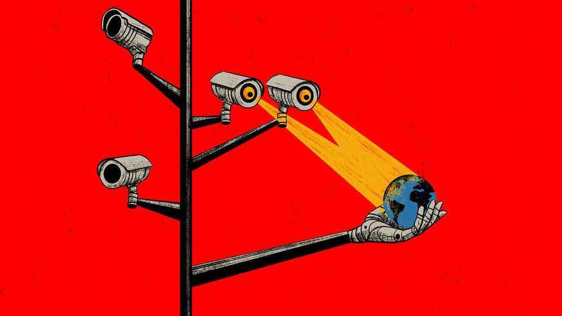

International | The Telegram
Who is winning in AI—China or America?
China offers the world a values-free, results-based vision of AI governance
September 4th 2025

IN 1995, DURING a golden age for globalisation, a business professor from Berkeley coined a cheering term: “the California effect”. When companies in wealthy markets face new competition from foreign rivals, argued David Vogel in his book “Trading Up: Consumer and Environmental Regulation in a Global Economy”, they do not invariably lower standards, as gloomsters might predict. Instead, strict rules in a competitive market can trigger a race to the top, including in neighbouring jurisdictions. A case in point involves strict engine-emissions standards imposed by the state of California, America’s most important car market. Rather than make different engines for different states, to take advantage of those with looser regulations, many firms chose to make all their cars to comply with Californian standards.

In 2012 Anu Bradford of Columbia University coined what she called “the Brussels effect”. This was her tribute to the rule-making superpowers of the European Union, a vast consumer market stitched together by rules written in Brussels. Multinational firms might chafe at fussy EU regulations, or rage when fined by Eurocrats. But time and again, they adopted EU standards worldwide.

Today the global governance of trade is not enjoying a golden age. Still, the largest economies—America, China and the EU—retain a keen interest in setting global standards. And for rule-writers in 2025, shaping AI governance is the greatest prize of all. Until this year few would have bet on a Chinese victory in that contest, or the emergence of a “Beijing effect”. For many countries, the Communist Party’s record of internet regulation set a forbidding precedent. Early glimpses of AI regulation with Chinese characteristics were not encouraging. Authorities swiftly banned ChatGPT, an American generative-AI chatbot. The party is especially sensitive about apps that recommend content. In 2023 officials required generative-AI services that can shape public opinion to undergo a security assessment and register their algorithms.

China’s reputation for innovation was boosted in January, with the release of DeepSeek-R1, an advanced large-language model produced with a fraction of the computing power and financial support needed by American rivals. The “DeepSeek moment” cast into doubt American government strategies to maintain a lead in AI by denying China access to advanced semiconductors. But technical success faces political obstacles. Italy banned DeepSeek over data-privacy concerns and Taiwan barred DeepSeek from government systems, citing security fears.

For all that, China’s AI investors and officials are upbeat. The state is pouring resources into a drive to produce applications that are cheap, accessible and “good enough”. With the help of cheap electricity and a domestic propaganda barrage about AI’s benefits, the party wants the technology to be used as quickly and widely as possible. Being content to come a close second to America is seen as a smart commercial bet. It is also an approach likely to resonate with many countries. The contrast with America is stark, where some in Congress compare the race for AI supremacy to the quest to split the atom. In February Vice-President J.D.

Vance scolded Europeans for overcautious regulation, declaring: “The AI future is not going to be won by hand-wringing about safety.”

Others seem to share China’s apparent hunch that AI is a general-purpose technology of huge but not apocalyptic significance: something more like electricity or computers than the atom bomb. In July Singapore’s prime minister, Lawrence Wong, reminded an audience of businesspeople that after the electric dynamo was invented, it took decades to find industrial uses for it. “We get very enamoured with countries that are the leaders of the cutting- edge, frontier technology,” said Mr Wong. “But in fact, the big advantage of technology is when there is broad-based adoption.”

What is more, China’s regulation is more pragmatic and industry-friendly than outsiders suppose, argues a paper by Angela Huyue Zhang, a law professor at the University of Southern California. “The Promise and Perils of China’s Regulation of Artificial Intelligence”, published last year, catalogues how strict controls on information co-exist with lax enforcement of rules on privacy, copyright or data protection. Thus, China’s AI facial- recognition systems are world-class because officials share reams of government data with private firms. Judges boast publicly of making rulings intended to accelerate China’s AI development.

If a “Beijing effect” ever catches on, it is unlikely to trigger a race to the top. China’s approach puts profitability, convenience and social order ahead of individual rights. A European Commission white paper on AI from 2020 frets about the risks of discrimination by algorithm. It cites facial- recognition systems that are less accurate when scanning dark skin, and algorithms that betray racial bias, for instance when predicting whether a known offender will commit another crime. In China, racial discrimination is a business model. Companies have been caught registering patents for systems to spot Uyghurs and other ethnic minorities long subjected to intrusive human surveillance by Chinese police. The EU white paper worries about employers using AI to track workers’ behaviour. In China, that is a flourishing industry.

China’s version of AI governance faces obstacles in liberal democracies, then. But plenty of other countries are in the market for cheap technologies judged by their performance. China has one more advantage. It is competing

with a Trump administration openly bent on AI dominance, and on using that monopoly power to impose its ideological preferences. Mr Trump recently threatened punitive tariffs on foreign countries that seek to regulate American tech firms in ways that he dislikes. Once again, America is handing a political gift to China. Call that the “Trump effect”. ■

This article was downloaded by zlibrary from https://www.economist.com//international/2025/09/02/who-is-winning-in-ai-china-or- america

Business

Why nuclear is now a booming industry How Lululemon fell out of fashion Google and Apple dodge an antitrust bullet Morocco is now a trade and manufacturing powerhouse Broken workflows—and how to fix them What the splinternet means for big tech