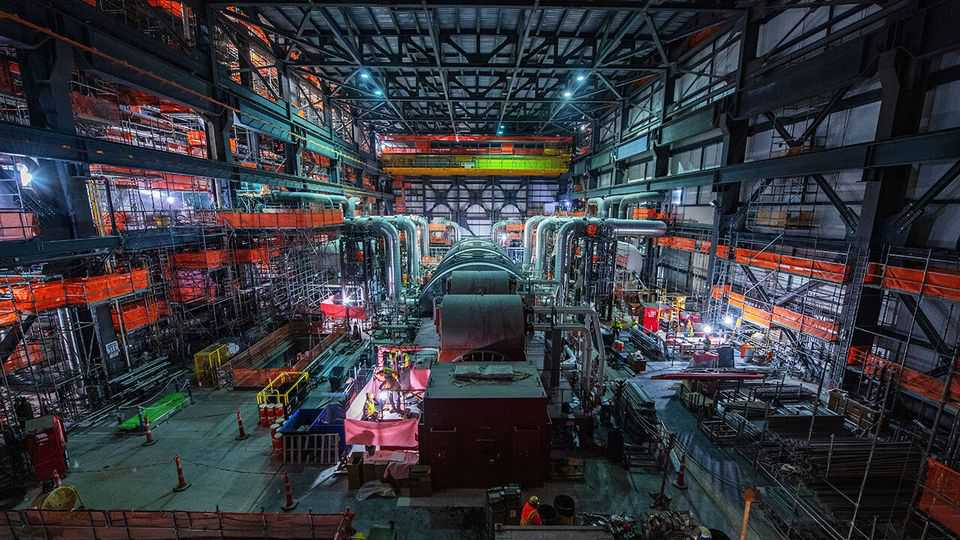
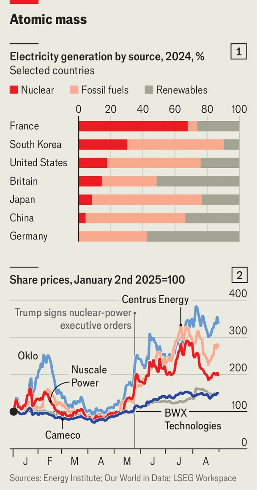
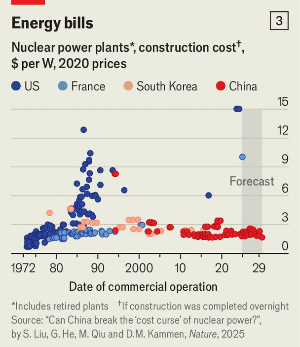

Business | Darkness before dawn?
Why nuclear is now a booming industry
Even if an atomic revival is far from assured
September 4th 2025

“Make America nuclear again.” That is the aim of Rick Perry, a former governor of Texas who served as energy secretary in Donald Trump’s first term as president. On July 4th, to back up the sloganeering, he launched Fermi America, a firm hoping to build the world’s largest energy and data- centre complex. Outside Amarillo, a cattle town in the Texan panhandle, bulldozers shift red soil for a facility that will first generate electricity using natural gas and solar, before construction of conventional nuclear reactors and several small modular reactors (smrs), which will produce 11 gigawatts (gw) of power. The past 20 years have not been happy ones for nuclear energy. Although such power is a significant part of the energy mix in some countries (see

chart 1), no plant has been built on time and on budget in Europe or North America over the period. As the costs of renewables have tumbled, already expensive nuclear projects in America, Britain and Finland have suffered from delays and vast cost overruns. But on August 25th, in the latest sign of nuclear enthusiasm, Fermi and Westinghouse, a nuclear-tech firm, unveiled a partnership that will seek approval to build four of the latter’s large ap1000 reactors in Amarillo. Is a long nuclear winter showing the first shoots of spring?

Growing nuclear optimism reflects three developments. First, governments in many Western countries increasingly desire a secure and independent source of electricity. Second, big tech’s thirst for reliable power and concern for emissions has brought aboard a rich green uncle. Third, novel operational and financial models may improve nuclear’s risky economics. “Something is different this time,” insists Sama Bilbao y Leon, head of the World Nuclear Association, an industry body.

Nowhere is the change of attitude more apparent than in America. Mr Trump is calling for a quadrupling of domestic capacity to 400gw by 2050. Although that target is unrealistically ambitious, it has mobilised the political system. The One Big Beautiful Bill Act, passed in July, showers tax credits on the industry. Republican states such as Texas are rolling out a

welcome mat. So, too, are some blue states. Officials in New York, which shut a big nuclear plant in 2021, now want the state-owned utility to build a new one.

Across the Atlantic, the European Commission unveiled a roadmap in June forecasting that nuclear capacity would rise from 100gw to up to 145gw by 2050. Germany has scrapped its opposition to classifying nuclear energy as “green” in European legislation, making it easier for France to build six new plants. In July Britain’s government made the final decision to proceed with Sizewell C, two giant reactors that could cost over £38bn ($51bn).

Meanwhile, Sweden recently confirmed plans to build several smrs, tiny generators that can be churned out by factories and then transported to suitable sites. Although the technology is not yet commercially viable, the promise of smaller capital outlays than for big reactors, as well as faster scaling, is tantalising. It has convinced over 120 firms to attempt to develop smrs. Barclays, a bank, predicts that between 2030 and 2050, net nuclear capacity outside China and Russia will probably increase by more than half, to over 450gw, with smrs accounting for 40-60% of the total, suggesting a $1trn market. Dozens of startups are also pursuing nuclear fusion, a far riskier endeavour that holds out the possibility of near limitless clean energy.

Tech giants are funding both types of technology. smr startups have raised more than $2bn since early 2024. In June Oklo, backed by Sam Altman, the boss of Openai, raised $460m and TerraPower, founded by Bill Gates, raised $650m. Google has signed a deal to help Kairos Power develop a fleet of smrs by 2035. Fusion startups are attracting big sums, too. Commonwealth Fusion Systems, which is also backed by Mr Gates, unveiled $863m in fresh funding on August 26th. All told, fusion startups raised $2.6bn in the year to July.

Michael Terrell of Google says his industry needs “clean, firm power” from nuclear to complement renewables. He argues it is supporting nuclear “short to middle to long”. Near-term, he reckons, life extensions, restarts and “upratings” will have the most impact. Big plants using proven designs and SMRs could come next. Then, only in the long run, might fusion arrive.

The Clinton Power Station in Illinois run by Constellation Energy, the world’s largest private operator of nuclear plants, shows the impact big tech might have. It was made unprofitable by cheap shale gas and was due to be retired in 2027 when state subsidies ran out. Instead Meta, which owns Facebook, signed a 20-year deal in June to fund a life extension in return for the carbon credits that come with nuclear generation. Last year Microsoft signed a similar deal to restart a retired reactor at Three Mile Island in Pennsylvania.

The Clinton plant holds another lesson. Constellation is investing in equipment, software and processes to expand output. Joe Dominguez, the chief executive of Constellation, reckons 7-10gw could be added to America’s fleet through such incremental improvements. All told, he reckons that big tech’s support will enable 30gw of power to be made available to the market that would not otherwise.

But it is not just big tech pouring money into the industry. Nuclear developers and supply-chain firms are raising hundreds of millions through public offerings, and shares of listed nuclear companies have skyrocketed since Mr Trump issued his executive orders supporting the industry (see chart 2). As Jacob DeWitte, boss of Oklo, notes: “There is no longer a scarcity mindset of reliance on government money, so we can take lots of shots on goal.”

All this is contributing to the third reason for nuclear optimism: the emergence of new financial models and operating practices that tackle the dismal economics of building nuclear plants. As Barclays notes, both regular nuclear and SMR costs “today exceed the market price for power”. But China and South Korea have demonstrated that it is possible to build big reactors in five years and on budget (see chart 3). Both countries standardised designs, built multiple reactors per site and moved quickly between projects so as to keep workers and supply chains active, all of which helped keep down costs.

A new paper in Nature, a scientific journal, by Daniel Kammen of Johns Hopkins University and co-authors emphasises the importance of China’s “vast and expanding electricity market” in providing demand certainty and spurring investment in supply chains. There may be ways to recreate such demand in the West, albeit in very different circumstances. Jim Schaefer of Guggenheim Securities, an investment bank, argues in favour of financing models that aggregate heavy power users within industries (such as big tech firms) to fund nuclear fleets through risk-sharing partnerships and long-term contracts at above-market prices. In return, they would benefit from reliable power. “The average utility and its ratepayers cannot afford to fund ‘early- of-a-kind’ projects,” he explains.

Financial innovation would make a difference, but operational advances are needed, too. “You can’t do one or two, you need ten…you need a national programme not a series of projects,” argues Armond Cohen of the Clean Air Task Force, a charity. Westinghouse seems to agree. It wants to start building ten ap1000 plants in America by 2030. The Nuclear Company plans a similar “design once, build many” approach. Patrick Maloney, the startup’s chairman, says it aims to assemble coalitions of customers to build six identical plants.

Much may yet foil a nuclear renaissance. Despite new innovations, the economics remain troublesome. Excessive regulation is still a barrier, and efforts to slash red tape risk a public backlash. Supply chains are underdeveloped; skilled labour is scarce. As those who have spent their careers in the industry are acutely aware, both government largesse and private investment can prove fickle.

Even so, pioneers are undaunted. “We don’t have the comfortable hammock of government funding to scale and commercialise,” declares Clay Sell, who runs X-energy, an smr startup. His firm is preparing to build its first four reactors at a Dow petrochemical facility in Texas. Amazon has invested in its expansion and pledged to help it deploy dozens of units. In his view, “There is more opportunity for nuclear innovators now than even during the dawn of the commercial nuclear age in the 1960s.” It is a claim that reflects the industry’s soaring ambition, if not yet its reality. ■

To stay on top of the biggest stories in business and technology, sign up to the Bottom Line, our weekly subscriber-only newsletter.

This article was downloaded by zlibrary from https://www.economist.com//business/2025/09/04/why-nuclear-is-now-a-booming- industry