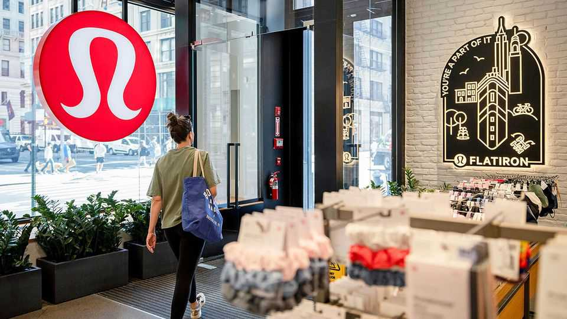
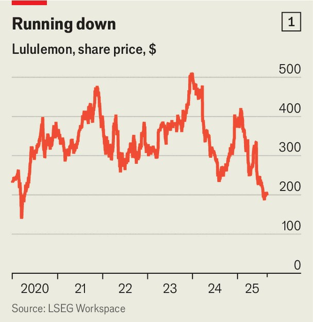
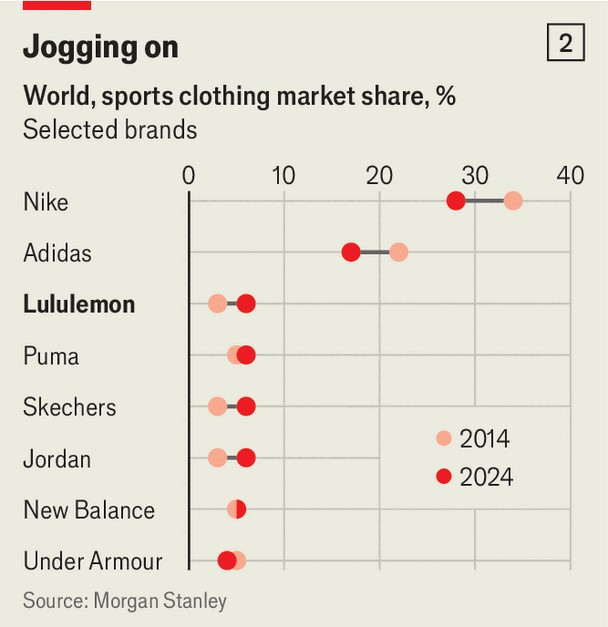

Business | Squeezed
How Lululemon fell out of fashion
Farewell to figure-hugging leggings; baggy is in
September 4th 2025

Lululemon Athletica, a brand famous for flogging leggings for over $100 apiece, has long been in vogue among investors as well as fashionistas. Over the past decade the “athleisure” firm has reported operating margins of 15- 25%, well ahead of rivals, in part owing to the vast share of sales it makes directly to customers. Its sales per square foot of shop space have reached around $1,500 a year, also far outstripping other retailers. Lululemon’s stretchy trousers and chic sweatshirts have married comfort and fashion for a new breed of home workers who wanted to look sharp but relaxed on conference calls.

Fashion, however, is famously fickle. Analysts are expecting more bad news when second-quarter results are revealed on September 4th, after The Economist is published. This would add to the woes revealed for the three- month period to May 4th, when Lululemon reported declining sales in the Americas, its most important region. It has already cut earnings guidance for the full year and its shares have fallen by 45% since January (see chart 1). What is going wrong for the king of athleisure?

After the brand was established in Vancouver at the turn of the millennium, Lululemon quickly became the cool kid of sports retail, offering an alternative to Adidas and Nike, the industry’s behemoths. Today it is the third-biggest company in a global sportswear industry that is worth $446bn by net sales, according to estimates by Morgan Stanley, an investment bank (see chart 2). As recently as 2016, it barely made the top ten.

Despite this growth, Lululemon has not managed to interest existing customers in its latest products. The brand expanded into new areas, including shoes and regular casualwear, and has started making gear emblazoned with logos in an attempt to woo youngsters, who like that sort of thing. But as Randy Konik at Jefferies, an investment bank, says: “They are putting out products that their core customers look at and say ‘who’s going to wear this?’”

Nor is Lululemon creating the buzz that might attract new clientele. It spends only 5% or so of revenues on marketing, preferring word-of-mouth endorsements. On, a Swiss rival, devotes around 10%, signing up celebrity ambassadors, such as Zendaya, an American actress, and collaborating with trendy labels, such as Loewe. That may help explain why visits to Lululemon’s American shops dropped by over 8% in the second quarter of 2025, according to Placer.ai, a location-analytics firm. Even in China, where the firm had been growing fast, sales are now slowing.

Fashion trends have not helped. Gone are the days when fashionistas worth their Vogue subscription wore Lululemon leggings for the coffee run, school run or just to run. Hotter rivals, such as Alo and Vuori, are gaining ground. Worse still, fashion editors have pronounced that fitted clothes are out and baggy ones are in. Not only that but a survey of 10,000 customers in 13 countries last year found that 48% of consumers were wearing denim more often than before.

Then there is the economic backdrop. Lululemon operates in 25 countries and has more than 750 shops worldwide. But three-quarters of its revenues come from the Americas. In March Calvin McDonald, the company’s boss, warned investors that concerns about inflation and the economy were making all-important American shoppers “more cautious”.

Lululemon is also vulnerable to President Donald Trump’s tariffs. Last year some 40% of its products were made in Vietnam and almost 30% of its fabrics came from mainland China, two countries that have been hit hard by new duties. Mr Trump’s decision to get rid of the “de minimis” waiver, which exempted from custom duties goods in parcels worth under $800, could raise prices and hurt sales. Ike Boruchow at Wells Fargo, another bank, reckons that about half of Lululemon’s American e-commerce orders had benefited from the waiver. Lululemon declined to comment on Mr Boruchow’s suggestion.

The king of athleisure, therefore, has turned to discounting. That hardly bodes well for the reputation of the firm, but its strategists have been left with little choice: inventories jumped by 23% year on year in the first quarter of 2025, while sales rose by just 7%. Analysts at Jefferies reckon that more than 60% of cut-price items at its outlet stores are now core products, such as its famed black leggings.

Lululemon has encountered one more problem of late. The brand’s sportswear is easy to copy. Earlier this year the firm sued Costco, a big retailer, for selling cut-price versions of its trousers and other items. In years to come, the firm’s executives might look back wistfully at the days when it was seen as a brand worth copying. ■

To stay on top of the biggest stories in business and technology, sign up to the Bottom Line, our weekly subscriber-only newsletter.

This article was downloaded by zlibrary from [https://www.economist.com//business/2025/09/04/how-lululemon-fell-out-of-fashion](https://www.economist.com//business/2025/09/04/how-lululemon-fell-out-of-fashion)