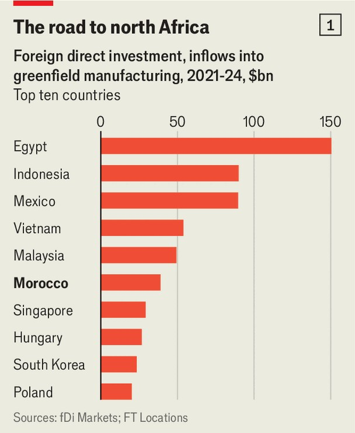

Business | North African enterprise
Morocco is now a trade and manufacturing powerhouse
The country’s ports and factories are humming
September 4th 2025

The sprawling port of Tanger Med on Morocco’s north coast looks out onto the busy Strait of Gibraltar. Departing ships carry cars and goods to 180 locations across the globe. In the port itself lorries zip about on roads that shimmer in the heat. Tanger Med is set to become even larger, showing off the country’s ambitions as a manufacturing and trade hub.

Morocco’s position on Europe’s southern doorstep (and as a northern entry to Africa) has helped it insert itself into global supply chains. Foreign investment has risen swiftly. According to fDi Markets, a data firm, the country has drawn about $40bn of greenfield manufacturing investment since 2020, catapulting itself into the list of the world’s largest recipients (see chart 1). As a result, Morocco’s exports have risen by two-thirds in the past five years (see chart 2).

The country’s officials attribute this success to the investor-friendly policies of King Muhammad VI, Morocco’s leader. To please overseas businesses, his government has poured money into electricity generation, ports, railways, roads and solar facilities. It spent between 25% and 38% a year on infrastructure from 2001 to 2017, which is among the most in the world. The results include a high-speed train that runs up the country’s west coast. On the road into Tanger Med, drivers pass endless wind and solar farms, as well as special economic zones ready to welcome investment.

Perhaps the biggest draw for European firms is a free-trade agreement that was struck with the eu in 2000. Preferential deals with 60 other countries have followed. This drew big investments by carmakers such as Renault and later Stellantis (whose largest shareholder, Exor, is a part-owner of The Economist’s parent company). Suppliers, including Yazaki, a components- maker, arrived next. Such activity “showcased” the country’s investor- friendliness, says a former industry minister.

Ships now cross to Europe every hour from Tanger Med. They carry vehicles made by Renault, as well as car parts and components for other industries. Down the coast, Kenitra, an industrial zone on the outskirts of Rabat, is home to Stellantis; Lear, one of America’s biggest automotive suppliers; Faurecia, a European car-component firm; and Nexteer, a Chinese-owned one. Car firms have invested more than $8bn overall in Morocco since 2012, about a quarter of the total foreign investment that has flowed into the country in the period. To box exported goods, International Paper, an American packaging company, has set up large facilities.

Last year Morocco became the biggest exporter of cars and parts to Europe, surpassing China and Japan. Ryad Mezzour, the country’s industry and trade minister, is intent on replicating this success in other industries. He hopes to support more than 50 high-value sectors, including aerospace and pharmaceuticals.

Morocco has already had some success in moving up the value chain. In Kenitra, simra, a local subsidiary of Segula Technologies, a French aerospace-engineering company, churns out parts for industrial giants including Airbus, Bombardier and Safran. The firm says its parts account for about 5% of the components in an Airbus A320 jet by value, up from about

2% a decade ago. Alstom, a European manufacturer of railway equipment, produces electric switch boxes and cables at a factory in Fez, some 300km away.

This activity has made the eu Morocco’s biggest trading partner by far. Yet money is now also pouring in from China. Firms from the country have struck deals to invest at least $10bn in electric vehicles and batteries, representing about 5% of all investments related to the Belt and Road Initiative worldwide over the past two years. Often, one boss notes, Chinese investors show up unannounced, speak Arabic and do business fast. Gotion, a battery-maker that accounts for nearly 4% of the global market, has invested over $6bn in a factory in Kenitra. China Overseas Engineering Group is set to help build a high-speed rail line.

Such investments may come with drawbacks, however. The entanglement with China could draw Morocco deeper into Donald Trump’s trade wars. Some officials also worry that a strategy focusing on foreign investors has ignored homegrown enterprise. There are few domestic industrial heavyweights. Indeed, at Kenitra there is only one Moroccan company, making plastics and plating.

And despite the flourishing relationship with China, Morocco’s export growth is still mainly tied to Europe—with which competition is becoming fiercer. In 2023 the European Commission imposed anti-dumping duties on aluminium car wheels; most of these are made by citic Dicastal, a Chinese company with several factories in Kenitra. As a result, the firm decided to set up a new facility in Portugal, instead of a fourth in Morocco. Last year catl, the world’s biggest battery-maker, looked at Kenitra as a possible venue for a new factory but was instead lured by financial inducements offered by Spain.

Moroccan officials still hope to convince European leaders to rein in their protectionism. Yet they are also hedging their bets by turning attention to Africa, where the country is one of the biggest investors. Morocco is leading work on a 5,600km gas pipeline to Nigeria, passing through 11 other countries. posco, a South Korean industrial firm, and Engie, a French energy company, have set up in Casablanca Finance City, a business and finance hub which touts itself as a gateway to Africa. All the challenges “will force

us to diversify”, says Mr Mezzour, the trade minister, “and [we] will. We’re very competitive.” ■

To stay on top of the biggest stories in business and technology, sign up to the Bottom Line, our weekly subscriber-only newsletter.

This article was downloaded by zlibrary from https://www.economist.com//business/2025/09/04/morocco-is-now-a-trade-and- manufacturing-powerhouse