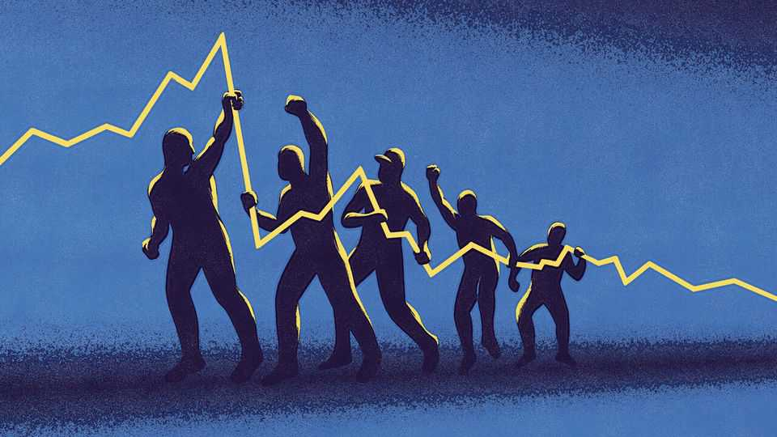
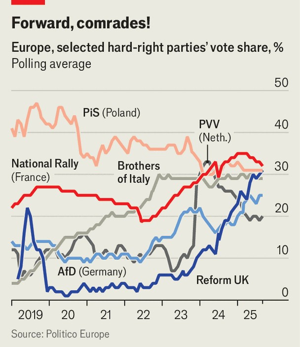

Finance & economics | Fiscal flag-waving
The hard right’s plans for Europe’s economy
It has moderated, but offers little hope of growth-boosting reform
September 4th 2025

If the French government fails a confidence motion on September 8th, it will soon have a new prime minister. They would have to face down the National Rally (RN), a hard-right party leading the polls by a wide margin. France is no outlier: the hard right is on the march. The Brothers of Italy govern Italy; the Law and Justice (PiS) party has the Polish presidency. Reform UK leads the polls in Britain. In Germany the Alternative for Germany (AfD) is neck and neck with the conservatives.

No single factor explains the hard right’s success, but Europe’s economic malaise has helped. Inflation, cuts to public services and the costly green transition all advance the cause. Reasons to be cheerful are scarce, with forecasts suggesting the continent’s output will not grow much faster than 1% a year any time soon. The German economy is moribund despite the government’s relaxation of its fiscal rules. America has already imposed tariffs of 15% on imports from the EU, which could easily rise. An influx of cheap Chinese goods threatens European businesses. And all the while, the ranks of retirees are swelling while birth rates decline.

How would hard-right governments approach this state of affairs? Our analysis of manifestos, speeches and policies suggests the movement has become more economically moderate as it has matured. But it still offers little hope of growth-boosting reforms. Meanwhile, parties promise lavish support for young families and pensioners, their core constituency. The big risk, therefore, is that Europe’s fiscal position deteriorates further—perhaps triggering an almighty stand-off with the bond market and the European Central Bank (ECB).

In the past Europe’s hard-right parties advanced a broad, unwieldy agenda: they blended ideas of the old left with libertarian views on tax cuts and deregulation. “At the start we were heterogeneous on economic policies, but

there has been a clear development to a more consistent position,” says Leif- Erik Holm, an AfD member of the Bundestag. Today’s hard right has coalesced on a conservative programme combining qualified support for free markets with generous handouts for some.

From their rhetoric, you might think they would curb immigration. On June 9th Viktor Orban, Hungary’s talismanic prime minister, called Europe’s migration policy “an organised exchange of populations to replace the cultural base”. The problem is that the continent’s economy depends on migrants. Without new arrivals and the hours put in by foreign workers, Spain’s output would have flatlined from 2019 to 2024. Germany’s would have shrunk by 6%.

Hence why, when the hard right wins power or influence, immigration continues unabated. After Brexit, arrivals to Britain fell from the EU, but surged overall. In Poland, under PiS, they rose from 86,000 in 2015 to 224,000 in 2021, then soared after Russia invaded Ukraine. Giorgia Meloni, Italy’s prime minister, has just approved 500,000 work visas for the next three years, on top of 450,000 over the past three.

Instead of cutting immigration, many parties—including France’s RN— favour making life harder for migrants. Plenty seek to mimic Germany’s old guest-worker schemes, bringing in foreigners without offering them the same services as natives or integrating them into society. Jordan Bardella, the RN’s president, wants “national preferences” for public services, jobs and housing, and a tougher path to citizenship. Ms Meloni recently encouraged voters to abstain from a referendum that would have reduced the residency requirement for citizenship from ten to five years.

Meanwhile, the hard right now pursues its Euroscepticism more obliquely. Once, it would have pressed for more countries to leave the bloc. But recently many parties, including the Dutch Party for Freedom (PVV) and RN, have ditched this goal. Others, such as the AfD, hint that their promises to leave the euro are mostly for show. Instead, those parties now want to reform the EU from within. “We do not want to leave the table. We want to finish the game and win, to take power in France and in Europe and give it back to the people,” Marine Le Pen, the RN’s most prominent politician, has

said. The AfD’s Mr Holm wants to see more national decision-making: “Common rules are fine, but every country has to be on board.”

Although it has made peace with the EU, Europe’s hard right is critical of trade deals entailing co-operation on migration or regulation, or lowering protection for farmers. Along with Emmanuel Macron, the French president, they oppose an agreement between the EU and Mercosur, a Latin American bloc, which is being ratified. President Donald Trump’s aggressive trade policy provokes much bristling, though hard-right politicians tend to blame the EU for it. “The trade deal concluded by Ursula von der Leyen with Donald Trump is a political, economic and moral fiasco,” wrote Ms Le Pen.

Many hard-right parties still take a tough line on climate change, opposing, say, net-zero targets. “Whether we eat meat, catch a plane or drive a gasoline car is something we decide for ourselves. Not Brussels,” reads the manifesto of the Dutch PVV. Yet those in power tend to change tack. Ms Meloni has made green investment easier and streamlined regulations. PiS is a fan of nuclear power, and has supported renewables and grid extensions.

The economic moderation is welcome, but growth-boosting policies are absent. German-style guest-worker schemes might make immigration more politically palatable, but would prevent migrants from reaching their full economic potential. An EU that devolved more power to member states would be even more sclerotic. A recent study by the European Parliament concluded that greater integration of the market for services could boost annual internal trade to between 8% and 10% of GDP by 2032, from the current level of 6.3%. But this would require common legislation that infringed on national sovereignty. Meanwhile, trade deals excluding agriculture or concessions on migration would have minimal value.

And then there are the handouts. Hard-right parties want to reward “insiders for the contributions they have made”, says Jérémie Gagné of More in Common, a research outfit. Pensioners fit the bill perfectly. PiS has reversed a reform to raise the retirement age to 67, putting it back to 65 for men and 60 for women. Ms Meloni wants to do something similar in Italy.

Ageing societies need more babies if they are to shun migrants; the hard right offers generous benefits to this end. In Poland the Family 500+ child benefit, introduced by PiS in 2016, has been raised from 500 zloty ($140) to 800 zloty a month. Marlena Maląg, a former PiS family minister, said in 2021 that her demographic plan was based on “pro-family policy, not on migrants”. In Britain Reform wants to scrap a two-child limit on universal credit, the country’s main welfare payment. The AfD promises a €20,000 ($23,000) pension subsidy to parents for each child they produce.

In Italy, Ms Meloni is running a tight ship. She has avoided fights with the European Commission, from which her country is set to receive €54bn in pandemic recovery funds. But elsewhere the hard right’s policies would cost a staggering amount. In February the German Economic Institute and the German Institute of Economic Research calculated that the AfD’s plans would add €150bn-180bn to the deficit, which last year came to €120bn. The Economist calculates that Reform’s plans would add costs of some £200bn a year and save just £100bn (with tax cuts comprising much of the shortfall). The claim that reduced spending on migrants could lead to big savings is ludicrously overblown.

In France, the RN’s plans would add a less alarming €14bn to the deficit, according to calculations made last year by the IFRAP Foundation, a think-

tank. Even so, investors are fretting. France’s borrowing costs are now on a par with Italy’s, owing to political paralysis over how to trim its deficit of 5.4% of GDP. An RN-led government seems unlikely to cut it. Other hard- right parties would face similar, if less acute, problems. Without a growth boost, the fiscal outlook would be bleak even if they curtail their spending plans. In time, that could lead to a stand-off with the ECB, which backstops European government debt. It would also pit hard-right governments against each other.

More worrying still is what happens next. “Do not be fooled by the first term,” warns Christoph Trebesch of the Kiel Institute, a think-tank. He has studied governments of the hard right since 1945, and found that over a 15- year period they lowered GDP per person by more than 10%, on average, compared with moderates. “There is the risk of favouring politically connected firms, building up a parallel oligarchy that has no interest in a free, competitive market,” adds Mr Trebesch. “It’s a consistent pattern.” Even if the hard-right governs relatively sensibly in its first term, damage will be done. The reforms that Europe urgently needs will not be. ■

For more expert analysis of the biggest stories in economics, finance and markets, sign up to Money Talks, our weekly subscriber-only newsletter.

This article was downloaded by zlibrary from https://www.economist.com//finance-and-economics/2025/09/04/the-hard-rights-plans- for-europes-economy