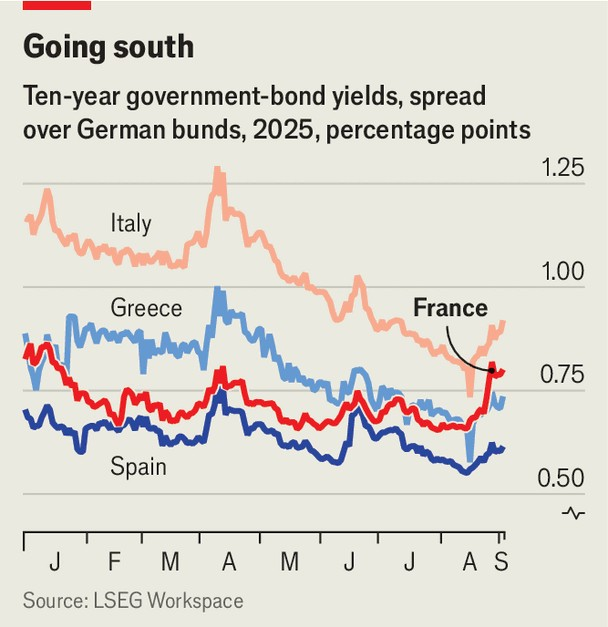

Finance & economics | On borrowed time
Bond vigilantes take aim at France
With any luck, the stand-off might focus politicians’ minds
September 4th 2025

Just how far can French politicians push the bond market? Efforts to slash the country’s American-style deficit, which sits at 5.4% of GDP, might soon bring down another government. On September 8th François Bayrou, the prime minister, will face a confidence vote over his proposed spending cuts. He seems almost certain to lose. Should that lead to another minority government, the chances are low that it could secure enough votes to pass a budget that would meaningfully lower borrowing. Meanwhile, the yield on ten-year French government bonds has climbed to 3.6%, above Greece’s ten- year yield and on par with that of Italy, the continent’s usual fiscal flounderer (see chart).

Although worrying, France’s position does not suggest an imminent crisis. The country’s rising debt load, currently 114% of GDP, is high but the risk of bond-market stress is moderate, according to the IMF. That is in part because the French government would need to generate only a relatively small fiscal surplus in order to stabilise its debt-to-GDP ratio. According to a forthcoming paper by Bruegel, a think-tank, such stabilisation would require the “primary surplus” (meaning the budget surplus before accounting for interest payments on existing debt) to be 1.2% of GDP, which is nowhere near the 3.5% of GDP that Greece’s creditors, France among them, demanded at the height of the euro crisis. Greece’s primary surplus in 2024, for comparison, was a Herculean 4.8% of GDP.

France’s problem is its starting point. The government ran a primary deficit of almost 4% in 2024. In other words, it would have to enact some combination of spending cuts and tax rises worth about 5% of GDP to stabilise its debt level. Doing so would be sufficiently politically fraught to undermine any prime minister’s chances of staying in office. Attempts to fix the public finances are therefore likely to backfire by raising the odds of less responsible politicians assuming power—as Mr Bayrou’s government is discovering.

As a result of this dynamic, the range of potential outcomes is wide. In turn, that makes the fiscal position worse. “Uncertainty over taxes or interest rates could undermine investment further, and hit consumers’ confidence too,” says Charlotte de Montpellier of ING, a bank. Already, the French economy is stagnating and likely to continue to do so, according to surveys of sentiment among services and manufacturing firms. By raising government- bond yields, stalling efforts at fiscal consolidation also raise borrowing costs for French firms and individuals. That slows growth by crimping investment and consumption, reducing the tax receipts that might otherwise cut the deficit, and making debt harder to stabilise relative to GDP.

Policymakers are wisely paying attention. “I am looking very attentively at the French bond spreads situation,” said Christine Lagarde, the president of the European Central Bank (ECB), on September 1st. The central bank is the lender of last resort in all but name for European public debt. It has assembled an alphabet soup of debt-buying programmes intended to keep the euro zone’s bond markets stable, and spreads between different countries’ yields contained. The political bargain is that countries adhere to “macroeconomic reasonability”, as a former ECB official calls it, in return. But this backstop was never intended for use by the core economies, France and Germany, which ultimately stand behind the ECB’s balance-sheet. Even if investors now think France’s bonds are as risky as those of peripheral countries’—as shown by yield spreads relative to German bunds—the ECB will be reluctant to intervene on its behalf.

That may turn out to be a good thing. “There is a consensus between Republicans and Socialists that the public deficit is an issue. Even the extreme right is recognising that deficits need to come down,” says Xavier Ragot, president of the French Economic Observatory, another think-tank. But as yet, this recognition—along with Mr Bayrou’s efforts—has been insufficient to force a compromise between centre-left and centre-right parties. The consequence might be that it is a problem for France’s next president, quite possibly drawn from the hard right. And the longer this drags on, the larger the fiscal mess will be. “The faster the crisis comes, the better,” argues one analyst. Perhaps the Greek government can then offer some advice. ■

For more expert analysis of the biggest stories in economics, finance and markets, sign up to Money Talks, our weekly subscriber-only newsletter.

This article was downloaded by zlibrary from https://www.economist.com//finance-and-economics/2025/09/04/bond-vigilantes-take- aim-at-france