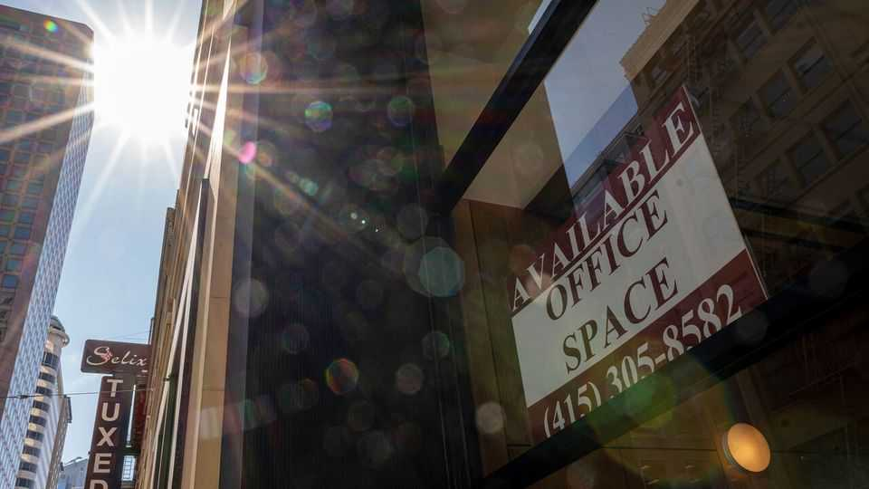
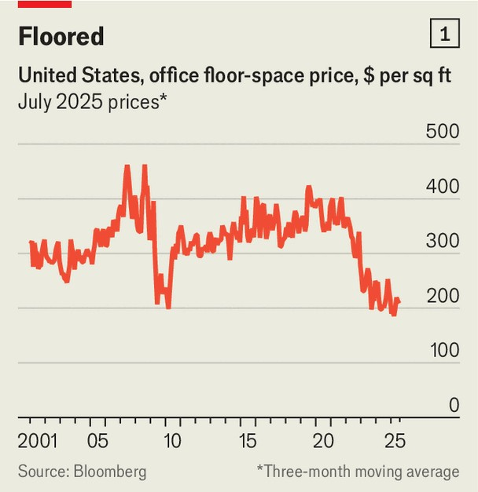
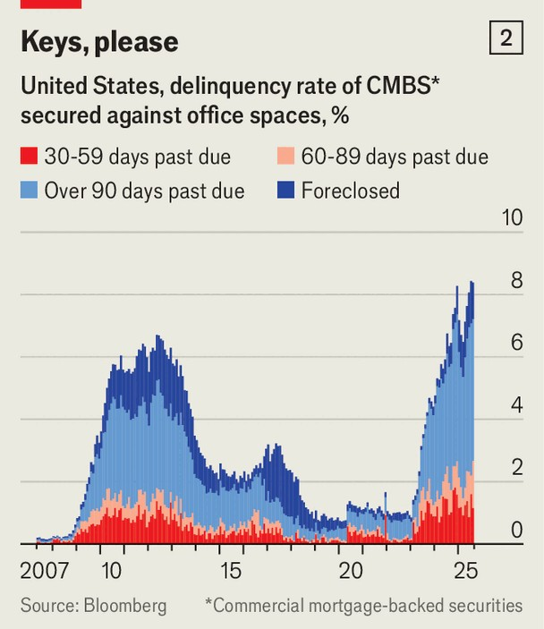
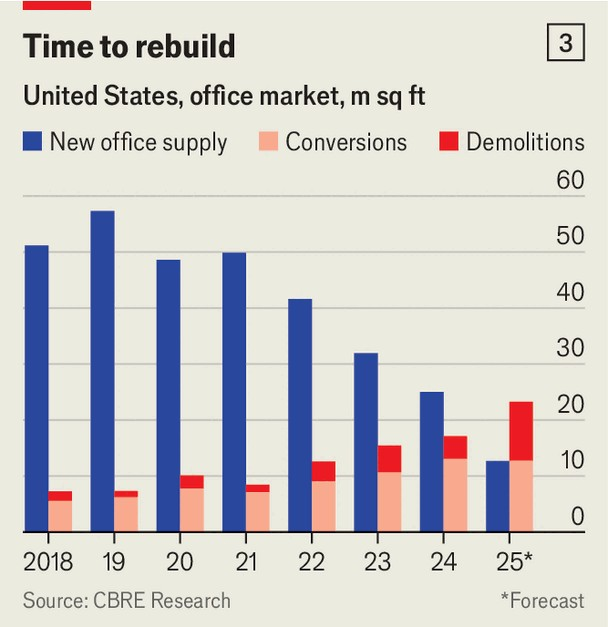

Finance & economics | Raise the roof
America is escaping its office crisis
The torment caused by covid-19 and high interest rates appears to be over
September 4th 2025

For most people the covid-19 pandemic ended years ago. But not for commercial-property investors and their lenders. Working from home prompted an office slump that lasted far longer than mask mandates and lockdowns. Starting in 2022 aggressive interest-rate rises hurt the sector even more, by making mortgage loans far more expensive to roll over. The banks that financed it, especially the smaller ones, have been brutally squeezed as credit quality has deteriorated.

At first glance, things look as bad as ever. The vacancy rate for American offices was a record 20% at the end of June, almost double where it was at the end of 2019. In real terms the price of floorspace has dropped by half since 2021 (see chart 1). A square foot is now as cheap as in 2010, after the global financial crisis. Some 8% of commercial-mortgage-backed securities (CMBS) secured against office buildings are in delinquency or foreclosure, the most on record (see chart 2).

But after half a decade of turmoil, commercial-property investors may have at last hit rock bottom. A fragile, slow recovery appears to be taking place. The multi-trillion-dollar market for owning and financing America’s workplaces is changing, too, as banks back away and fast-growing private- credit outfits fill the gap.

According to CoStar, a commercial-property research firm, this quarter is the first since 2020 in which America’s five biggest commercial-property firms—CBRE, Colliers, Cushman & Wakefield, JLL and Newmark—have lifted their earnings outlooks simultaneously. The share prices of the five are up by between 20% and 39% so far this year, and several have hit records.

Part of the explanation lies in dwindling supply. Only 13m square feet of office space will be built this year, down from 50m or so each year between 2018 and 2021 (see chart 3). Demolitions and conversions into housing mean that total American office space will shrink for the first time in at least a quarter of a century, according to CBRE. In cities where house prices have soared, converting offices into much-needed blocks of flats makes obvious sense.

American banks, particularly smaller ones, are exposed to commercial- property loans. And so in recent years lenders have slashed their

commitments (promises for funding) to developers and other real-estate companies. According to Bill Moreland of BankRegData, a research firm, the volume that borrowers had yet to tap dropped from $465bn at the end of 2022 to $306bn in the first quarter of 2025. But in the second quarter such unused commitments rose, albeit by a small amount.

A turnaround is more obvious in the CMBS market, where volumes have surged this year. In total $15.2bn in bonds that are between half and fully collateralised by offices have been issued, up from $4.3bn in 2024 and just $400m in 2023. With four months to go, 2025 is already the third-strongest year in the past decade.

The market is undergoing structural change, too. As the value of offices slumped, the loan-to-value ratios of mortgages attached to them rose. That left banks holding riskier loans and drove up their own loan-to-value ratios —a closely watched measure of financial health. As the banks have pared back lending, a variety of alternative lenders with higher risk appetites have stepped in. This year Blackstone, a private-investment giant, raised $8bn for its joint-largest real-estate fund, which will hunt out distressed properties. Brookfield Asset Management, another investment firm, raised almost $6bn for its own new real-estate fund.

This trend is set to continue. Moody’s, a credit-rating firm, expects about $1trn-worth of commercial property mortgages in Europe and America to shift to new private creditors over the next three to five years. Life insurers and private-credit funds are especially likely to snap up the mortgages banks no longer want.

As far as commercial-property prices go, though, the recovery will probably remain a slow one. According to the Survey of Working Arrangements and Attitudes, a research project, Americans spent 27% of their working days at home in July, a figure that has remained pretty constant over the past year. Demand for new office space is limited, and converting unused offices into housing will reduce oversupply only gradually. But for investors who have endured a five-year battering, an end to the punishment will be welcome. ■

For more expert analysis of the biggest stories in economics, finance and markets, sign up to Money Talks, our weekly subscriber-only newsletter.

This article was downloaded by zlibrary from https://www.economist.com//finance-and-economics/2025/09/01/america-is-escaping- its-office-crisis