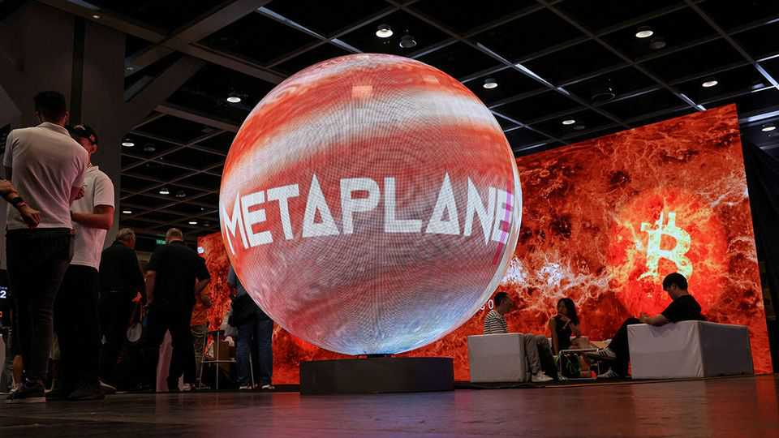
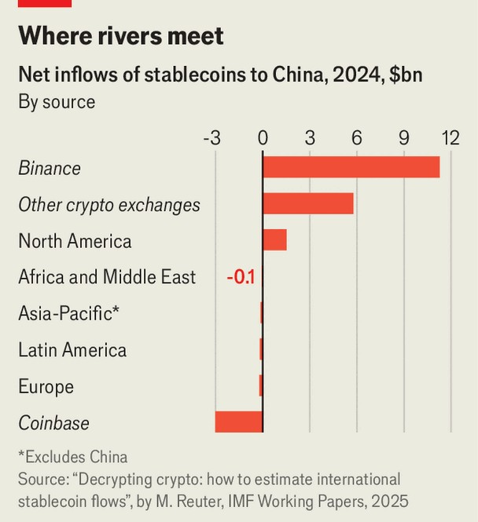

Finance & economics | The people’s money
China turns crypto-curious
But would the country’s leaders really want stablecoins to succeed?
September 4th 2025

Eric Trump, the American president’s second son, has been called “the top diplomat of the bitcoin nation”. Last month his mission took him to the People’s Republic of China, where he spoke in Hong Kong at Bitcoin Asia, a conference dedicated to the original cryptocurrency. What is it trading at today, he asked, while on stage: “112-113,000?” The correct answer ($110,143) was right behind him, continuously updated on a big screen. Bitcoin’s volatility helps explain the appeal of stablecoins, digital tokens pegged in value to a more established currency. The hope is that stablecoins will retain the advantages of cryptocurrencies, such as cheaper, quicker, round-the-clock settlement, without the gut-wrenching gyrations in value. More than 99% of stablecoins, now collectively worth over $280bn, are

pegged to America’s currency. In July Eric’s father signed the GENIUS Act, which paves the way for regulated dollar stablecoins, widening their appeal to institutional investors and ordinary punters. The aim is to entrench dollar dominance in the new world of digital finance. America, Eric said, is winning the “digital revolution”. How might China respond?

With some disquiet. China has long sought to end its dollar dependence. At a summit of the Shanghai Co-operation Organisation in Tianjin on September 1st, the organisation’s ten members, which include China, India and Russia, promised to settle a greater share of transactions between themselves in local currencies. China settled over 30% of its current-account transactions (including trade in goods and services) in yuan in the first half of this year, up from 15% in the whole of 2019.

China’s cabinet is considering a “roadmap” to boost its currency’s usage overseas, according to Reuters, a news agency. That may include yuan- backed stablecoins. But America’s enthusiastic embrace of the technology has put China in a bind. China banned cryptocurrency trading in 2021. It also puts tight controls on how much residents’ capital can leave the country, which stablecoins might weaken.

Hong Kong may offer one way out of this bind. Unlike mainland China, the territory permits capital to flow freely. And to keep up with rival financial centres it has encouraged experimentation in virtual assets. It also has a crypto-curious public. The company behind the world’s most popular stablecoin, Tether, started life in Hong Kong. Even the city’s law firms are becoming crypto-savvy. After unknown scammers defrauded a Hong Kong company of $2.7m-worth of Tether, lawyers served the miscreants a “tokenised” court order via a blockchain.

As luck would have it, Hong Kong’s new stablecoin legislation came into effect on August 1st. The rules try to ensure that regulated coins are indeed stable. They require issuers to have capital of at least HK$25m ($3.2m) and to back their coins with a pool of safe, liquid assets worth at least as much as the coins’ face value. They also require issuers to collect customer information, submit to audits and comply with regulations against money- laundering. All this will make the coins safer to hold but less profitable to operate.

Most stablecoins now in circulation around the world are held by crypto speculators. Yet Hong Kong’s regulators seem keen to encourage other uses, such as supply-chain financing and cross-border payments. Last year the authorities allowed some firms to experiment with stablecoins inside a “regulatory sandbox”. They included a subsidiary of JD.com, a Chinese e- commerce giant, and Standard Chartered, a bank founded in 1853. None of them were crypto-trading platforms.

In principle, stablecoins issued in Hong Kong could be pegged to the offshore yuan, which trades separately from its onshore twin. That would allow China to test the international appeal of yuan stablecoins while holding them at arm’s length. One problem, however, is that yuan stablecoins would have to be backed by yuan-denominated assets, which are scarce outside the mainland. Hong Kong’s pool of such deposits amounted to less than 1trn yuan at the end of July, compared with over 300trn on the mainland. Although China’s central bank has issued short-term borrowing instruments in Hong Kong, which could serve as backing for a stablecoin, it sometimes buys them back again when it wants to stop the offshore yuan strengthening too far above the onshore one. That makes the supply of safe, liquid assets denominated in offshore yuan “unpredictable”, points out Morgan Stanley, a bank.

Yuan stablecoins might, therefore, prove impractical. If not, they would bring dangers. Despite the ban on crypto trading, Chinese mainlanders already trade more stablecoins than the authorities would like. A new paper by Marco Reuter of the IMF uses artificial intelligence to identify the geographic location of crypto wallets. He estimates that in 2024 China bought $18.6bn of stablecoins from the rest of the world and sold $3.6bn. Binance, a crypto exchange which cannot be accessed directly from mainland China, was a big source (see chart). Mr Reuter’s figures are far higher than alternative estimates, which assume the Chinese do not disguise their location using digital tricks.

The first firms to win stablecoin licences in Hong Kong will not peg to the yuan. Instead, they will almost certainly pick the Hong Kong dollar. This has been called the “original stablecoin”. It has been tied to the American dollar since the 1980s. The peg is backed by a vast trove of dollar assets held by the Hong Kong Monetary Authority (HKMA), the de facto central bank.

Such a chain creates an intriguing geopolitical irony. If stablecoins take off, they will raise demand for assets to back them. That will put upward pressure on the Hong Kong dollar, obliging the HKMA to sell its currency and buy American dollars to keep the exchange rate stable. The city’s experiments, if successful, could raise demand not for the yuan but for dollar assets. Indeed, the HKMA might be obliged to buy a little more of the government debt issued by Mr Trump’s administration. At Bitcoin Asia, his second son enjoyed an “incredible reception”. He may soon have even more reason to thank Hong Kong. ■

For more expert analysis of the biggest stories in economics, finance and markets, sign up to Money Talks, our weekly subscriber-only newsletter.

This article was downloaded by zlibrary from https://www.economist.com//finance-and-economics/2025/09/02/china-turns-crypto- curious