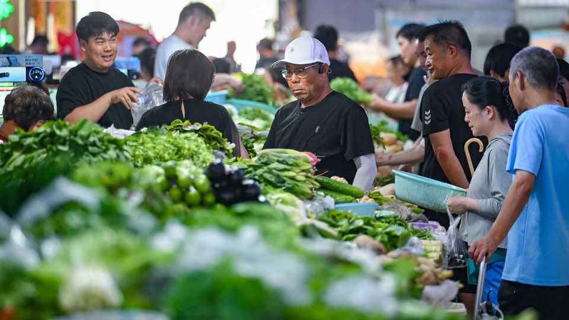
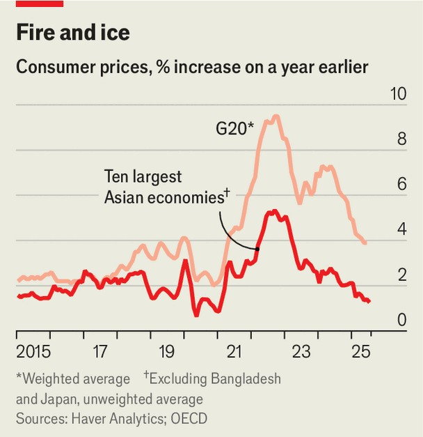

Finance & economics | That sinking feeling
The threat of deflation stalks Asia’s economies
Blame China, slumping commodities and creaky growth
September 4th 2025

Just as the inflationary heat is rising again in America, much of Asia is feeling a chill. Leave aside the hotspots—Japan and Bangladesh—and the average rate across the continent’s ten biggest economies is a tame 1.3%. Consumer prices have fallen outright in China, the biggest of all, and in Thailand. Other Asian economies, including the Philippines, are not far from deflation. Even in inflation-prone India prices rose by just 1.6% in the year to July, the slowest rate since 2017. In some Asian economies inflation is within central bankers’ target ranges. But in five it is now below these, and even in on-target countries the trend is disinflationary. It is tempting to blame Donald Trump’s tariffs. In theory, they should hit Asia as a demand shock, reducing both export prices and output. That,

though, is not what has happened of late. Instead, firms “frontloaded” shipments before the tariffs came into force, with the result that many Asian countries’ exports to America soared. And Asia’s missing inflation in any case dates back to the second half of 2024, before Mr Trump was re-elected (see chart). His tariffs might tug down prices in the future, but they do not explain the past year.

What does, then? One culprit is Chinese overcapacity, which has entrenched deflation domestically. It has also put pressure on prices elsewhere: since 2022 China’s export-price index has fallen by 15%, even as exports have risen. Although the spillovers are global, Asian economies have probably been hit hardest. Over the same period, China’s goods-trade surplus with developing countries in Asia has almost doubled. Prices of cars in Thailand, where cheap Chinese models increasingly dominate, fell by 6% in the year to July. Relentless competition from Chinese smartphone makers has dragged down the prices of these in Vietnam and Singapore.

Commodity markets, chiefly for fuel and food, have also exerted a cooling effect. The decision of the Organisation of the Petroleum Exporting Countries and its allies to ramp up drilling has kept oil prices quiescent. Meanwhile, food inflation—which has been high for years because of the war in Ukraine and damage to harvests from hot weather—has subsided. As

recently as 2024 the average food-inflation rate in Asia’s ten biggest economies (again excluding Japan and Bangladesh) was 5%. By July it had fallen to 1%. The speed of the decline is not only due to “base effects”, meaning that the current inflation rate is calculated using last year’s high prices as a starting point. A surfeit of pigs in China has resulted in pork- price deflation, which Chinese officials have recently pledged to combat by shrinking herds by 1m.

What is more, demand in many Asian countries is weak. Some places, including South Korea, are experiencing business-cycle slumps. In others, sluggish demand reflects structural flaws in their economies. Indonesia’s increasingly uncompetitive manufacturing sector has been laying off workers, denting consumer confidence.

Wage growth across Asia has been decelerating. In several countries a growing supply of workers has put downward pressure on wages, notes Miguel Chanco of Pantheon Macroeconomics, a consultancy. Labour-force participation has surged in the Philippines and broken records in India, Indonesia and Malaysia. Fresh memories of the global inflationary surge of 2022, to which most Asian households were painfully exposed, may have pushed more people to seek work. Asia’s central bankers also seem fearful of a repeat. In general, their monetary policy is too restrictive given threats to demand, says Alex Holmes of the Economist Intelligence Unit, our sister company.

Expect Mr Trump’s tariffs to entrench the low-inflation trend. As the levies sap American demand for Asian exports, they will also intensify a race to find new markets. A dash to cut prices could well follow. For consumers battered by recent cost-of-living shocks, falling prices may seem like good news. In reality, they are a symptom of Asia’s faltering economic health. ■

For more expert analysis of the biggest stories in economics, finance and markets, sign up to Money Talks, our weekly subscriber-only newsletter.

This article was downloaded by zlibrary from https://www.economist.com//finance-and-economics/2025/09/01/the-threat-of- deflation-stalks-asias-economies