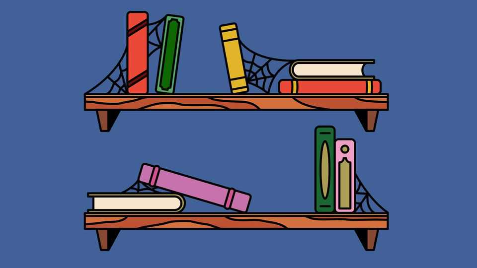
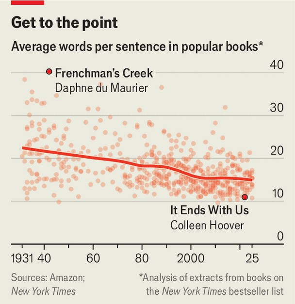

Culture | Book-spurning
Is the decline of reading making politics dumber?
As people read less they think less clearly, scholars fear
September 4th 2025

The experiment was simple; so too, you may have thought, was the task. Students of literature at two American universities were given the first paragraphs of “Bleak House” by Charles Dickens and asked to read and then explain them. In other words: some students reading English literature were asked to read some English literature from the mid-19th century. How hard could it be? Very, it turns out. The students were flummoxed by legal language and baffled by metaphor. A Dickensian description of fog left them totally fogged. They could not grasp basic vocabulary: one student thought that when a man was said to have “whiskers” it meant he was “in a room with an

animal I think…A cat?” The problem was less that these students of literature were not literary and more that they were barely even literate.

Reading is in trouble. Multiple studies in multiple places seem to be showing the same thing. Adults are reading less. Children are reading less. Teenagers are reading a lot less. Very small children are being read to less; many are not being read to at all. Reading rates are lower among poorer children—a phenomenon known as “the reading gap”—but reading is down for everyone, everywhere.

In America, the share of people who read for pleasure has fallen by two- fifths in 20 years, according to a study published in August in iScience, a journal. YouGov, a pollster, found that 40% of Britons had not read or listened to any books in 2024. Reading for displeasure is little better: as Sir Jonathan Bate, an English professor at Oxford University, has said, students “struggle to get through one novel in three weeks”. Even the educated young, another greybeard said, have “no habits of application and concentration”.

Such laments should be treated with caution: almost the only thing bookish sorts love more than books is complaining about books and reading. They always have done: the greybeard above was Dickens in, ironically, “Bleak House”. Almost as soon as people stopped fretting about the arrival of reading—Socrates feared it would “produce forgetfulness” in those who used it; Ecclesiastes says that “of making many books there is no end”— people started fretting about its decline. As Ecclesiastes also says, “there is nothing new under the sun”.

Arguably, however, what is happening now is new. It is not just that people are reading less, though they are; the texture of what is being read is changing, too. Sentences are getting shorter and simpler. We analysed hundreds of New York Times bestsellers and found that sentences in popular books have contracted by almost a third since the 1930s.

Open the Victorian bestseller “Modern Painters” by John Ruskin and you will find that its first sentence is 153 words long. It contains the stern advice that you should not trust the “erroneous opinion” of the public and includes a subheading that reads: “Public opinion no criterion of excellence”. Open Amazon’s current non-fiction bestseller, “The Let Them Theory” by Mel Robbins, and you will find that its first sentence is just 19 words long. A subheading reads “How I Changed My Life”. Among its stern advice is that, to get things done, you should count backwards like NASA at a rocket launch because, “Once you start the countdown, 5-4-3-2-1, there’s no turning back.” This is a reminder that Ruskin knew a thing or two.

Smartphones are blamed for dwindling reading habits—and certainly the number of distractions has increased. But reading has always been a bother. “A big book”, said Callimachus, an ancient Greek poet, “is a big evil.” This is particularly true after lunch. You sit down to read then, as one writer noted, the sun streams in, the day feels “50 hours long”, the reader “rubs his

eyes” then finally places the book “under his head and…falls into a light sleep”. Given that that particular reader was a fourth-century monk and ascetic he was probably not distracted by Snapchat.

So it is not merely that distractions have increased: the sheer desire to read seems to have declined. In the Victorian era, self-improvement societies flourished. In the Scottish hills, shepherds “maintained a kind of circulating library”, writes Jonathan Rose in his magnificent book “The Intellectual Life of the British Working Classes”. Each shepherd left books in the crannies of walls for other shepherds to read. In Victorian mill towns, workers saved up to buy books. In one Scottish locale, a boy noticed a ragman reading a book. The book—which the ragman lent him—was Thucydides. The boy was Ramsay MacDonald, who would go on to become Britain’s first Labour prime minister.

Today that zeal for personal advancement has diminished. Some blame the high cost of books and closing of libraries for modern intellectual apathy— but books have never been cheaper. In Roman times, a book cost three- quarters of a camel (ie, a lot). In the Victorian era, a copy of Lord Byron’s “Childe Harold’s Pilgrimage” cost a labourer about half a week’s income. And yet, by the end of the 18th century, literacy rates among Scotland’s autodidacts were among the highest in the world. Today “Childe Harold’s Pilgrimage” is free on Kindle, and readers can find plenty of other books that cost less than a coffee. But reading rates keep falling.

A blunter explanation is that people just cannot be bothered. Professor Bate got everyone in a bate with his comments about students not reading: saying such things, he admits, might seem “old fogeyish”. Speak to professors, however and they all lament their students’ waning attention spans. When Professor Rose began teaching, he taught “Bleak House”. He would not attempt it today, he says, partly because of “constant pressure” from university deans to “assign less and less and less reading” and partly because “students simply won’t read it”. In multiple surveys young people describe reading as “boring” and “a chore”.

It is possible to say: who cares? English professors may well lament a fall in literacy, but that may be simple self-interest: less a concern about a declining custom than a declining number of customers. Yet literacy affects more than

university reading lists. For one thing, increasing literary sophistication seems to lead to increasing political sophistication. At its simplest, Athenians in the fifth century BC could begin to practise “ostracism”— voting to banish people by writing their name on ostraka, scraps of pots— because, as William Harris, an academic, points out, they had achieved “a certain amount of literacy”.

By contrast, decreasing literary sophistication may lead to decreasing political sophistication. Our analysis of Britain’s parliamentary speeches found that they have shrunk by a third in a decade. We also analysed almost 250 years of inaugural presidential addresses using the Flesch-Kincaid readability test. George Washington’s scored 28.7, denoting postgraduate level, while Donald Trump’s came in at 9.4, the reading level of a high- schooler.

This is not inherently a bad thing. Often simple prose is good prose, and few people have ever wished politicians’ speeches to be longer. Professor Bate is more pessimistic. Lose the ability to read complex prose and he fears you may also lose the ability to develop complex ideas that “allow you to see nuance and to hold two contradictory thoughts together”. The medium is the message, and the message is currently 280 characters long. (“Bleak House”, by contrast, weighs in at around 1.9m characters.)

There will be other losses from a reading decline. Few engines of social mobility are more effective than reading: just ask the Scottish shepherds. Rich children may do it more, but reading is an egalitarian invention. No one —not your nanny, not your tutor, your friends or your posh school—can impel you to devour a book except you. Reading is not merely a tool: it is also one of life’s great pleasures, as Dickens knew well. As Joe, the kind blacksmith in “Great Expectations”, says: “Give me a good book...and sit me down afore a good fire, and I ask no better.” Once people forget that, things really will feel bleak. ■

For more on the latest books, films, TV shows, albums and controversies, sign up to Plot Twist, our weekly subscriber-only newsletter

This article was downloaded by zlibrary from https://www.economist.com//culture/2025/09/04/is-the-decline-of-reading-making- politics-dumber