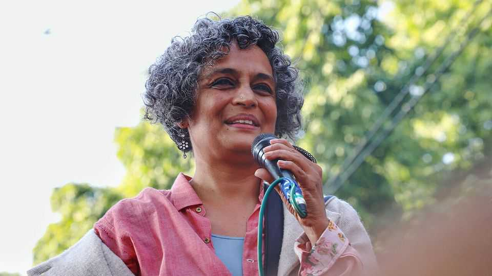

Culture | There’s something about Mary
Mother (not always) dearest: Arundhati Roy on her parent
An account of a relationship between two extraordinary women
September 4th 2025

IT HAS BEEN nearly three decades since Arundhati Roy’s vivid, poetic novel “The God of Small Things” won the Booker, Britain’s most prestigious literary prize. Back in 1997, after the cold war and before September 11th, the West basked in its supremacy and India was more widely known for tropical exoticism than Hindu nationalism, writing a hit literary novel could propel its author to global fame. The world has since changed markedly, but Ms Roy has not. She rejected a lucrative career churning out pretty novels to become one of the foremost polemicists of the 21st century. She has spoken out against India’s nuclear testing, supported Kashmiri independence, fought a mega-dam in the

western state of Gujarat, denounced American wars in Afghanistan and Iraq and has staunchly opposed Hindu nationalism. Now 63 years old, she remains fiercely independent.

For that independence, and for much else, Ms Roy credits Mrs Roy (as she refers to her mother), whose name adorns the title of her first memoir, “Mother Mary Comes To Me”. Mary Roy was a “dreamer, warrior, teacher”, as her gravestone put it. She dreamed of a world where women could be equal to men. She fought, all the way to India’s Supreme Court, for equal inheritance rights for the women of her community, and won. And she was a teacher, building a successful school in her home state of Kerala and instilling her values in her pupils.

Mary was also a terror. She behaved abominably towards her staff, her relatives and, especially, her own children, who “had to absorb much of her darkness”. At the age of 18, two years into architecture school in Delhi, Ms Roy stopped returning home. Mother and daughter would not see each other again for seven years. When their relationship at last resumed, it was no less fractious, and it remained so until the very end.

But that period apart was, perhaps, an inoculation against a more permanent separation. It was also when Ms Roy embarked on the long path that would turn her into the writer, essayist and fighter she became. “I am grateful for that gift of darkness,” she writes. “It turned out to be a route to freedom, too.”

Winning that freedom required long periods of hand-to-mouth living. Eventually, she met her husband, with whom she would make films and build a happy family. Writing scripts for British producers supported her through four years of writing “The God of Small Things”. It was only with the book’s success, when Ms Roy was 36, that she found financial stability.

With money came physical comfort, but also deep spiritual discomfort about being so well-off in a country still filled with injustice and poverty, and about becoming the sort of privileged, insulated, upper-class Indian she had once laughed at. And so, with the cushion of royalty payments and the independent streak inherited from Mary, she remained her own person, using her talents and tenacity to fight for the causes she believed in. That has not

been easy. In 2002 India’s supreme court found her guilty of contempt for criticising the judiciary. Last year, Narendra Modi’s government approved her prosecution under anti-terrorism legislation for comments she made about Kashmir 15 years ago (no action has yet been taken).

Ms Roy’s facility with words is undisputed. By writing about herself, her mother and her life—all of which she sees alongside the wider social and political currents of the day—she brings a touch of lightness to weighty concerns, including child abuse and sexual harassment. At times, the memoir feels like the best kind of fiction, veering into magical realism. “But no”, she writes, “it was pretty much the only kind of realism I knew.” For the reader, the magic lies in discovering the extraordinary relationship between two extraordinary women, and how it shaped one of the world’s best writers. ■

For more on the latest books, films, TV shows, albums and controversies, sign up to Plot Twist, our weekly subscriber-only newsletter

This article was downloaded by zlibrary from https://www.economist.com//culture/2025/09/04/mother-not-always-dearest-arundhati- roy-on-her-parent