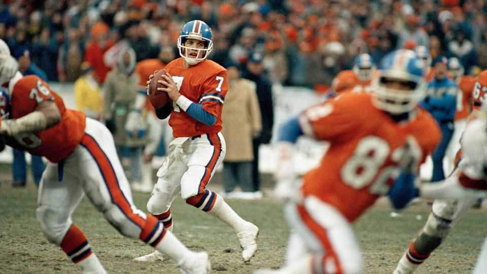

Culture | Lonely at the top
Quarterbacks shoulder an immense burden on the field
And life off the field is often harder
September 4th 2025

No position in team sports carries as much pressure and responsibility as the quarterback in American football. They direct every offensive play, which means they must know their team’s entire playbook. Most of the highest- paid players in America’s National Football League (NFL) are quarterbacks; often 20-25% of a team’s wages go to their quarterback. Signing the right quarterback is one of the most important decisions a team must make. Before the league’s annual player draft, squads will sift through piles of reports, profiles, tests and interviews. But Seth Wickersham, a journalist at ESPN, argues that “no scouting processes have cracked the

code, or even clarified it”. He reckons that most of the 69 quarterbacks chosen in the draft’s first round since 2000 have been failures.

In “American Kings”, Mr Wickersham analyses what it takes to be successful in such a singular role. He profiles some of the best quarterbacks, such as Bob Waterfield, who popularised football in Los Angeles; and Johnny Unitas, the son of Lithuanian immigrants who became “the first truly great [quarterback] to come out of nowhere”. Mr Wickersham spends time with his childhood hero, John Elway, who helped the Denver Broncos win two Super Bowls (after three losses earlier in his career), and follows three young contenders through the quarterback-industrial complex, from school, to college, to the.

One of these prospects is Colin Hurley, a 15-year-old. His dad, Charlie, is unusually enlightened for the father of a sport prodigy, and the pair appear to have a sweet rapport. In a telling moment, both are aghast as they watch a Netflix documentary about high-school quarterbacks in which a father tears his son to shreds after poor play. Colin trains endlessly, and does little else. Mr Wickersham observes that he leads “a fiercely limited existence in the hopes of an expansive life”.

College football is an extended apprenticeship for the. It is also where a great winnowing takes place: around 16,000 boys play quarterback in high school, but just 860 start in college. Would-be quarterbacks pick their destinations carefully, and colleges compete to attract the best. Mr Elway recalls receiving a postcard from the cheerleading squad at the University of Missouri, informing him: “We don’t sleep with teddy bears. We only sleep with Missouri Tigers.” (He went to Stanford.)

As the sport has become increasingly guided by statistics, the tolerance for mistakes, and even quirks, has shrunk. Football has “never seemed less real, less instinctive, less open to improvisation”, Mr Wickersham writes.

“American Kings” argues that quarterbacks pay a high price for their fleeting moments of glory. Few of those who make it to the summit are able to fully appreciate the view. Steve Young, a three-time Super Bowl winner, says that being around other elite quarterbacks felt deflating “because I

wasn’t quite as far along as I thought I was”. When Mr Elway finally wins the Super Bowl, his principal emotion was not joy but relief.

Unsurprisingly, life in retirement does not come easily either. “Everyone with the luxury of myopically pursuing their dreams, and then succeeding, faces a transition into a less-selfish version of adulthood,” Mr Wickersham diagnoses. There is a lot of drink, drugs and infidelity. These vices are common across sports, but Mr Wickersham contends that quarterbacks are particularly vulnerable. They have “a deep and urgent imperative to dominate. Interactions with old friends, with accountants and business partners, with girlfriend and wives, are every bit as geared toward filling some bottomless hole in their personality as is calling a play.”

This is Mr Wickersham’s sad conclusion. He sets out hoping to learn how these men can repeatedly execute a spot-perfect 60-yard spiral pass. He finds that this is the teachable bit that they will eventually commit to muscle memory. The trickier part is how to cope with everything outside the straight lines of the gridiron. ■

For more on the latest books, films, TV shows, albums and controversies, sign up to Plot Twist, our weekly subscriber-only newsletter

This article was downloaded by zlibrary from https://www.economist.com//culture/2025/09/04/quarterbacks-shoulder-an-immense- burden-on-the-field