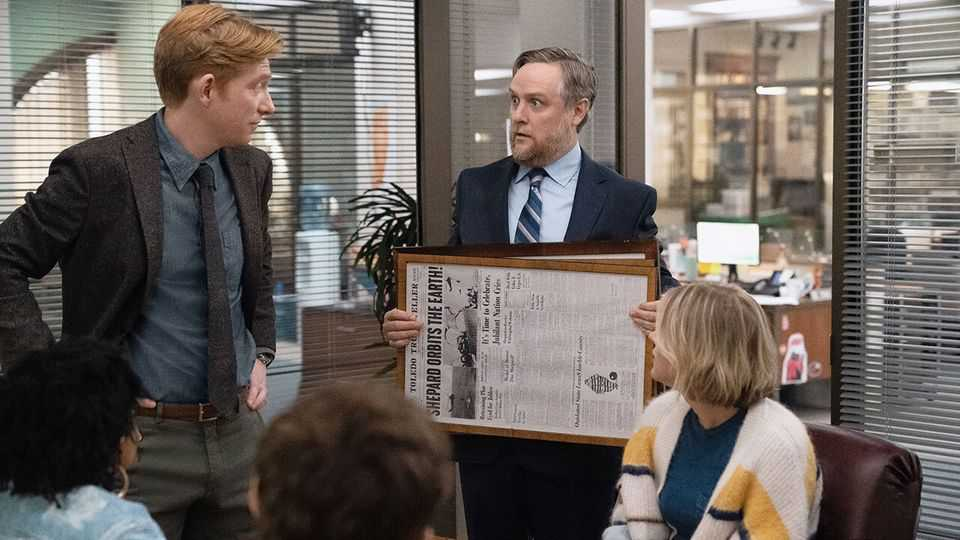

Culture | Same again, please
“The Paper” is less spin-off from than clone of “The Office”
Fans of the original sitcom may not care
September 4th 2025

THE SHIP of Theseus is a thought experiment concerning the nature of change: is a ship that has had every plank replaced still the same ship? “The Paper”, a new comedy series from the producers of the American version of “The Office”, poses a related question. What if, instead of everything, just a couple of planks and most of the crew were replaced, and its name was changed from the Ship of Theseus to Frank’s Boat. Is it a different craft? NBC, the network behind both shows, says they are “set in the same universe”, if not the same place. “The Office” focused on a paper company in Scranton, Pennsylvania, whereas the workplace in “The Paper” is a struggling newspaper in Toledo, Ohio. Yet a bit of clunky narrative

engineering in the new show’s first episode—as well as Oscar Nuñez’s portrayal of the same character, Oscar, a pernickety accountant—links the two series directly.

The focus on the Toledo Truth-Teller leads to some unfortunate romanticisation. The opening credits show newspapers being used to wrap bread, train dogs and cover walls, reminding viewers how embedded they once were in daily life. Then again, radios, fax machines and petrol containing lead were once essential, too. Times change.

Domhnall Gleeson plays a starry-eyed toilet-roll-salesman turned editor-in- chief who likes to rally his troops by holding forth on journalistic principles. Black-and-white clips from 1971 showing a bustling newsroom and a publisher talking high-handedly about “saving democracy” come off as extraneous moralising.

But the larger problem is that the new show is almost wholly derivative of its predecessor. It follows the same fake-documentary format and is also set in a struggling post-industrial small city (signifying to viewers that they are watching a show about “real America” rather than the coasts). The theme song is similarly composed; the humour is similarly cringeworthily witty. Though the characters are different, the types—and therefore their interactions—are the same.

Tim Key plays a boorish, ambitious corporate lackey, as Ricky Gervais and Steve Carell did previously. (Alas, Mr Key is less funny than either of them.) Sabrina Impacciatore is an older, female, Italian version of Dwight Schrute (Rainn Wilson in the original), an incompetent conniver with no self- awareness. Mr Gleeson and Chelsea Frei, as the paper’s star reporter, have the lead romance arc that John Krasinski and Jenna Fischer, as Jim and Pam, did in “The Office”, while Ramona Young and Melvin Gregg have the same weird secondary entanglement as Kelly and Ryan (Mindy Kaling and B.J. Novak). The show is intermittently funny. But it is about as surprising as a McDonald’s Happy Meal.

Then again, McDonald’s sells a lot of Happy Meals and “The Office” has a lot of fans. It was reasonably but not wildly popular when it was on air. At its peak, in its fifth season, around 9m people watched each week; far more

people preferred “Two and a Half Men”, a pedestrian sitcom about fatherhood starring Charlie Sheen. But according to Parrot Analytics, a data firm, since Peacock acquired streaming rights for “The Office” in 2021, it has been responsible for more than twice as many subscribers as “Two and a Half Men”, and has been among the channel’s ten most popular shows this year and last. If “The Paper” can attract even 20% of fans of “The Office”, Parrot Analytics says, it will be considered a hit.

“The Paper” may be devoid of novel ideas, but the popularity of franchises, reboots and remakes suggests that viewers crave familiarity. For many fans, a new ship is all well and good—but an old one that does a reliable job is even better. ■

For more on the latest books, films, TV shows, albums and controversies, sign up to Plot Twist, our weekly subscriber-only newsletter

This article was downloaded by zlibrary from https://www.economist.com//culture/2025/09/03/the-paper-is-less-spin-off-from-than- clone-of-the-office