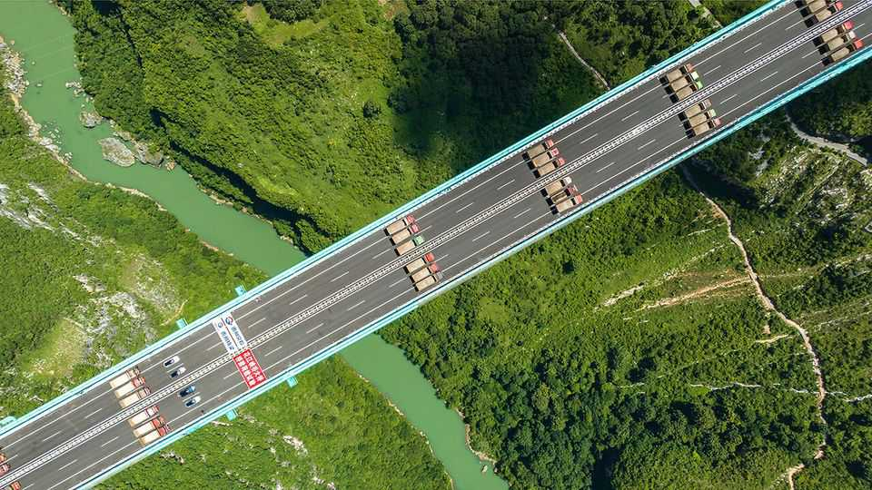

Culture | Welcome to the machine
A new theory of China’s rise: rule by engineers
As opposed to America, which is ruled by lawyers
September 4th 2025

Many of the people who run China are engineers, and it shows. Since the 1980s China has built a motorway network twice the length of America’s and a high-speed rail network more than 15 times the size of Japan’s. It uses almost as much solar and wind power as the rest of the world combined, and it produces around one-third of the world’s manufactured goods. In his illuminating new book, “Breakneck: China’s Quest to Engineer the Future”, Dan Wang argues that China is an “engineering state”, locked in competition with America, which is run by lawyers. China builds things quickly. America debates endlessly about whether they should be built at all. How did China, a country that was once known mostly for intellectual- property theft and child labour, become a technological powerhouse?

Practice helps. Mr Wang compares engineering prowess to cooking. A chef needs the right equipment, a clear recipe and most important, intuition—the know-how and proficiency that comes only through practical experience. “Ask someone who has never cooked before to do something as simple as fry an egg,” Mr Wang writes. “Give him a beautiful kitchen and the most exquisitely detailed recipe and he might still make a mess.”

Millions of factory workers and managers across China have spent decades accruing this sort of intuition. As contract manufacturers of smartphones, consumer drones and other sophisticated electronics, they have built a skilled workforce that powers many of the world’s most valuable companies, including Apple, Samsung and China’s own Huawei.

This process knowledge is China’s big advantage over America, argues Mr Wang, who was born in China, migrated to America and has worked in both countries. Xi Jinping, China’s president, has declared, “The real economy is the basis of everything…so we must never deindustrialise.” Chinese manufacturing leads the world in numerous sectors: clean technology, ultra- high voltage transmission, high-speed rail and 5G networks.

To be sure, America has many success stories, including semiconductors and medical devices. But should the two countries stumble into war, the engineering state may have an advantage. In 2022 China had nearly 1,800 ships under construction; America had five. During fierce fighting, Ukrainian forces fired nearly as many artillery shells every two days as America makes in a month. Even if America achieves artificial general intelligence, Mr Wang notes that algorithms alone cannot win battles—they must be embodied in manufactured drones and munitions.

Still, noting the primacy of engineering in China’s global ambitions, though illuminating, does not explain the country’s failures. “Breakneck” does not ignore China’s big challenges, which include overcapacity, rising debt, environmental destruction and the human cost of living in a state that views “people as aggregates, not individuals”. But Mr Wang contends that these stem from the excesses of the “engineering state”. In fact they are the consequences of political incentives in China’s rigid, top-down authoritarian system.

For example, Mr Wang argues that only an “engineering state” would have allowed Song Jian, a missile scientist, to formulate its notorious one-child policy. His background matters less than the Communist Party’s acceptance of his proposal, which, according to Mr Wang, has led to 321m abortions and the sterilisation of 108m women. A proper engineering-based approach might have included cost-benefit analyses and adaptation based on results— precisely what China’s top-down political system did not allow.

China’s approach to the pandemic is another example. Mr Wang writes poignantly about his three years living under the “zero-covid” policy. He recalls endless intrusive tests and unavailable fever medication. China, Mr Wang posits, was the only country that denied its people ibuprofen, fearful that people might use it to avoid being detected with a higher-than-normal

temperature. He calls this “a perfect encapsulation of the engineering state’s twisted logic”.

It is actually the perfect encapsulation of China’s authoritarian system. Who wants to be caught selling contraband fever pills in a police state? What official would risk suggesting to their superiors that people might benefit from painkillers? Fear of political punishment, not engineering prowess, drove these decisions.

The “engineering state” is a useful way to think about industrial competition between America and China. Yet readers seeking to grasp China’s governance failures might do better to focus on the “one-party” in “one- party state”. ■

For more on the latest books, films, TV shows, albums and controversies, sign up to Plot Twist, our weekly subscriber-only newsletter

This article was downloaded by zlibrary from https://www.economist.com//culture/2025/09/04/a-new-theory-of-chinas-rise-rule-by- engineers

Economic & financial indicators

Economic data, commodities and markets