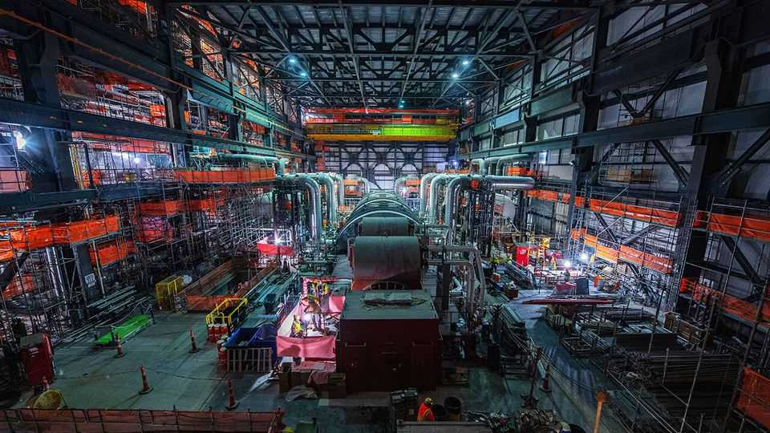

商业 | 黎明前的黑暗？
为何核能产业此刻迎来繁荣
即便“核能复兴”仍远未板上钉钉
2025年9月4日

摘要：核能“回暖”由能源安全、科技巨头用电需求与新金融/运营模式共同推动。美国与欧盟加速布局，SMR 与聚变获资本加持；标准化与多站并建有望压降成本。但监管、供应链与劳动力仍掣肘，短期更依赖延寿与重启，长周期或见规模化突破。 建议：聚焦核能与公用事业主题逢低配置，中线关注SMR与燃料链龙头；短期警惕监管与供应链扰动，控制仓位。

“让美国重返核能时代。”这是里克·佩里（德州前州长、特朗普首任总统任期内的能源部长）的目标。7月4日，他为口号注入“实操”：创立了 Fermi America，计划建设全球最大的能源与数据中心综合体。在德州狭长地带的阿马里洛郊外（牛仔小镇），推土机正翻动红土，先期将建成一座以天然气与太阳能发电的设施，随后兴建常规核反应堆与多台小型模块化反应堆（SMR），总装机达11吉瓦（GW）。过去20年对核能并不友好。尽管在一些国家，核电仍是能源结构的重要组成（见图1），但在欧洲与北美，没有一座核电站按期、按预算建成。随着可再生能源成本大幅下降，本已昂贵的美国、英国与芬兰核电项目遭遇延期与巨额超支。然而在8月25日，核能热情的最新信号出现：Fermi 与核技术公司西屋电气宣布建立伙伴关系，将寻求批准在阿马里洛建设四台后者的大型 AP1000 反应堆。一场漫长的“核冬天”，是否正露出春芽？

对于核能的乐观，源于三大演变。其一，许多西方国家的政府愈发渴望安全、独立的电力来源；其二，科技巨头对可靠电力的渴求与对排放的顾虑，使其成为“富有的绿色金主”；其三，新的运营与融资模式或可改善核能高风险的经济性。世界核能协会总干事萨玛·毕尔巴鄂-莱昂断言：“这一次，确有不同。”

这种态度转变在美国尤为明显。特朗普呼吁到2050年将国内核电装机提高到400GW（现有四倍）。尽管目标明显过于雄心勃勃，却已发动了政治体系。今年7月通过的《至美法案》（One Big Beautiful Bill Act）为该行业大幅提供税收抵免。德州等共和党州在铺开“欢迎地毯”，一些蓝州亦然。纽约在2021年关闭一座大型核电站后，如今希望州属公用事业公司新建一座。

大西洋彼岸，欧盟委员会6月发布路线图，预测核电装机到2050年将从100GW升至最多145GW。德国已取消反对在欧盟立法中将核能归为“绿色”的立场，从而让法国更容易新建六座核电站。7月，英国政府作出最终决定推进 Sizewell C 项目，这两台巨型反应堆的造价可能超过380亿英镑（510亿美元）。

与此同时，瑞典确认将建多台 SMR，这类小型机组可在工厂批量制造，再运至合适的站点。尽管技术尚未商业可行，但相较大型核电站更小的资本开支、以及更快速的规模化，颇具吸引力。超过120家公司正尝试开发 SMR。巴克莱银行预测，2030—2050年间，中国与俄罗斯之外的净核电装机可能增加逾一半，超过450GW，其中 SMR 占比40—60%，对应约1万亿美元市场。数十家初创也在追逐核聚变——这更具风险，却承诺几乎无限的清洁能源。

科技巨头正为两类技术注资。自2024年初以来，SMR 初创累计融资已超20亿美元。6月，由 OpenAI 负责人山姆·阿尔特曼支持的 Oklo 融资4.6亿美元；由比尔·盖茨创办的 TerraPower 融资6.5亿美元。谷歌已签约，协助 Kairos Power 在2035年前打造一支 SMR 机队。核聚变初创亦在吸金：同样有盖茨站台的 Commonwealth Fusion Systems 于8月26日公布新一轮8.63亿美元融资。统计期至7月，聚变初创合计融资26亿美元。

谷歌的迈克尔·特雷尔表示，行业需要来自核能的“清洁、稳定电力”来补足可再生能源。他认为对核能的支持贯穿“短—中—长期”。近期，延寿、重启与“功率提升（uprating）”最具影响；随后是采用成熟设计的大型机组与 SMR；再往后，才可能轮到聚变。

由全球最大民营核电运营商——康斯特雷欣能源（Constellation Energy）在伊利诺伊州运营的克林顿核电站，展示了科技巨头可能带来的影响。由于页岩气压低电价，该站一度无利可图；原计划随州政府补贴在2027年到期而退役。但今年6月，拥有 Facebook 的 Meta 签署了一份为期20年的协议，资助电站延寿，以换取核电发电附带的碳信用。去年，微软也签署了类似协议，拟重启宾夕法尼亚州三哩岛的一台退役机组。

克林顿核电站还提供了另一条启示。康斯特雷欣正投资设备、软件与流程以扩大发电。其首席执行官乔·多明格斯估算，通过这类渐进式改造，美国核电机组群可新增7—10GW产能。他总计认为，科技巨头的支持将让原本不可得的30GW电力进入市场。

投钱的并非只有科技巨头。核电开发商与供应链企业正通过公开市场筹资数亿美元；自特朗普颁布支持该行业的行政令以来，核能上市公司的股价节节攀升（见图2）。Oklo 的负责人雅各布·德维特指出：“不再只依赖政府资金那种‘稀缺思维’了，我们可以多点开花。”

上述种种催生了乐观的第三个理由：新的金融模型与运作实践，正针对建设核电站那套“糟糕经济学”。正如巴克莱所言，常规核电与 SMR 的度电成本“目前均高于市场电价”。但中国与韩国已经展示：完全有可能在五年内、在预算内建成大型反应堆（见图3）。两国采用标准化设计、单站多堆、项目无缝衔接以保持人力与供应链活跃，这些都压低了成本。

约翰斯·霍普金斯大学的丹尼尔·卡门等人在《自然》杂志发表的新论文强调，中国“巨大且不断扩张的电力市场”为需求确定性与供应链投资提供了保障。在截然不同的环境下，西方或许也能重建类似需求。古根汉证券的吉姆·谢弗主张一种融资模式：把行业内的大型用电客户（如科技巨头）打包，构建风险共担的伙伴关系与长期高于市场价的合同，以此为核电机组群融资；作为回报，他们将获得可靠电力。“普通公用事业公司及其用户难以负担‘首台套’项目的成本。”他说。

金融创新固然关键，运营端的进步同样不可或缺。“不能只做一两台，你得做十台……需要的是国家级计划，而不是一串分散项目。”清洁空气特别工作组（Clean Air Task Force）负责人阿蒙德·科恩如是说。西屋看法一致：该公司希望在2030年前在美国启动十台 AP1000 的建设。初创 The Nuclear Company 也计划采取“设计一次、多点建造”的路径。其董事长帕特里克·马洛尼称，公司打算组织客户联盟来建设六台同型机组。

阻碍“核复兴”的因素仍不鲜见。尽管出现了新创新，核电的经济性依旧棘手；过度监管仍是障碍，削减繁文缛节又可能引发公众反弹。供应链尚不健全、熟练劳动力短缺。许多在该行业摸爬滚打一生的人深知：政府慷慨与私人投资同样可能反复无常。

即便如此，先行者并不畏惧。“我们没有政府资金那张舒适吊床可躺着把规模做起来、把商业化做出来。”X-energy（SMR 初创）负责人克莱·塞尔表示。该公司正准备在德州一家陶氏化工设施建设首批四台机组。亚马逊已投资其扩张，并承诺助其部署数十台。在他看来，“现在的核能创新机会，比上世纪60年代商用核电的黎明期还要多”。这份雄心，或许尚未变成现实，但它清楚地映照出行业的壮志。■

为及时追踪商业与科技领域最重要的故事，欢迎订阅我们每周一次、仅面向订阅用户的通讯 Bottom Line。

本文下载自：https://www.economist.com//business/2025/09/04/why-nuclear-is-now-a-booming- industry

