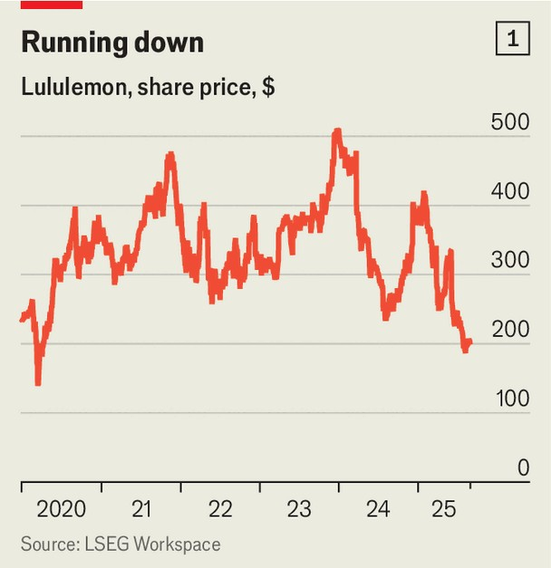

商业 | 被“宽松风”挤压
Lululemon 为何“失宠”
告别“紧身打底裤”，宽松当道
2025年9月4日

摘要：Lululemon 从“神裤”到失速：北美走弱、核心客不买单；宽松风+牛仔回潮、对手猛攻，库存高企被迫打折，关税与成本挤压利润。

【核心结论】
Lululemon 失速的本质，是“需求转弱 + 产品错位 + 流量不足 + 潮流逆风 + 宏观与关税拖累 + 库存与仿制掣肘”的叠加效应，导致增长与利润承压。

【一｜需求与产品错位】
品牌从“紧身神裤”崛起，但当核心客转向更宽松的穿搭时，新品扩展（鞋类、常规休闲、醒目 Logo）未能打动原有受众，出现“谁会穿这个”的反应。

【二｜营销与流量劣势】
公司营销投放约占营收5%，偏重口碑；而 On 等竞品投放约10%，签名人、做联名，声量与破圈能力更强。美国门店来访量2025年二季度同比下滑逾8%，中国增长也放缓。

【三｜潮流与竞品挤压】
“宽松当道、牛仔回潮”，Alo、Vuori 等更“当红”的对手在抢份额。修身风退潮，Lululemon 的标志性单品热度回落。

【四｜宏观与关税压力】
营收四分之三来自美洲，美国消费者因通胀与经济不确定更谨慎。供应链上，越南产成品与中国内地面料受到新关税冲击；取消“最低免税额”豁免抬升价格、抑制销量。

【五｜库存与复制风险】
库存同比大增而销售放缓，被迫以折扣去化，核心款也下沉至奥特莱斯；产品易被低价模仿，法律纠纷增加，品牌稀缺性被稀释。

【小结】
从“高增长、高溢价”的运动休闲代表，到被潮流与成本双重夹击，Lululemon 面临的是系统性挑战：既要重塑产品与品牌叙事，也要补足营销与供给韧性，才能走出“失速带”。■

 

