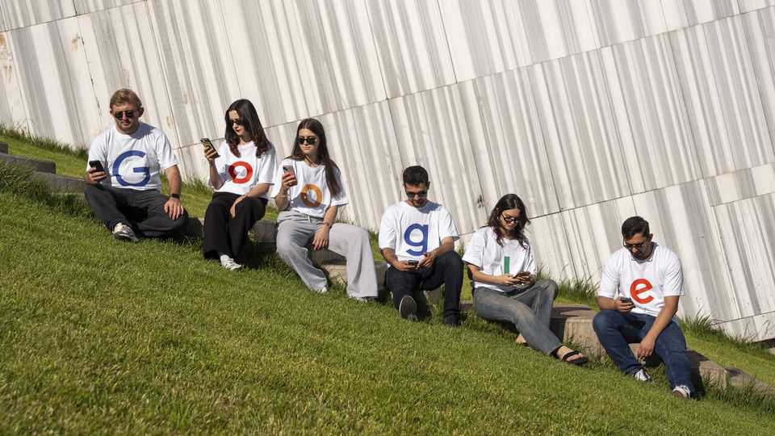

商业 | 不粘锅科技
谷歌与苹果“躲过一劫”的反垄断判决
感谢 AI，风向变了
2025年9月4日

摘要：法官拒绝拆分谷歌，采纳较温和的补救：限制排他分发、但允许合作付款延续，以免“伤及生态”。AI 被视为改变搜索市场格局的变量，弱化强制性结构性拆分的必要性。苹果同获喘息，二者或更紧密合作。

【核心结论】
生成式 AI 被法院认定为足以撬动搜索竞争的新力量，从而将“拆分谷歌”的强硬路线，转为“行为纠偏 + 数据共享”的温和方案；苹果默认搜索分成模式得以续命。

【一｜判决要点】
— 去年裁定谷歌构成非法垄断的联邦法官 Amit Mehta，本次否决政府提出的拆分补救，称其“越界”。
— 禁止谷歌就 Chrome、Google 搜索、Gemini 等部分产品签排他分发，但允许继续向合作方（含苹果）支付分成，避免对依赖该收入者造成“致命”冲击。

【二｜AI 改变了什么】
— 法官认定，自上一判决以来，AI 令搜索市场发生重大变化：巨额资金涌向生成式 AI 创业；ChatGPT、Claude、Perplexity 等被广泛用于“类搜索”。
— 苹果高管证词称，Safari 的谷歌搜索量 22 年来首次下滑。法院据此认为应“让市场力量发挥作用”，避免强行震荡。

【三｜对谷歌与苹果的影响】
— 谷歌免于最严厉惩罚，但需与小型竞争者共享用户交互与搜索相关数据，旨在降低其数据壁垒。
— 谷歌仍拟就“垄断”原判提起上诉，并在另一宗广告科技反垄断案中面临潜在资产剥离风险。
— 苹果获保留巨额默认搜索分成收入，市场预期其或与谷歌在 iPhone 上深化 Gemini 等 AI 合作。

【四｜市场反应与外部变量】
— 裁决落地后，Alphabet、苹果股价齐涨，悬而未决的不确定性缓解。
— 欧委会对谷歌广告科技的罚款亦传出推迟，与美欧关税谈判拉锯有关，短期利空减轻。

【小结】
“科企大分拆”叙事降温，AI 作为新竞争维度被司法认可。强监管转向“可竞争化”的精细治理路径，谷歌与苹果赢得时间窗口，但数据开放与广告科技案仍是后续压力点。■

