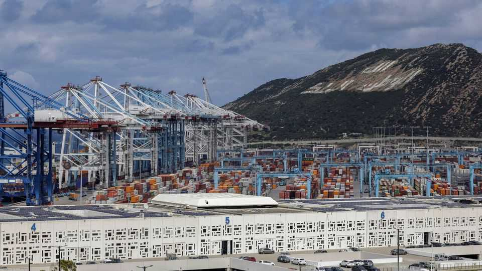
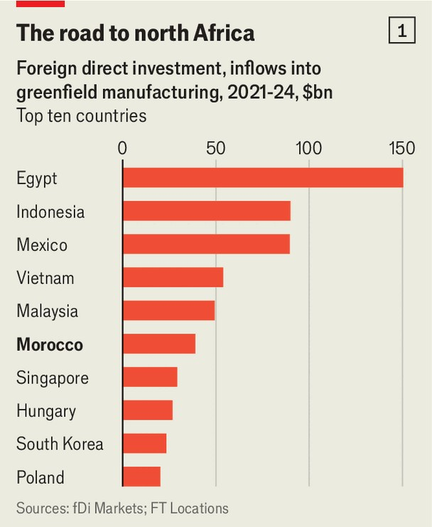
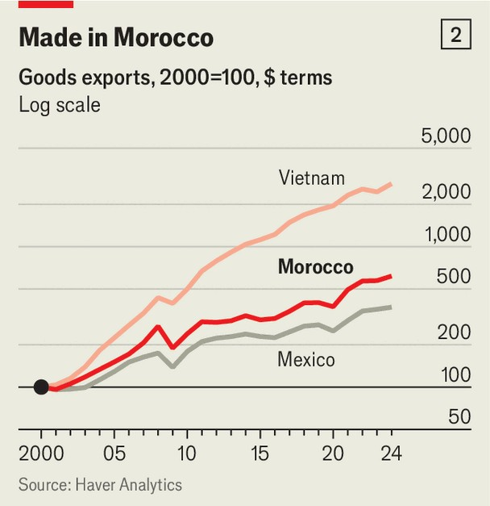

商业 | 北非“工业带”
摩洛哥：从港口到工厂的“新枢纽”
港口轰鸣，产线加速
2025年9月4日

摘要：依托直面直布罗陀海峡的区位、FTAs 与基建投入，摩洛哥迅速嵌入全球供应链：吸引逾400亿美元绿地制造投资，出口五年增三分之二，跃升欧盟最大汽车与零部件来源地。外资驱动带来中国与欧盟的机会与博弈，同时倒逼产业多元化与非洲布局。

【核心结论】
摩洛哥以“区位 + 通关 + 基建 + 自贸网络”四件套，构建面向欧盟与非洲的制造与物流枢纽；汽车先行，新能源与高端制造接棒，外资深度参与但竞争与地缘风险并存。

【一｜进入全球链条的“入口”】
— 坦吉尔梅德（Tanger Med）港口通达全球 180 个航点，滚装与集运高效衔接。
— 自 2020 年来吸引约 400 亿美元绿地制造投资，出口五年增约 2/3。

【二｜政策与基建底座】
— 王室主导的“投资者友好”政策：电力、港铁路、专用经济区与光伏风电持续投入（2001—2017 年基建投资占比 25%—38%）。
— 2000 年与欧盟自贸协定，叠加与 60 国优惠安排，汽车链率先集聚（雷诺、斯泰兰蒂斯与 Yazaki 等配套）。

【三｜汽车之外的爬坡】
— 出口车与零部件位居欧洲首位；肯尼特拉集群吸引 Lear、Faurecia、Nexteer 等。
— 航空、药品等高附加值行业起势：本土工厂为空客 A320 等供货占比提升；阿尔斯通在非斯生产电气设备。

【四｜中资涌入与地缘牵引】
— 中国资本两年内在电动车/电池领域承诺投资超 100 亿美元；国轩高科在肯尼特拉建 60 亿美元级电池厂，中海外承建高铁。
— 但欧盟反倾销与产业回流趋势加剧：中信戴卡受轮毂反倾销影响在葡萄牙另设厂；宁德时代转向西班牙的激励方案。

【五｜向非洲纵深与多元化】
— 作为非洲大投资方，主导 5,600 公里尼日利亚跨国输气管；卡萨金融城吸引 POSCO、Engie 等把摩洛哥作为“非洲门”。
— 官方强调在中欧拉扯中“分散风险、扩大赛道”。

【小结】
摩洛哥正把“门口优势”变成“产业优势”。下一步成败，在于本土龙头培育、供应链本地化深度，以及在中欧间拿捏好开放与安全的平衡。■

