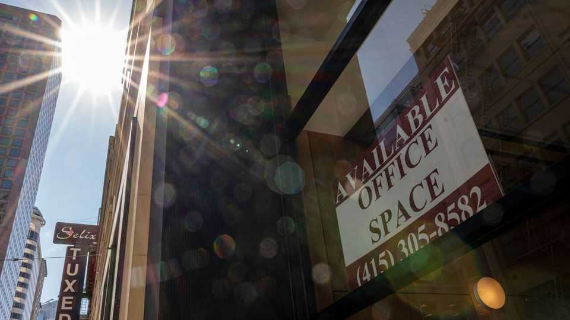
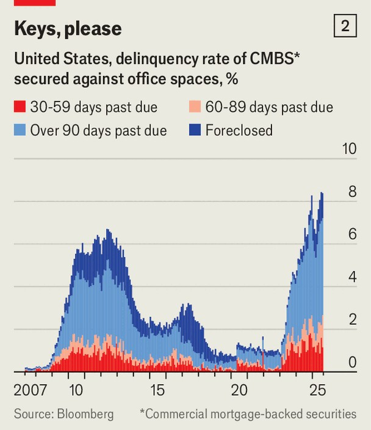
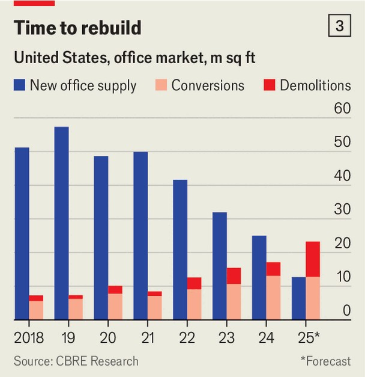

财经与经济 | 顶棚抬升
美国正走出“写字楼危机”
疫情与高利率带来的折磨，似乎要过去了
2025年9月4日

摘要：疫情+加息，把写字楼打到谷底：空着的多、价格腰斩、坏账上来。现在看到了一点回暖：新楼建得少了，旧楼拆改成公寓多了，银行退后、私募上前。但居家办公还在，恢复不会快。

【核心结论】
底基本打出来了：供给收、改造多、资金换赛道。别指望“V 形反弹”，慢慢修复才现实。

【一｜底部迹象】
— 行业龙头上调业绩预期，股价普涨。
— 新建少了，拆改多了，全国写字楼总面积二十五年来首次减少。
流程为何总“卡住”，以及如何疏通
【二｜谁在出钱】
— 银行收缩，特别是小银行；CMBS 回暖，私募巨头募资抄底“问题资产”。

【三｜拦路虎还在】
— 居家办公稳定在约 27%，新增需求有限；把办公室改成住宅要时间。

【小结】
不是一蹴而就的反弹，更像长期康复。看重改造能力和耐心的人，才是这波的赢家。■

