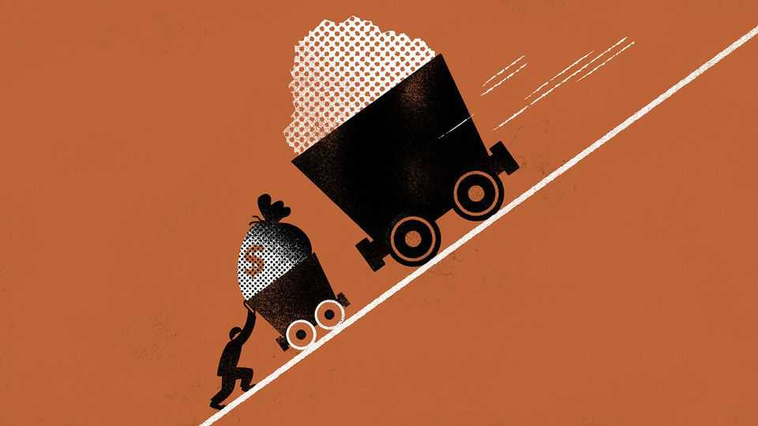

财经与经济 | 巴顿伍德
为何“供给冲击”是大宗投资者的陷阱
从锂价“假行情”学到的教训
2025年9月4日

摘要：大宗看起来很简单——少了就涨，多了就跌。但靠“供给冲击”博行情，多半昙花一现：行政关停易反转、装置很快修好、矿山很快复产，价格回落更快；真能走长牛的，只有“需求结构升级”。

【核心结论】
别把一次性事件当趋势。政治决定会变、供给会修复，价格靠“惊吓”拉升站不稳；能站稳的，只能是长期需求的变化。

【一｜锂：一腔期待，迅速回落】
— 中国关停建霞窝等矿引发“减产想象”，锂价/矿企股短线拉升；随后许可续期、供给预期修复，价格回到原点。
— 2022年的锂价飙升，本质是车厂/电池厂抢现货放大波动，非“永久性短缺”。补库结束+EV销量降速，价格塌方。

【二｜为什么“供给冲击”靠不住】
— 可逆：关税/关停属政策变量，来得快去得也快（如美国铜关税风波）。
— 可修：炼厂维修、矿山复产、改道运输，都能较快缓解供给。
— 可替：高价倒逼下游“去钴化”等技术替代，需求被重塑。

【三｜真正的底牌：结构性需求】
— 只有当需求端发生持久改变（技术路线、消费结构、产业政策），价格与利润中心才会迁移。

【小结】
别赌“意外”，要配“长期”。把精力放在需求大势而非短期供给插曲。■

