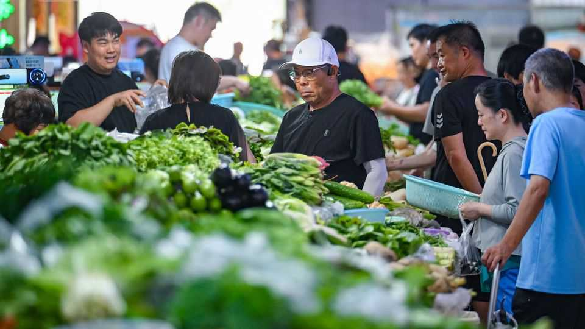
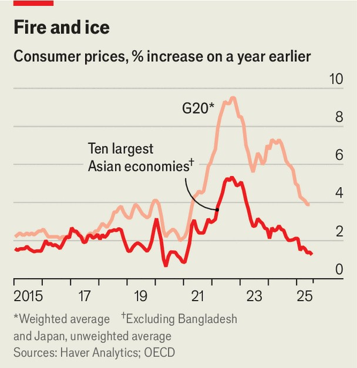

财经与经济 | 下行阴影
“通缩威胁”在亚洲游走
中国产能、商品转冷与需求疲软，共同拖低物价
2025年9月4日

摘要：亚洲多数经济体的通胀都很低，中国与泰国已见“负增长”的物价。主因不是关税当下的冲击，而是更早显现的：中国“出口价下行+产能外溢”、油粮转冷、内需偏弱与工资涨幅放慢；偏紧的货币政策也在放大需求风险。

【核心结论】
“低通胀/通缩”更像是结构性问题：中国产能、商品周期与本地需求共振下行，短期反弹难改大势。

【一｜现状：低到不正常】
— 除个别热点（日本、孟加拉），亚洲前十经济体通胀均值约1.3%。中国、泰国已转负，印度也刷新多年低位。
— 关税前“抢出口”反而推高了对美出货，通胀转弱从2024年下半年就开始。

【二｜三股冷风】
— 中国出口价自2022年起跌约15%，低价车与电子压低周边价格；
— OPEC+增产、粮价回落，油粮降温；
— 周期性下滑+结构性疲弱，制造竞争力转弱拖累就业与信心。

【三｜工资与政策】
— 劳动力供给走高，工资涨幅放慢；
— 多国央行“怕再通胀”，货币偏紧与需求疲弱叠加。

【小结】
关税可能锦上添霜，但根问题在“供给外溢+商品转冷+内需偏弱”。政策上需更关注需求托底而非单纯抑通胀。■

