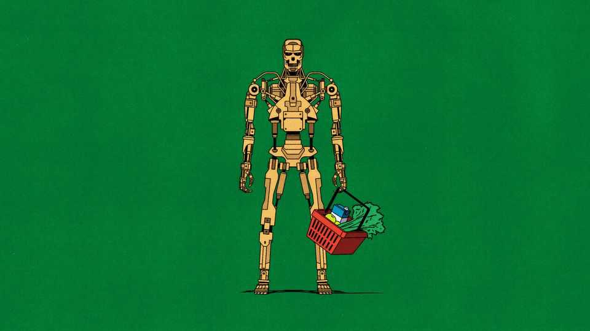

财经与经济 | 自由交流
要是AI只是“一种普通技术”呢？
它或许会走过往技术革命的老路
2025年9月4日

摘要：两位学者把AI当“普通技术”看：采用会慢于创新，经济影响更像“慢渗透”；工作会从“做事”转向“管机器做事”。风险治理不必神化“对齐”，更该把防线放到使用端与下游制度。

【核心结论】
别把AI当“超人伙伴”或“世界终结者”。把它当电气化/计算机化那样的通用技术，政策与落地都会更稳。

【一｜为何“慢采用”是常态】
— 习惯与流程要重塑，隐性知识难迁移，数据不规范、合规受限，导致用得不深不广。
— 历史类比：工厂电气化也花了几十年，先改布局再改组织。

【二｜创新也不一定很快】
— 许多应用要现实世界大规模验证（药物/自动驾驶/出行预订等），在高安全监管领域更慢更贵。

【三｜工作的形状会变】
— 任务更可自动化，人类转向“配置/监控/干预”。像工业革命里从“织布”到“看机器织布”。

【四｜风险治理往下游走】
— 模型“防滥用”不现实，关键是把网织在使用端：强网络/生物安全、登记备案、披露使用、事件上报、吹哨保护。

【小结】
把AI放回“普通技术”的框里，既不乐观到失真，也不悲观到失措，治理更有效。■

