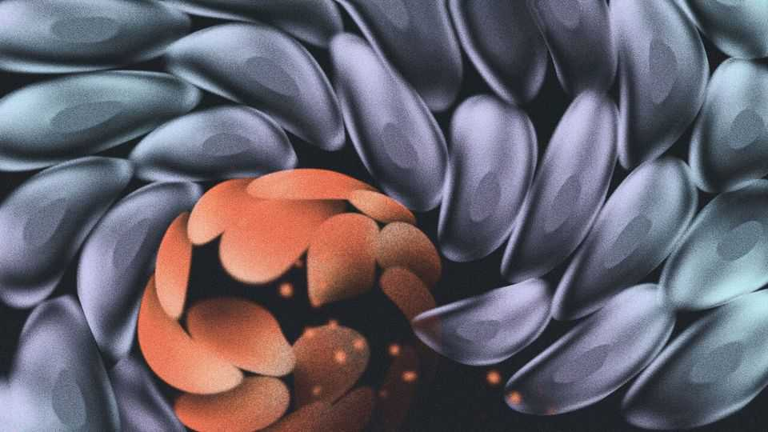

科学与技术 | 肿瘤预防
一种更有力的“抗癌预防”思路正在成形
不只杀坏细胞，还要“扶正”好细胞
2025年9月4日

摘要：健康组织里也遍布“致癌驱动突变”，但多被周围“更适应”的好细胞压住。新思路是：让好细胞长得更好，抢过位、把坏细胞“挤”出去；并把注意力移向慢性炎症等“推癌因素”的免疫端干预。

【核心结论】
预防不只靠“灭敌”，还要“扶正”。让健康细胞在竞争中占优、减少慢性炎症的土壤，或能把很多“未犯事”的坏细胞按住。

【一｜常识被刷新】
— 健康皮肤/食管/胃等组织里，大量细胞带“致癌驱动突变”。
— 为何没都变成肿瘤？因为邻居里有更“能打”的好细胞，会把它们顶下去、随新陈代谢被更新掉。

【二｜把好细胞“练强”】
— 小鼠实验：二甲双胍能让正常细胞获得类似突变细胞的代谢优势，从而“顶掉”带 PIK3CA 突变的坏细胞；高脂饮食则助坏细胞扩张。

【三｜盯住慢性炎症】
— 很多“非致突变型致癌物”通过长期炎症促肿瘤：空气污染、胃食管反流、紫外线、顽固细菌感染等。
— 针对关键炎症分子（如 IL-1β）的药物，在动物实验里可抑制由空气污染触发的肺癌启动。

【四｜工具更强】
— 从“多年育鼠”到“CRISPR快测”，筛基因与通路的速度大幅提升。

【小结】
未来的抗癌预防可能更像“生态调控”：既压坏也扶好，还要管住炎症这把火。高风险人群与“癌前病变”患者最可能受益。■

