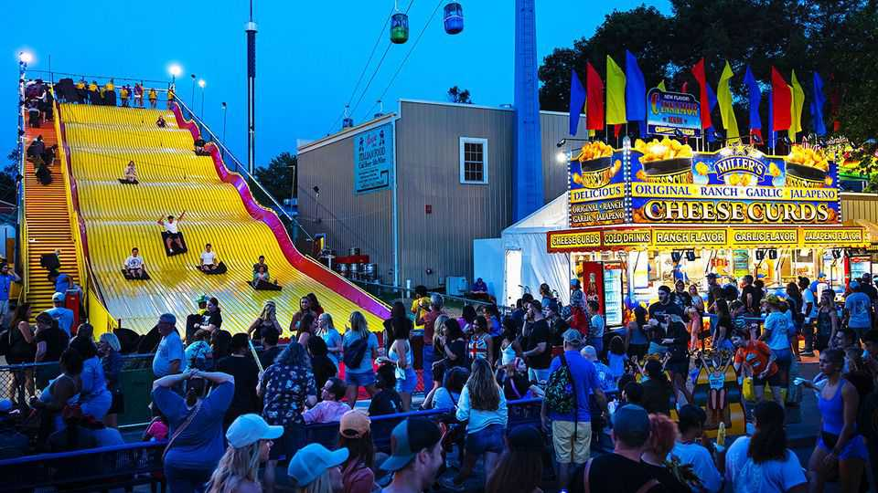

科学与技术 | 更贴近自然
怎么研究“非常醉”的人
“自然情境”实验正当红
2025年9月4日

摘要：把实验搬到“人群里”和“日常里”。该喝就喝到平时那水平，该看电影就边看边扫脑，该测疼就真上手：便宜、快、样本海量，更像现实。缺点是有点乱，但胜在更真。

【核心结论】
把研究从“白板实验室”搬到“烟火现场”，结论更贴近我们日常怎么想、怎么决定、怎么感受。

【一｜为何火起来】
— 疫情把大家练成“远程+就地”采样高手；
— 互联网自带大样本（比如4.6万人一起打卡戒酒），拿来就能跑效果。

【二｜能研究什么】
— 实验室不太敢做的：高酒精状态下的“止疼”效果、宿醉到底多伤、娱乐性致幻剂的真实体验；
— 以及更日常的情绪触发：边看电影边看大脑在想啥。

【三｜怎么做更真】
— 别只给单一刺激，直接上“生活版组合拳”（灯光/音乐/表情/对白一起上）；
— 用野外数据喂AI，让它学会在各种光线和角度下都能认出“疼是真的”。

【小结】
真实感=更多噪声→要靠更大样本和多次重复来稳住。但换来的，是更能解释现实世界的答案。■

