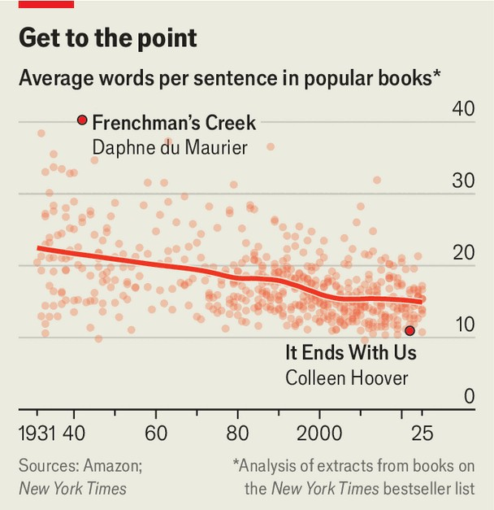

文化 | 不爱读书了
“不阅读”，会把政治变“更笨”吗？
学者担心：少读书，就更难清晰思考
2025年9月4日

摘要：数据一致指向“读得更少、读得更浅”。不仅量在掉，文风也变短变白话。阅读能力弱，可能拖累“理解复杂观点”的能力；政治语言也在同步“降配”。

【核心结论】
阅读不仅是爱好，也是思维肌肉。肌肉少练，政治讨论就更难容纳复杂度与反直觉观点。

【一｜下降面更广】
— 成人、儿童、青少年阅读都在降，小朋友被阅读的时间也更短；
— 即便爱书人，也更难“读完一本书”。

【二｜文本在变“轻”】
— 畅销书的句子长度近百年来缩短约三分之一；
— 演讲与议会发言可读性显著下降。

【三｜为什么重要】
— 读长文训练“持久注意、复杂结构理解与多线并行”的能力；
— 这些能力缺席，公共讨论更易被短平快与情绪化带着走。

【小结】
不是非要回到维多利亚时代的长句，但得给大脑留点“有咀嚼感”的文字。■

