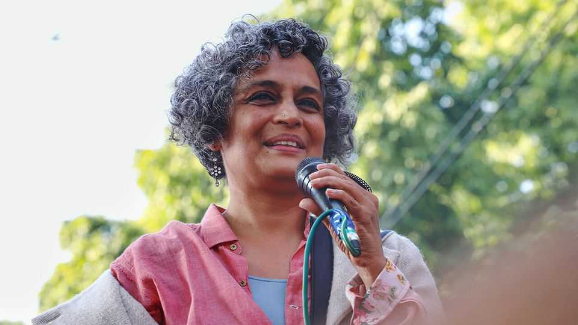

文化 | 玛丽身上有点事
“不总是”最亲的母亲：阿兰达蒂·洛伊写母亲
两位非凡女性之间的纠缠
2025年9月4日

摘要：《微物之神》之后，洛伊把笔对准母亲玛丽：她既是“做梦者、斗士、教师”，也是施压者、伤人者。分离与重聚，塑造了洛伊的反叛与写作；个人史与印度的社会政治流变交织在一起。

【核心结论】
这本回忆录写的不是“完美母女”，而是摩擦里生出的自由人格，以及与之并行的公共介入与代价。

【一｜母亲的两面】
— 玛丽·罗伊为女性平权打到最高法院，也创办学校“育人”；
— 但她对亲人和孩子“严苛到伤人”。

【二｜黑暗里的自由】
— 18岁离家，七年不见，反而把洛伊推向独立与写作；
— 成名与财富带来舒适，也带来“道德不安”，她选择继续站在公共议题上发声。

【三｜与时代对话】
— 从核试验到克什米尔、从水坝到战争，她持续“逆风而行”，也因此屡遭起诉与围攻。

【小结】
母女之爱并不总是温柔，但它能催生“带刺的独立”。洛伊把这份成长写成了她的现实魔幻。■

