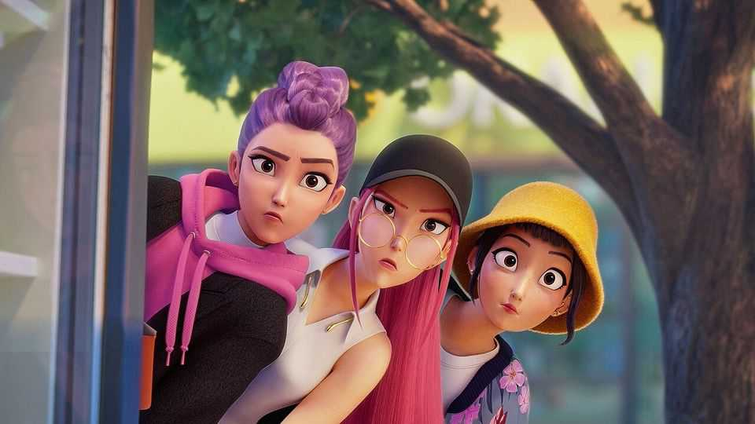

文化 | K-pop破圈
女团PK恶魔：这部Netflix爆款，凭什么这么上头
一边唱“自我接纳”，一边用神曲把你洗脑
2025年9月4日

摘要：这片能火，有三件事说得通：歌洗脑、情绪共鸣、粉丝生态给力。把音乐当“发动机”、把粉丝当“助推器”，传播路径顺了，记录就不是天花板。

【核心结论】
一部动画长片做到“看片后还在哼”，就半赢；能把粉丝写进世界观，就全赢。

【一｜歌一响，记忆点就上身】
K-pop标配是“钩子密集”，这次也一样：《Golden》冲上美榜第一，Twice翻唱带节奏。因为旋律能留在脑子里，所以安利链更短。

【二｜线下线上一起拉满】
影院合唱场把“社交体验”做实；TikTok翻唱、学舞、造梗，把“路人”拉成“观众”，再进化成“粉”。

【三｜女孩互助+自我接纳】
Huntrix不是纸片人：会花痴、会丢脸、会吃拉面。Rumi的“半恶魔”设定，落到“接纳真实的自己”，共情点很稳。

【四｜粉丝是世界观核心，不是背景板】
“Honmoon”把粉丝之爱具象成护盾；当你敢动粉丝，主角就会“让你知道疼”。当作品尊重粉丝，粉丝也会回报作品。

【五｜画像更广，口碑外溢】
镜头里不只有年轻女孩，还有男性和年长观众。更多人“照见自己”，口碑才能扩出去。

【小结】
歌抓耳、情绪真、粉丝强，传播自然就顺。它的成功，是“音乐×粉丝文化”的一次闭环。■
