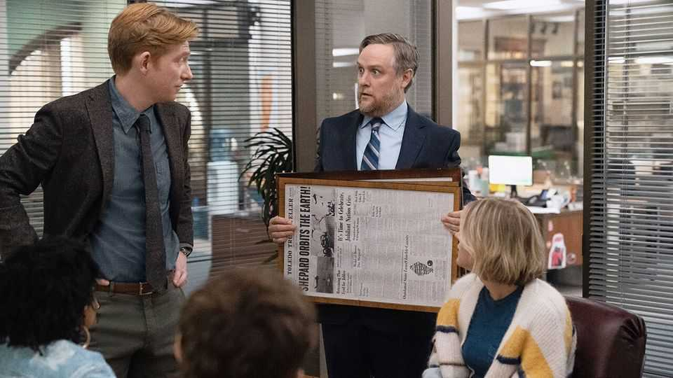

文化 | 同宇宙再就业
《The Paper》：与其说“衍生”，不如说《The Office》复制粘贴
熟悉感在线，惊喜感离线：老粉也许不介意
2025年9月4日

摘要：设定“强行同宇宙”、人物几乎一一对标、笑点路线也熟悉。商业上说得通：吃到老粉的20%就算赢；创作上还缺“只此一家”的表达。

【核心结论】
这是“稳妥不出错”的产品：能陪伴，但难惊喜。

【一｜设定：硬桥硬马接上老IP】
从造纸厂到地方报社，地点换了但气质未变；用老角色与剧情机关“打通世界观”，代入感立起，但新意打折。

【二｜怀旧滤镜：情怀好用，但别太厚】
片头把“报纸的日常”拍得很温情，但时代换代是事实：像收音机、传真、含铅汽油，曾经刚需，如今退场。

【三｜人物与互动：老配方复刻】
伪纪录片、后工业小城、尴尬而机智的幽默；主副CP、边角人物都能在旧作找到影子。能笑，但难“哇”。

【四｜商业逻辑：熟悉即生产力】
数据证明《The Office》在流媒体时代仍是“拉新王”。新剧只要拿到老粉20%注意力，就能过线。

【五｜短板：像得太像】
对需要“情绪陪伴”的观众，这没问题；但对追“新表达”的观众，动力不足。

【小结】
如果下一季能在人物弧线或叙事结构上走出“只此一家”，它才能从“复刻”升级为“续作”。■
