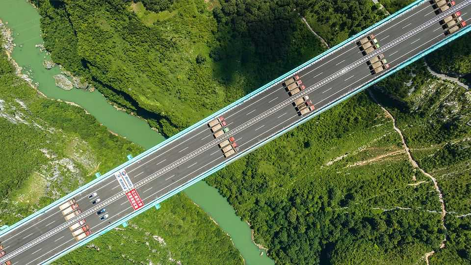

文化 | 机器之心
中国“工程师治国”的说法，到底有几分真
对照组：美国被说成“律师治国”
2025年9月4日

摘要：基建、制造、清洁能源的数据都很能打，说明“会做事”；但把问题全归因于“工程逻辑”并不准，体制激励与治理刚性才是关键变量。

【核心结论】
“工程国家”是好视角，但不是万能钥匙；理解成功要看“手感与产线”，理解问题要看“体制与激励”。

【一｜为什么看起来“能建能造”】
高速公路、高铁、清洁能源、制造占比，都有硬数据；几十年“代工链”练出的“手感”，是美国短期补不回的。

【二｜过程知识是优势，不是全部】
流程里的学问，决定“从0到1到100”的效率；但光有流程，还得有制度容错与迭代空间，才能越做越好。

【三｜如果真遇到硬冲突】
真打消耗战，关键看“生产补给能不能跟上”。算法强也得落到无人机与弹药等“实体货”，才是战力。

【四｜把一切问题都怪到“工程”不公平】
产能过剩、债务、环境、人身代价，这些更多与体制的“自上而下”有关：成本收益分析与动态调整如果进不去流程，工程也会走样。

【五｜疫情是个分界案例】
“清零”期间的药品紧张，不是工程思维本身的问题，而是行政压力与问责恐惧的外溢。

【小结】
用“工程国家”理解产业竞争OK；想看治理短板，还得回到“一党制”的运行逻辑。■

