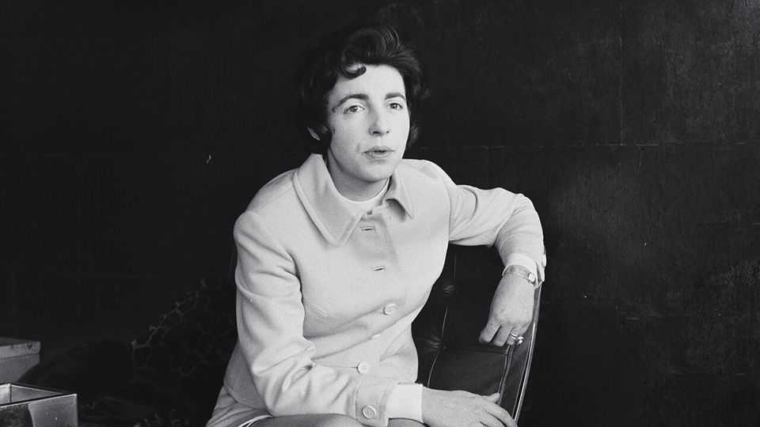
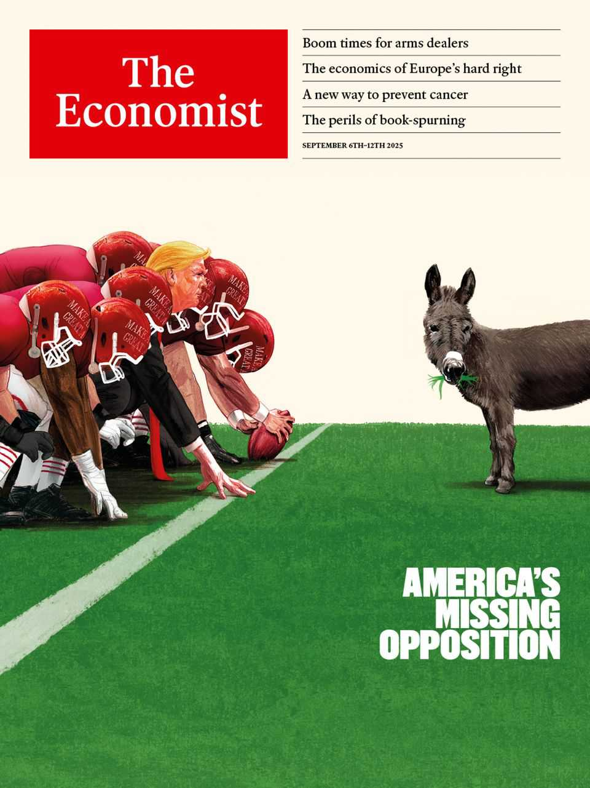

讣告 | 为女性而作的事业
她用“自己开公司”回击职场性别歧视：Steve Shirley
难民出身、企业家、慈善家：8月9日辞世，享年91岁
2025年9月4日

摘要：她把“被拒绝”变成“自己造路”：在家工作、弹性时间、按件计酬、员工持股——在那个年代就拉齐了今天仍然有效的职场友好清单。她相信技术，也相信人值得被托举。

【核心结论】
当被排斥是现实，最硬的回击就是“自己开门”。

【一｜从贴墙防骚扰，到“我自己来”】
在CDL，她学会了忍耐，也学会了离开。第二天递辞呈，决定“为女性开一家公司”。

【二｜她的公司，提前实现了很多人的理想职场】
只招被市场忽视的女高材生；支持远程、灵活、按件；团队协作、最终共享。后来它做大做强：8,500名员工、估值30亿美元、给协和客机写黑匣子、被北约采用管理协议。

【三｜聪明也要有点“狡猾”】
固定报价掩盖分布式团队；电话里放“打字声”营造忙碌；把落款从Stephanie改成Steve，提高冷启动的命中率。

【四｜她的人生底色：被救助的人，要活得值得】
童年随“幼童救援行动”来到英国；此后白天工作、晚上读书，做交换机、做抽奖机、做早期计算机的软件。她把时间攥得很紧。

【五｜当命运下狠手，她把钱撒向帮助】
儿子重度自闭并伴癫痫，让她多年与抑郁同行。她把持股分给员工，建中心照顾更多像儿子一样的年轻人。

【小结】
她相信技术，也相信人的尊严。她不等门开，自己造门——并把门留给后来的人。■

