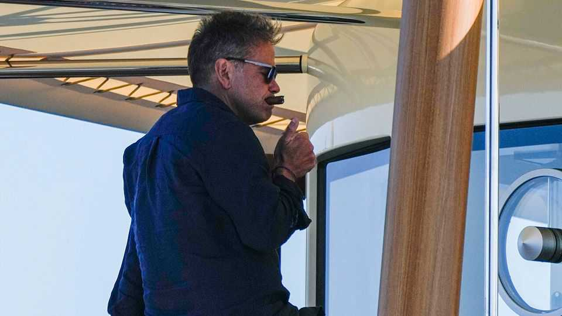

The world this week
Business
September 11th 2025

The Murdoch family reached a settlement on who will head Rupert Murdoch’s media empire when he dies, bringing an end to a decades-long succession battle. Lachlan Murdoch, Mr Murdoch’s eldest son, emerged as the winner. He will take a controlling stake in Fox, which covers television and broadcast news, and News Corp, which publishes the Wall Street Journal, the New York Post, and in Britain the Sun and the Times, when his father, who is 94, passes away. Lachlan already runs the companies, but formally handing him the reins fulfils the elder Murdoch’s wish that they continue to promote a “conservative voice”. Oracle’s stock jumped by a third in value thanks to an “astonishing” quarter in which its expected revenue from future contracts for cloud services rose by 359%, year on year. It also emerged that Oracle will supply OpenAI with data-centre capacity in a $300bn contract. Larry Ellison, Oracle’s founder,

has seen his net worth grow by $191bn this year, to $383bn. He is now vying with Elon Musk for the title of world’s richest man.

Anthropic’s recent $1.5bn settlement with a group of authors in a copyright lawsuit was roundly criticised by the judge overseeing the case. The suit alleges that the AI startup downloaded books from pirated websites to train its models. The judge called another hearing for September 25th, to “see if I can hold my nose and approve” the agreement.

The European Commission fined Google €2.95bn ($3.5bn) for favouring its own display advertising technology to the detriment of its rivals. Google has 60 days to tell the commission how it will remedy the situation, or else face the possibility of being ordered to sell part of its ad business. Google said the fine was unjustified and that it would appeal against it.

China’s exports grew by 4.4% in August, year on year, the slowest pace by that measure since February. The value of goods sent to America plunged by 33%, but exports to South-East Asia were up by 22.5% and to the EU by 10%. Meanwhile, China fell back into deflation in August, as the consumer- price index dropped by 0.4%, year on year.

America’s Bureau of Labour Statistics reported that 911,000 fewer jobs had been created in the 12 months ending March than had been thought. The

revision is based on new census data and updated information from businesses. The head of the BLS was recently sacked by Donald Trump after a big downward correction to payroll numbers for May and June. The president had claimed those figures were “rigged”. Meanwhile, data for August suggested that only 22,000 jobs were created that month.

A federal judge decided that Lisa Cook could continue to serve as a governor at the Federal Reserve while she fights Mr Trump’s attempt to sack her. The judge ruled that because Ms Cook’s alleged transgressions in filling out a mortgage application occurred before she became a governor it did not meet the threshold of “sufficient cause” that the president had used to justify her firing. The decision means that Ms Cook will get to vote on interest rates at the Fed’s meeting on September 17th.

Anglo American announced that it will merge with Teck Resources, a Canadian mining company, to become a giant in the production of copper. Mining companies have tried to consolidate in recent years, though few have succeeded. Anglo fought off a bid from BHP last year and Teck rejected an offer from Glencore in 2023. Anglo Teck will have its headquarters in Vancouver, but will keep its primary share listing in London, with secondary listings in Johannesburg, Toronto and New York.

Klarna’s IPO on the New York Stock Exchange made a splash. The Swedish fintech company’s stock was up by 15% by the close of trading, giving it a market valuation of $15bn.

Apple unveiled the iPhone 17 and the iPhone Air, its thinnest phone yet with a width of 5.6mm. That is even thinner than Samsung’s Galaxy S25 Edge, which came out earlier this year. The iPhone 17 is roughly the same price as last year’s model, despite Apple’s warning that it faced huge disruptions to its supply chain because of tariffs.

Novo Nordisk decided to cut 9,000 jobs amid intense competition in the market for weight-loss and diabetes drugs. It also issued its third profit warning of 2025. When sales surged of its Wegovy and Ozempic treatments the Danish firm increased its workforce by 75% to 78,400. But with Eli Lilly eating into its market share investors have lost their appetite for Novo’s stock, which is down by 45% this year.

This article was downloaded by zlibrary from [https://www.economist.com//the-world-this-week/2025/09/11/business](https://www.economist.com//the-world-this-week/2025/09/11/business)