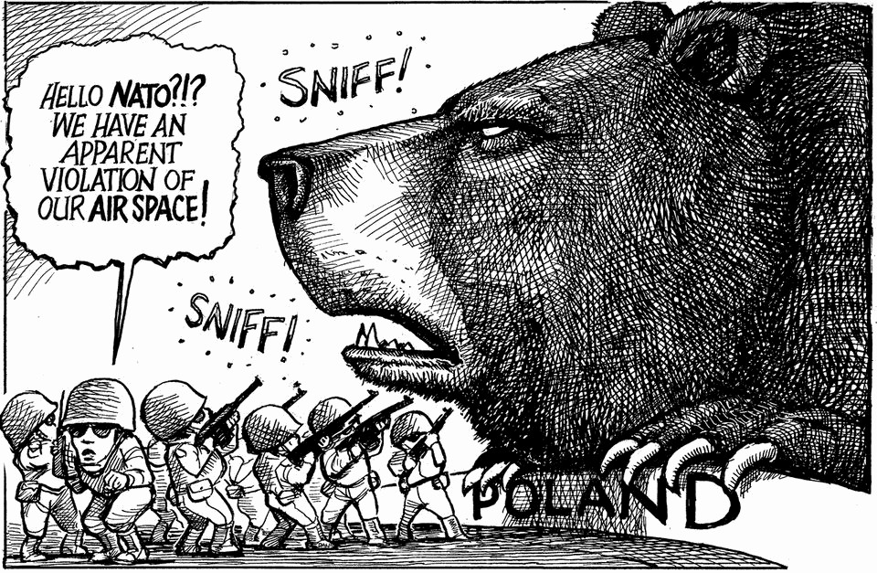

The world this week
The weekly cartoon
September 11th 2025

Dig deeper into the subject of this week’s cartoon: The Kremlin’s plot to kill NATO’s credibilityPutin’s dangerous drone probe is a moment of truth for NATOWould Vladimir Putin attack NATO? The editorial cartoon appears weekly in The Economist. You can see last week’s here. This article was downloaded by zlibrary from https://www.economist.com//the-world-this-week/2025/09/09/the-weekly-cartoon

Leaders

What if the $3trn AI investment boom goes wrong? Don’t panic about the global fertility crash Israel’s Qatarstrophic error The Kremlin’s plot to kill NATO’s credibility Nitazenes: another failure of drug prohibition Is British politics broken? Its centre is cracking