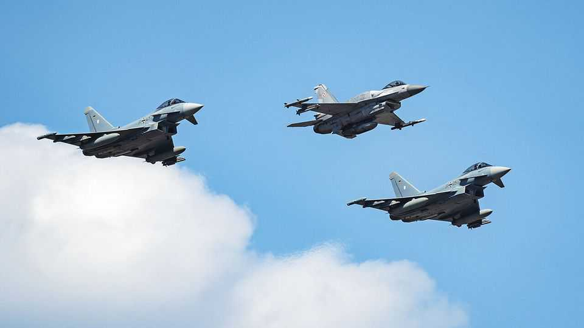

Leaders | Europe’s air space
The Kremlin’s plot to kill NATO’s credibility
The alliance needs an emphatic response to Russian air incursions
September 11th 2025

RUSSIAN DRONES have hit NATO countries before. One, presumably destined for Ukraine, landed in a field in Poland just last month. But what happened early on September 10th was the most serious incursion into NATO territory since the alliance began in 1949. Nineteen drones were fired, largely from Belarus, a client state where Russian troops freely operate. They ended up deep in Polish airspace, where some were shot down. Others crashed, fortunately with no loss of life. Russia says the drones veered off course because they were confused by electronic jamming. Defence experts say this is unlikely, but even if it is true it indicates that Russia is behaving with provocative recklessness. Much more likely is that Russia was deliberately probing Poland, and NATO, for

weakness, both military and political, and doing so with just the sort of ambiguity and deniability in which the Kremlin delights. The alliance, and above all America’s president, now face a moment of truth. Unless the response is immediate and unequivocal, weakness is exactly what Russia will surmise.

Since the invasion of Ukraine in 2022, NATO has welcomed Finland and Sweden into its ranks and set a new target for defence spending of 3.5% of GDP. But it has also tolerated years of abuses: the cutting of submarine cables; airspace and naval violations; assassinations and sabotage. The drones in Polish skies are the Kremlin’s latest test. All too often, Western officials have sought to avoid “escalation”. But now European citizens may fear their borders are not safe. And escalation has already come—from Moscow. If NATO signals timidity, the risk of sleepwalking into a larger war will grow.

So far the signals are mixed. European leaders have sounded appropriately outraged. President Donald Trump has sounded bemused. “What’s with Russia violating Poland’s airspace with drones? Here we go!” he said on social media. This is feeble. NATO should state that all incursions in Poland and other front-line states will be intercepted, overturning the practice of playing these down. It should deploy more aircraft on Baltic and Polish air- policing missions, and shift air-defence systems, providing this does not denude Ukraine. NATO should also mount a forward-defence, shooting down drones and missiles inside Ukrainian and perhaps Belarusian airspace if these are bound for NATO airspace. And NATO should strengthen Ukraine’s ability to strike drone-production facilities deep inside Russia. That will involve the transfer of intelligence, components and, if needed, long-range systems.

Much of this will require more spine from Mr Trump. Despite having promised to end the war in Ukraine in a day, he has let Vladimir Putin lead him by the nose. He insisted on a ceasefire, but then dropped the idea; he threatened harsh sanctions on Russia but did not impose them; he called for Mr Putin to sit down with Ukraine’s president, Volodymyr Zelensky, but then went silent on that idea, too. Mr Trump claims to hate bloodshed, but has remained passive as Mr Putin has intensified his drone strikes on

Ukraine. Mr Putin’s answer to Mr Trump’s peace initiative is 800 drones a night.

Joe Biden promised America would defend “every inch” of NATO territory. Mr Trump has mused about abandoning allies who do not “pay their bills”. His ambiguity about America’s position is a gift to the Kremlin, which aims to sow doubt about American resolve. It also emboldens others, including Israel’s prime minister, Binyamin Netanyahu, whose raid into Qatar on September 9th made a fool of Mr Trump, undercutting his efforts to end the war in Gaza.

The task before Mr Trump is simple. He must find the words that have long failed him and declare that America will uphold its treaty obligations, and defend its allies. Anything less will invite further aggression, not only from Russia but from autocrats elsewhere. ■

Subscribers to The Economist can sign up to our Opinion newsletter, which brings together the best of our leaders, columns, guest essays and reader correspondence.

This article was downloaded by zlibrary from https://www.economist.com//leaders/2025/09/10/the-kremlins-plot-to-kill-natos- credibility