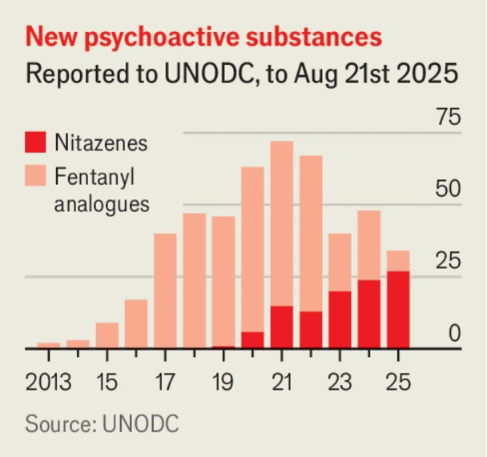

Leaders | The futility of drug wars
Nitazenes: another failure of drug prohibition
As countries crack down on fentanyl, a new synthetic opioid takes off
September 11th 2025

According to Britain’s National Crime Agency, there has never been a more dangerous time to take drugs. In a review of the British drug market in 2024, the agency reported a steep increase in the use of cocaine; an explosion in imported cannabis; and the spread of a new synthetic opioid. As we report in this week’s Science & technology section, drug authorities around the world are increasingly worried about nitazenes. Developed in the 1950s, these drugs are so powerful that they were never approved for medical use, meaning that far too little is known about them. The vast majority of nitazenes are much stronger than heroin and some appear to be even more potent than fentanyl, a synthetic opioid that helped kill nearly 50,000 Americans last year.

Since emerging on the illicit drug market in 2019, nitazenes have been detected all over the place. Clusters of overdoses have been reported across Africa, the Americas, Australia and, in particular, Europe. Often they are sold as other products; in Ireland they have appeared as “Chinese heroin” and in Australia they have been found masquerading as MDMA, a party drug better known as ecstasy. They also frequently turn up as contaminants or additives—in West Africa, for instance, they have been found in cannabinoid products.

Why now? Synthetic opioids suit illicit drugmakers. They are easier to make than heroin, which depends on growing opium poppies and the whims of those who control the fields. Because their chemical structures can easily be tweaked, producers can circumvent bans on specific compounds. Because they are so potent, smugglers can pack more lucrative highs into smaller, lighter packages. That is why fentanyl has long been popular with traffickers. And as drug cops everywhere have cracked down on it, many crooks have switched to nitazenes.

The timing is suggestive. Fentanyl has been controlled under a UN convention since 1964, but America stepped up its efforts in 2018 and banned all fentanyl analogues. China, the main producer of fentanyl, followed in 2019 and local production plunged. In 2021 the Taliban seized

power in Afghanistan and banned opium production, possibly disrupting Europe’s heroin supply. Market conditions have thus been ripe for the emergence of a new, uncontrolled class of synthetic opioid.

This makes nitazenes an example of the Iron Law of Prohibition, proposed by Richard Cowan, a drug-legalisation activist, in 1986. Banning one compound opens the door to a new, stronger alternative—just as Prohibition in America led to a shift from beer to spirits, which are easier to smuggle and more dangerous. Indeed, some argue that America’s current opioid crisis can also be understood this way. A clampdown on prescriptions of opioid painkillers left masses of patients unable to get their fix legally. So many of them turned to illicit dealers and got hooked on stronger drugs, such as fentanyl.

Better detection and treatment are needed. Overdose patients and street drugs should be tested, to reveal how and where nitazenes are being taken. Rich countries should share information about new nitazene structures with poor ones. Naloxone, an antidote to opioid overdoses, should be made more available to users’ friends and family. If it is to hand, an overdoser is more likely to survive.

In the long run, governments should seek ways to discourage innovation in the illicit-drug market. Simply banning every new drug is not the answer. Nitazenes are probably too dangerous to legalise. But the best way to reduce harm to drug users and revenues for criminal gangs is to allow addicts regulated access to better-understood opioids, including heroin. ■

Subscribers to The Economist can sign up to our Opinion newsletter, which brings together the best of our leaders, columns, guest essays and reader correspondence.

This article was downloaded by zlibrary from https://www.economist.com//leaders/2025/09/10/nitazenes-another-failure-of-drug- prohibition