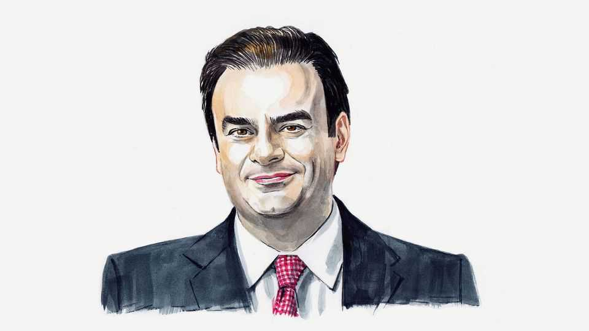

By Invitation | The Draghi report, one year on
A finance minister on what Europe must do to please Mario Draghi
A single market is not enough. It must also drive growth, writes Kyriakos Pierrakakis
September 11th 2025

IT HAS BEEN a year since Mario Draghi, a former Italian prime minister and European Central Bank governor, presented his report on European competitiveness—a landmark effort to chart a course for growth. His message then was clear: without bold reforms, Europe risked a “slow agony” of relative decline. One year on, the sense of urgency has only deepened, hence the continued ringing of alarm bells by Mr Draghi, including a recent speech in which he warned that Europe must make “massive investments… now, when we still have the power to shape our future”.

Among the many recommendations Mr Draghi set out, completing the single market—the project to ensure the free movement of goods, services, capital and people within Europe—remains the most important. It is the key to unlocking the continent’s next phase of growth.

The push to complete the single market must, however, go hand in hand with reigniting competitiveness. The European Commission is right to target persistent barriers that fragment the continent’s economies. But although regulatory convergence is necessary, it is far from sufficient.The importance of completing the single market is underlined by stark statistics: intra-EU barriers act as a de facto tariff of 44% on average in goods—three times higher than trade barriers between American states—and an even steeper 110% in services, according to the IMF. Lowering these barriers should be a priority. Nevertheless, a new burst of European growth will require pursuing two additional, critical shifts.First, we need to be more strategic about where we pool our resources—sector by sector. Take telecommunications. It is a capital-intensive industry with declining margins, yet essential for digital competitiveness. In Europe today, telecoms operators face 27 different regulatory regimes and have had to navigate 27 separate 5G-spectrum auctions. This patchwork drives up cost, slows deployment and makes it harder to achieve scale.By contrast, America has a single regulator, the Federal Communications Commission, and a single spectrum-allocation process. Meanwhile, China has gone even further, allocating the spectrum administratively to operators, rather than auctioning it, in recognition that 5G’s value lies not in auction revenues but in the applications and services it enables.Europe’s position in this broader geopolitical context has been paradoxical. In recent years, global competition over digital infrastructure has evolved into full-fledged strategic rivalry. Whereas the European Union has lacked a cohesive response, European companies have often been at the centre of the most important developments—as leading providers of 5G infrastructure, standards and innovation. In other words, Europe held many of the tools but lacked the common policy to turn them into long-term industrial strength.In my own country, Greece, we tried to respond to this challenge at the national level. We retained 25% of our 5G-auction proceeds to establish a special fund to invest in companies building 5G-enabled applications. This reflects a recognition that in the digital era infrastructure alone is not enough. Innovation on top of that infrastructure is what drives growth.Had Europe instead adopted a co-ordinated or even singular

regulatory approach, a unified auction framework and a common funding mechanism for strategic tech investment in 5G applications, it might have positioned itself more convincingly as a global leader in 5G-enabled innovation. The opportunity cost of fragmentation is measured not only in missed efficiency, but also in lost competitiveness.The second required change is to align regulation with the growth priorities of the future, not the past. Take procurement, which in Europe runs under what is known as the Public Procurement Directive. Here traditional construction projects tend to move forward much more swiftly than digital or innovation-driven projects. That discrepancy is not merely procedural—it reflects the growth priorities of an era in which physical infrastructure dominated strategic thinking.Today the shelf-lives of digital projects are often measured in months. In Europe, however, the timelines to commission and deliver them are measured in years. If it takes longer to procure a digital-identity system or a public e-health platform than it does to resurface a motorway, the institutional framework is clearly exerting a drag on ambition.This is not just a matter of simplification. It is a matter of direction. The question we should be asking is not “How do we make procurement easier?” but “What do we want procurement to achieve?” The answer must be growth and innovation. That means rewriting rules to be fit for agile development, public-private technology partnerships and rapid deployment in areas like AI, cyber- security, energy transition and advanced manufacturing.Let us, by all means, eliminate the invisible tariffs that fragment Europe’s internal market. But let us also ask ourselves: what kind of economy are we enabling once those barriers are gone?The answer cannot be “more of the same”. It must be an economy that innovates, competes and grows—with an institutional architecture designed not just to manage risks, but to catalyse Europe’s potential. ■

Kyriakos Pierrakakis is the finance minister of Greece.

This article was downloaded by zlibrary from https://www.economist.com//by-invitation/2025/09/10/a-finance-minister-on-what- europe-must-do-to-please-mario-draghi

Briefing

Humanity will shrink, far sooner than you think A contracting population need not be a catastrophe