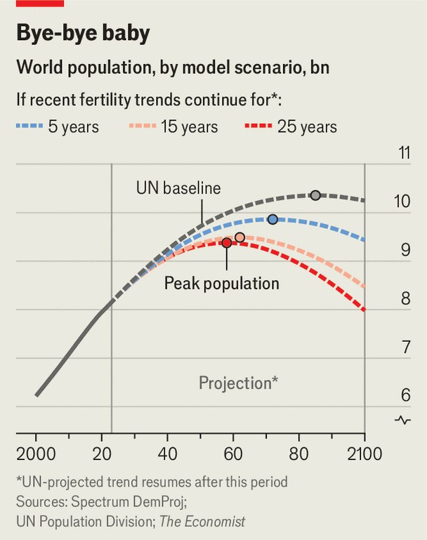

Briefing | Population implosion
Humanity will shrink, far sooner than you think
Demography sneaks up on you
September 11th 2025

“In the past,” says Furkan Kayabasoglu, an obstetrician in Istanbul, “I would deliver a couple’s first baby and then their second or even a third.” These days, however, “one and done” parents are becoming the norm. Out of every ten births Mr Kayabasoglu attends, only one is of a second child. “We can’t even reach the number of births needed to train new doctors,” he laments. Last year Turkey’s total fertility rate (tfr), the number of births a typical woman will have in her lifetime if current patterns persist, fell to 1.48. That is well below the level needed to keep the population stable in the long run, which is about 2.1. It was also below what demographers had expected. The United Nations Population Division thought that Turkey’s tfr would not fall so low until at least the year 2100.

Slumping birthrates are not confined to Turkey. All over the world, in poor and middle-income countries as well as rich ones, fertility is in much sharper decline than most projections had expected (see chart one). The total fertility rate in Bogotá, the capital of Colombia, is just 0.91 children per woman, lower than in Tokyo. India’s tfr has fallen below the level needed to keep its population stable in the long run. It is more-or-less bound to start shrinking around mid-century.

China’s population is already contracting. Mexico’s tfr stands at 1.6, about the same as that of its richer northern neighbour, the United States. In 2024 France recorded fewer births than in 1806, when the population was less than half its current size. Italy registered its lowest count since unification in 1861.

Fertility rates have been dropping for centuries, mostly for benign reasons. Social security systems mean that people need not rely on their offspring to pay for them in old age—and, because childhood mortality is so much lower, do not feel the need to produce spares. After the baby boom of the 1960s in America, and in many parts of the world today, falling fertility reflected the liberation of women, who began to spend more time in education and exercise greater choice over their careers and use of contraception. Teenage pregnancies have become rarer.

What is striking and unexpected is that the decline in fertility is accelerating. The pace of global falls doubled between the 2000s and 2010s and has doubled again in this decade, sinking, on average, by almost 2% a year. In many places the fertility rate is dropping much faster. Levels that once would have been unimaginably low are becoming routine. South Korea has had a tfr of less than one for seven years. If that is sustained, its population will shrink by more than half in a single lifetime.

Many countries have confounded demographers’ expectations, as Turkey has done. The un had thought that Thai women would record a tfr of 1.2 in 2024. The actual figure was just one. In Colombia it expected a tfr of 1.63, and saw only a 2.5% chance of a reading below 1.4. But the national statistics agency reckons Colombia has already plunged under that level, dropping to 1.2 births per woman in 2023. Jesús Fernández-Villaverde, an economist at the University of Pennsylvania, thinks Colombia’s tfr may have fallen as low as 1.06 in 2024. Fewer than 2m babies were born in Egypt last year, a threshold it was not expected to cross before 2100.

Only about one-third of the world’s people live in countries where fertility is high enough to keep the population growing, and even in those places, rates are falling rapidly. Africa still produces many more babies than the global norm, but it is no exception to the rule of faster declines than expected. All this means that the world’s population is likely to peak much earlier than experts have been predicting, at a much lower level. Rather than climbing until 2084, as the un currently foresees, to 10.3bn people, it may stop growing in the 2050s and never exceed 9bn. At that point, the world’s population will start to shrink, something it has not done since the 14th century, when the Black Death wiped out perhaps a fifth of humanity.

A lower-than-expected peak in population and a more imminent decline have huge implications for humanity. It is not simply a matter of planning, although the World Bank, the imf and many governments do rely on the un’s statistics for that. The world economy might struggle to cope with a sustained contraction in population, though Jeremiahs are probably overdoing it. The international balance of power, the environment, social and political structures: all are likely to be radically reshaped.

Alarming as this might sound, it is also more or less inevitable. Many population forecasts, including the un’s, are inflated by implausible assumptions (see chart two). Demographers are naturally reluctant to predict that the current pace of decline in fertility rates will continue far into the future, since that would eventually yield a global population of zero. Yet even if you assume that fertility rates will stabilise or recover at some point, it is difficult to justify the choice of any particular year as the moment when that inflection might occur. In the minds of the un’s demographers, the least arbitrary solution to this problem is to assume that the recovery will begin right away.

The un therefore projects that all countries that have transitioned to low fertility will follow one of only two trajectories: a stabilisation or an increase in baby-making. It puts the United States, for example, on the first path. The country’s tfr has fallen almost continuously from 1.9 births in 2010 to 1.6. And there, according to the un, is where it will stay for the rest of the century. On the second trajectory is South Korea, where the fertility rate has plunged from 1.2 to 0.72 over the past decade. The un assumes it will rise slowly back to 1.3 over the next 80 years.

In none of these countries does the un expect fertility rates to continue falling. The improbable implication is that low fertility is a self-correcting

problem and that the correction will begin immediately in some of the worst afflicted countries.

It is indeed possible to imagine that fertility might recover in some countries. It has done so before, rising in the early 2000s in the United States and much of northern Europe as women who had delayed having children got round to it. But it is far from clear that the world is destined to follow this example, and anyway, birth rates in most of the places that seemed fecund are declining again. They have fallen by a fifth in Nordic countries since 2010.

John Wilmoth of the United Nations Population Division explains one rationale for the idea that fertility rates will rebound: “an expectation of continuing social progress towards gender equality and women’s empowerment”. If the harm to women’s careers and finances that comes from having children were erased, fertility might rise. But the record of women’s empowerment thus far around the world is that it leads to lower fertility rates. It is not “an air-tight case”, concedes Mr Wilmoth.

Anne Goujon of the iiasa, an institute in Austria that releases rival population projections, calls the expectation of a rebound in fertility “a bit of wishful thinking”. Other demographers question the notion, too. Ms Goujon says that the institute is preparing to include scenarios in which declining fertility persists in the next round of its forecasts.

Indeed, there is good reason to suppose that fertility rates have further to fall in many countries. In India, for instance, fertility varies widely. In Delhi women can expect to have just 1.2 babies. In the poorer northern states of Uttar Pradesh and Bihar—together home to about 300m people—the fertility rate is more than double that, but is also falling. In effect, a huge chunk of northern India’s population is tracing the same demographic path as wealthier parts of the country, with a lag of a decade or so. That matters because the national average, now at 1.9, blends regions at different stages of fertility decline. Even if rates stabilise in richer regions, the national rate will continue to fall as poorer places catch up.

A similar logic applies in many other countries, from Colombia to Turkey. If nothing else, the idea that the confluence of social trends that have lowered

fertility would reverse all over the world at exactly the same time beggars belief. Yet even short delays make big differences to long-term projections of the world’s population.

To show how sensitive the projected date of the global peak is to these assumptions, The Economist has analysed a few scenarios (see chart three). The un expects that in 182 out of 210 countries the annualised change in fertility during the next 75 years will be greater than it has been since 2013. In most of the world, where the tfr has been falling, this means that those declines will either slow down, flatten entirely or start to reverse. In the handful of places where the tfr has been rising, it means that these recent gains would accelerate.

We have maintained this assumption, but have shifted into the future the point at which this abrupt change in the fertility curve occurs. The impact of such a shift is large. We project that if the tfr goes on falling at its recent rate for even one more year, the eventual global population peak will arrive three years sooner, with 130m fewer people. If it declines for another decade before stabilising, peak humanity will arrive in 2065, with 750m fewer people.

“Replacement fertility is a knife-edge,” says Lant Pritchett of the London School of Economics. “Over the very long run, humans shrink to zero or swell to huge numbers, depending on whether they stay below or above the replacement rate.” The assumption that TFR must trend towards replacement is alluring, simply because “It makes the maths embarrassing if you don’t.” Alarmist predictions of a “population bomb”, which were trendy in the 1960s, may have made demographers hesitant to predict the opposite: that humanity will soon be shrinking. And yet, alarming or not, that will soon be happening. ■

This article was downloaded by zlibrary from https://www.economist.com//interactive/briefing/2025/09/11/humanity-will-shrink- far-sooner-than-you-think